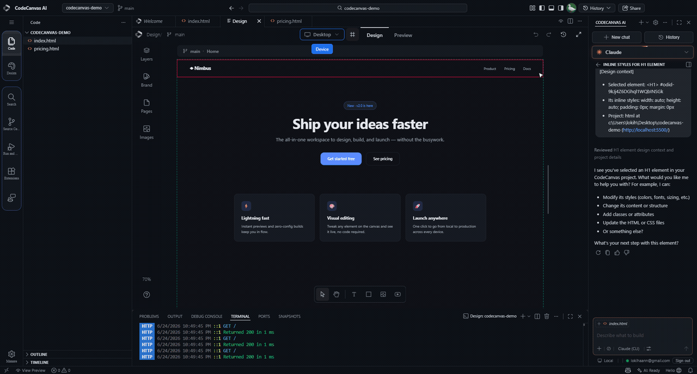
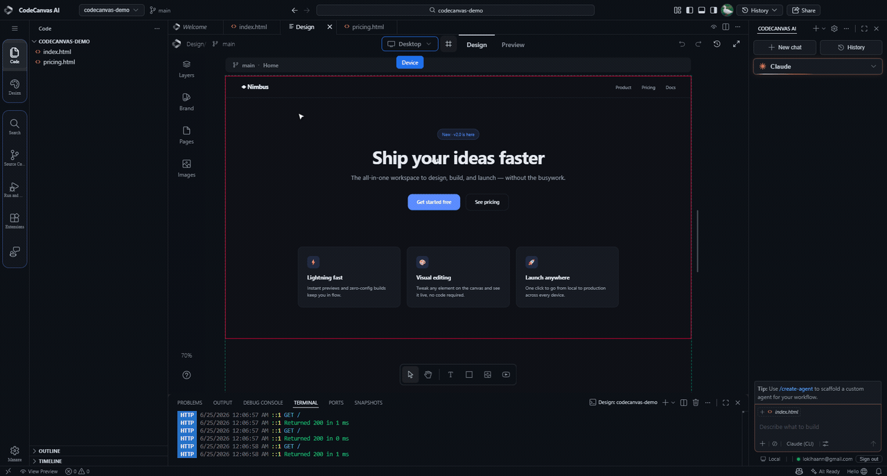
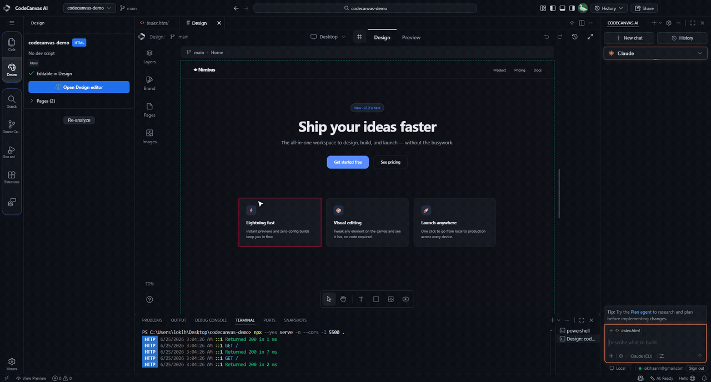
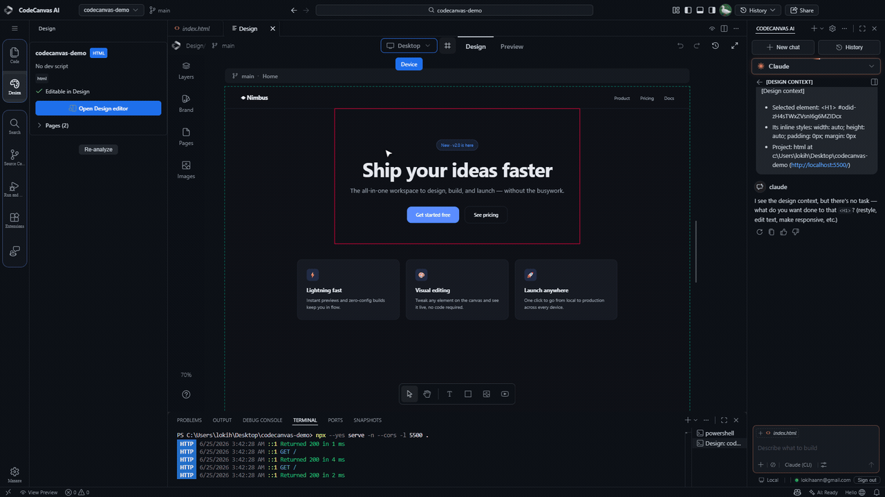
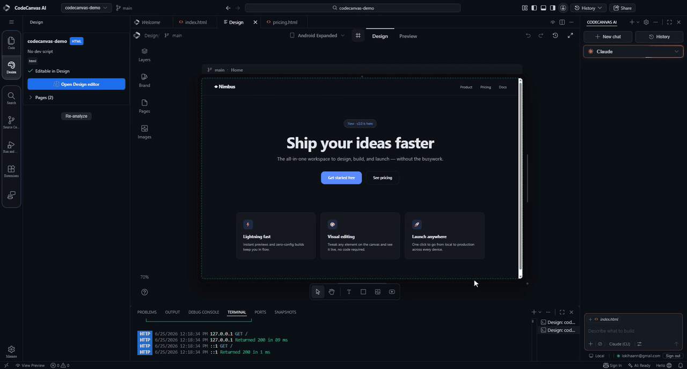

<div align="center">


# CodeCanvas Web

**Marketing landing page and product documentation for [CodeCanvas AI](https://github.com/FaridDevU/CodeCanvas-AI)** — the visual-first IDE built on a VS Code OSS fork.

### [getcodecanvas.dev](https://getcodecanvas.dev)

</div>

---

This repository is the **public website only**. The product itself lives in
[`FaridDevU/CodeCanvas-AI`](https://github.com/FaridDevU/CodeCanvas-AI). The docs here
describe that codebase (cited by `file:line`) but do not depend on it.

## Preview

| Edit text on the canvas | Switch device | Send selection to AI |
|---|---|---|
|  |  |  |

| Live preview | Inspect elements |
|---|---|
|  |  |

## Stack

- **Build:** [Vite](https://vitejs.dev/) 6
- **Landing:** React 18 + Tailwind CSS 4, with GSAP, Lenis (smooth scroll) and Three.js for the WebGL pieces
- **Docs viewer:** a dependency-free `docs.html` that renders the Markdown in `public/docs/` (Mermaid diagrams + syntax highlighting)
- **API reference:** a Swagger UI console (`docs-api.html`) over `public/docs/api/openapi.yaml`

## Quickstart

```bash
npm install        # install dependencies
npm run dev        # dev server  -> http://localhost:5173
npm run build      # production build -> dist/
npm run preview    # serve the built dist/ -> http://localhost:4173
```

## Structure

```
.
├── index.html              # landing entry (Vite)
├── src/
│   ├── components/         # React landing sections (Hero, Capabilities, FAQ, …)
│   └── lib/                # animation / WebGL helpers
├── public/
│   ├── docs.html           # documentation viewer
│   ├── docs-api.html       # OpenAPI / Swagger console
│   ├── docs/               # documentation source (Markdown)
│   │   ├── 00-overview.md … 12-operations.md
│   │   ├── _meta/          # style guide, IA, standards
│   │   └── api/openapi.yaml # internal API catalog (OpenAPI 3.0.3)
│   └── media/              # images / video
└── internal/               # working notes & audit reports (not part of the site)
```

## Documentation

- Pages are plain Markdown under `public/docs/`. The sidebar/order is the `NAV` map in `public/docs.html`.
- The API catalog is `public/docs/api/openapi.yaml`; validate with `openapi-spec-validator`.
- Diagram and writing conventions live in `public/docs/_meta/`.

## Branches

- **`main`** — production; what gets deployed to [getcodecanvas.dev](https://getcodecanvas.dev).
- **`develop`** — integration branch for in-progress work; merge into `main` via PR.

## Deployment

`npm run build` emits a fully static `dist/`. Host it on any static host
(GitHub Pages, Netlify, Vercel, Cloudflare Pages) and point `getcodecanvas.dev` at it.
