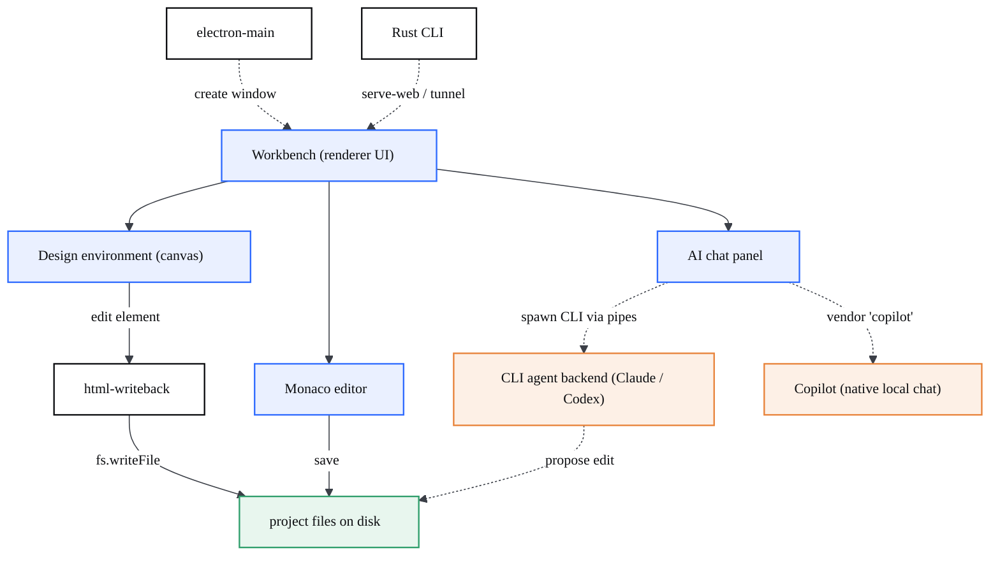

# Overview

> CodeCanvas AI is a desktop editor — a fork of VS Code OSS — where you design on a live canvas and your real source files stay the source of truth.

## At a glance

- **What it is:** a visual-first IDE built on VS Code OSS (TypeScript + Electron). Open a real project, edit it on a live **canvas**, and every change is written back to the actual source files.
- **The philosophy:** the code is the source of truth; the preview is *derived* from it. The human composes (what goes where, sizes, hierarchy), the AI structures (turns that composition into clean, scalable code).
- **One window:** design, build, and talk to an AI agent without round-tripping between a design tool and an editor.
- **100% local:** when the Design environment was ported from Onlook, every cloud dependency was stripped — no Onlook/Supabase/tRPC/cloud-AI calls. The app talks only to your files and to local agent processes.
- **The stack:** VS Code OSS fork (v1.124.0 base), Electron 42, TypeScript core, a Vite + React bundle for the canvas, and a Rust [CLI](?p=06-cli).
- **Status:** alpha, Windows x64. Working today: the Design canvas (edit, device frames, inspect, live preview, write-back, undo) and the Claude agent.

## Philosophy: code is the source of truth

CodeCanvas splits the work between human and AI along the line each is good at.

- **The human composes.** Visual composition — what goes where, exact coordinates, sizes, hierarchy, design intent — is human work. An AI is poor at placing image/text components and at fitting text inside them, so the Design environment exists to let a person do that by hand: position, size, and rank elements directly on the canvas.
- **The AI structures.** The AI only does what it does well: take an already-concrete composition and turn it into scalable, well-structured code.
- **The truth flows one way.** The system never chases a *picture* of the preview by mutating code until it matches. The **code is the single source of truth and the preview is derived from it** — "modify the preview to point at the code, not the code to point at the preview." Visual validation (a screenshot of the preview after an edit) only confirms the code renders; it does not become the target to chase.

This is the project's core differentiator and the reason write-back, not a throwaway mockup, sits at the center of the architecture. See `PROYECTO_CodeCanvas_AI.md` §1.5.

## The canvas <-> code duality

Every edit has two faces that must stay in sync:

- **Canvas:** the live, rendered project you point at and manipulate directly (text, layout, styles, device frame).
- **Code:** the real `.html`/source files on disk.

A canvas edit is **persisted back to the real file** ([write-back](?p=03-visual-editing-writeback)); a file change re-renders the canvas. Neither is a copy of the other — the file is authoritative, the canvas is a view onto it. This is what keeps CodeCanvas from being "WordPress/Webflow/Framer": it works on real projects and never hides the code.

## What are the parts

The [Workbench](?p=01-architecture) is the inherited VS Code shell; CodeCanvas adds the [Design environment](?p=02-design-environment), the [live preview](?p=05-codecanvas-preview), the [multi-agent AI chat](?p=04-ai-chat-multiagent), and [write-back](?p=03-visual-editing-writeback) on top, while the [Rust CLI](?p=06-cli) ships alongside.

## Repository layout

Top-level directories an engineer needs to know:

| Path | Responsibility |
| --- | --- |
| `src/vs/base` | Foundation utilities (collections, async, lifecycle) with no UI/platform deps. |
| `src/vs/platform` | Dependency-injection services and platform abstractions (files, storage, IPC, `cliAgent`, `agentHost`). |
| `src/vs/workbench` | The IDE UI shell (renderer). CodeCanvas features live under `workbench/contrib/`. |
| `src/vs/editor` | The Monaco text editor. |
| `src/vs/code` | Electron entry points: `electron-main`, `electron-browser`, `node`, `browser`. |
| `src/vs/server` | Remote / server entry points (serve-web). |
| `src/vs/sessions` | CodeCanvas agent-sessions surface (a sessions-oriented workbench variant). |
| `design-editor-src` | Vite + React source for the Design canvas bundle (Onlook-derived). |
| `cli` | The Rust CLI: tunnels, serve-web, self-update. |
| `extensions` | Bundled extensions (e.g. `extensions/copilot`). |
| `build` | The gulp build system, the `build/next` transpiler, installers, `build/codecanvas` helpers. |
| `resources` | App resources, including the built Design bundle at `resources/app/design-editor`. |
| `product.json` | Branding and product config (names, `applicationName`, telemetry off). |
| `gulpfile.mjs` | The gulp entry point; imports `build/gulpfile.ts`. |

Most of `src/vs` is upstream VS Code OSS. The CodeCanvas-specific code and how it relates to upstream is mapped on the [architecture page](?p=01-architecture).

## Glossary

| Term | Meaning |
| --- | --- |
| **Design environment** | The full-window canvas mode that hides the IDE chrome and opens the visual editor. See [Design environment](?p=02-design-environment). |
| **Canvas** | The live, editable visual surface showing the rendered project; edits map back to source. |
| **Write-back** | Persisting a canvas edit to the real source file (`html-writeback.ts`; element identity via positional index, inline styles in v1). See [visual editing & write-back](?p=03-visual-editing-writeback). |
| **CLI agent backend** | How the Claude/Codex agents actually run: `src/vs/platform/cliAgent` (`NativeCliAgentService`, electron-main) spawns the CLI with `child_process` **pipes** (not a PTY), streams stream-json, and kills by handle (`killTree`). Reached from the renderer over the `cliAgent` `ProxyChannel`. See [AI chat](?p=04-ai-chat-multiagent). |
| **Copilot (native)** | Copilot is **not** a spawned process: it runs in VS Code's local chat session using the bundled GitHub Copilot extension's own models (vendor `copilot`) and your GitHub session. |
| **Agent host** | A separate, optional `src/vs/platform/agentHost` subsystem (a UtilityProcess), gated by `chat.agentHost.enabled` and off on first run — not the default chat backend. |
| **penpal** | The parent/child `postMessage` RPC library that bridges the React Design bundle and the injected preview preload (the inspector). |
| **Moveable** | The `react-moveable` layer that move/resizes absolutely-positioned elements on the canvas. |
| **oid / cc-id** | Element identity. `oid` is a positional index (drifts when the DOM reflows); `cc-id` is a stable id added to support free editing. |

## Gotchas

- **"Local-first" is a hard rule, not a default.** The Onlook port intentionally removed every remote endpoint; do not reintroduce cloud calls into the Design environment.
- **The canvas is not the truth.** Tooling that "fixes the code until the screenshot matches" inverts the model. Validation confirms rendering; the file remains authoritative.
- **It is a fork, not a rewrite.** CodeCanvas rebrands and *extends* VS Code via contributions/services. Touch the upstream core as little as possible (see the [build & platform page](?p=07-core-platform-build)).
