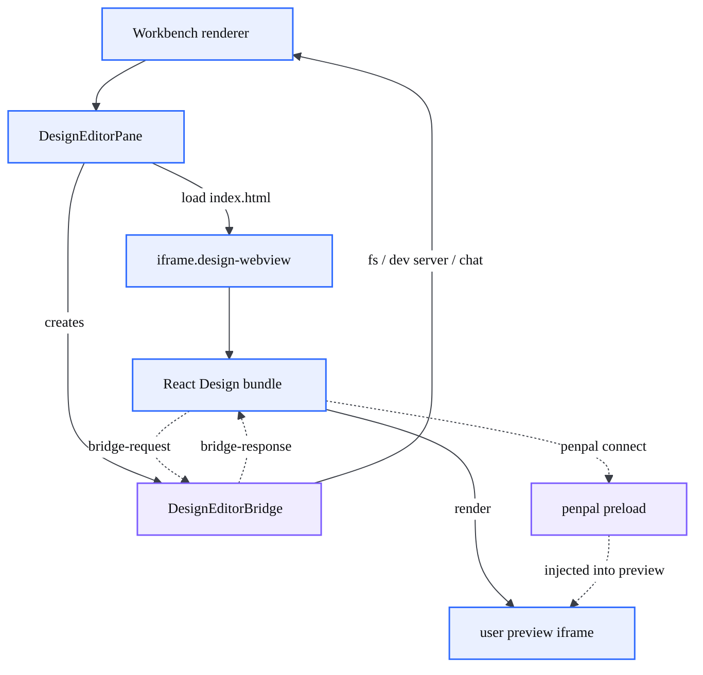
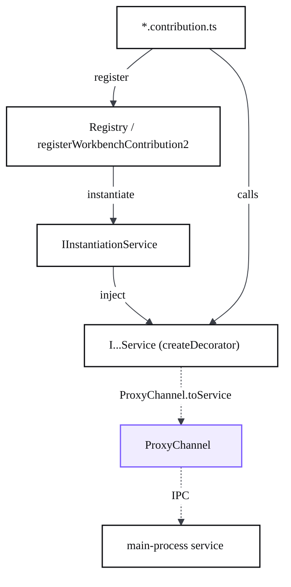

# Architecture

> How CodeCanvas is put together: the Electron process model it inherits from VS Code, the nested iframe stack that makes the Design canvas work, and where the fork's own code lives.

## At a glance

- CodeCanvas keeps VS Code's **multi-process Electron model**: a privileged `electron-main` process, one `renderer` per window (the workbench), and separate `extension host` processes.
- The **Design canvas is a stack of nested browsing contexts**: workbench renderer -> a React Design bundle in an iframe -> the user's preview inside it.
- Features are wired the VS Code way: a **contribution** registers itself, pulls **services** through dependency injection, and reaches the main process over a **channel** (`ProxyChannel`/IPC).
- CodeCanvas code is additive: it lives in a handful of `contrib`/`platform` folders plus `design-editor-src`, `resources/app/design-editor`, `cli`, and `product.json`. The rest is upstream VS Code OSS.

## The Electron process model

```mermaid
%%{init: {'theme':'base','themeVariables':{'fontFamily':'Space Grotesk, Segoe UI, sans-serif','fontSize':'14px','primaryColor':'#ffffff','primaryTextColor':'#0c0d10','primaryBorderColor':'#0c0d10','lineColor':'#3b3f47','tertiaryColor':'#f6f6f3'}}}%%
flowchart TD
  subgraph MAINP["electron-main process"]
    LC["lifecycle / windows"]:::core
  end
  subgraph RENP["renderer process"]
    WB["Workbench UI"]:::ui
  end
  subgraph EHP["extension host process"]
    EXT["extensions"]:::ext
  end
  AGC["claude CLI child"]:::ai
  CLI["Rust CLI binary"]:::core

  LC -.->|IPC / ProxyChannel| WB
  WB -.->|extHost RPC| EXT
  WB -.->|chat request| LC
  LC -.->|spawn (pipes)| AGC
  AGC -.->|stream-json| LC
  CLI -.->|serve-web| WB

  classDef ui fill:#eaf0ff,stroke:#2f6bff,stroke-width:1.5px,color:#0c0d10;
  classDef core fill:#ffffff,stroke:#0c0d10,stroke-width:1.5px,color:#0c0d10;
  classDef ai fill:#fdf0e6,stroke:#e8833a,stroke-width:1.5px,color:#0c0d10;
  classDef data fill:#e8f6ee,stroke:#2f9e6b,stroke-width:1.5px,color:#0c0d10;
  classDef ext fill:#f1f1ee,stroke:#8b909a,stroke-width:1.5px,stroke-dasharray:4 3,color:#3b3f47;
  classDef bridge fill:#f0ecff,stroke:#7c5cff,stroke-width:1.5px,color:#0c0d10;
```

- **Main process** (`src/vs/code/electron-main`) owns app lifecycle, windows, and the trusted side of IPC. CodeCanvas spawns the Claude/Codex CLI agents from here (`src/vs/platform/cliAgent/electron-main`, `NativeCliAgentService`) because the Claude CLI hangs under a PTY; it is driven with `child_process` pipes instead and killed by handle (`killTree`).
- **Renderer / workbench** (`src/vs/workbench`) is the UI: editor, panels, the Design pane, the chat panel. One renderer per window.
- **Extension host** runs extensions out-of-process (e.g. `extensions/copilot`), reached over extHost RPC.
- **Rust CLI** (`cli/`) is a separate binary, not an Electron process; it provides tunnels and serve-web. See the [CLI page](?p=06-cli).

## The nested iframe / context stack

The Design canvas is the part that most diverges from stock VS Code. The visual editor is a Vite + React app, loaded inside the workbench through three nested browsing contexts.



- `DesignEditorPane` creates an `iframe.design-webview` (`src/vs/workbench/contrib/codecanvasPreview/browser/designEditorPane.ts:52`) and loads the Design bundle through `loadBundle()` (`designEditorPane.ts:66-81`). The path is build-dependent: a packaged build resolves `vs/../../design-editor/index.html`, a dev build resolves `vs/../../resources/app/design-editor/index.html`, switched on `environmentService.isBuilt` (`designEditorPane.ts:76-81`). Either way `FileAccess.asBrowserUri` serves it over the **`vscode-file://`** origin (`src/vs/base/common/network.ts:305-326`), not `file://`.
- All other iframe <-> workbench traffic rides the **`DesignEditorBridge`** (`designBridge.ts`), the primary RPC channel, which the pane instantiates next to the iframe (`designEditorPane.ts:62`). The iframe posts `codecanvas:bridge-request` messages; the bridge first checks each message really came from the Design iframe's own `contentWindow` (`designBridge.ts:116`), then dispatches the method against workbench services — file system (`fs.*`, confined to the workspace folders, `designBridge.ts:349`), dev-server/terminal control (`project.*`), and `workbench.chat.openWithContext` — and replies with `codecanvas:bridge-response` (`designBridge.ts:131-171`). Click-to-source and the fullscreen toggle use the same listener. Its client half lives in `design-editor-src/src/lib/workbench-bridge.ts`; the trust boundaries it enforces are detailed on the [Security & permissions](?p=11-security-permissions) page.
- The React bundle renders the user's project inside its own preview iframe and injects a **penpal preload** (`resources/app/design-editor/onlook-preload-script.js`) so the inspector can read/edit elements. Without that preload, penpal times out and nothing is selectable.
- Selection and editing cross these boundaries by message, not by direct calls. The internals (inspector, Moveable, write-back) are covered on the [Design environment](?p=02-design-environment) and [visual editing](?p=03-visual-editing-writeback) pages.

## How a feature is wired

CodeCanvas adds features the VS Code way — as **contributions** that depend on **services** and, when they need the main process, talk over a **channel**.



- **Contributions.** A `*.contribution.ts` registers itself into a `Registry` via `registerWorkbenchContribution2` (and registers actions/views). Example: `src/vs/workbench/contrib/codecanvasPreview/browser/codecanvasPreview.contribution.ts`.
- **Services + DI.** Services are interfaces created with `createDecorator` and obtained through constructor injection by `IInstantiationService`; a `SyncDescriptor` lazily instantiates panes/inputs. A contribution declares the services it needs (`IFileService`, `IEditorService`, ...) and they are supplied automatically.
- **Channels.** When a renderer service needs the main process, it talks over a **`ProxyChannel`** so a main-side service implementation can be called as if local — e.g. the CLI agent backend (`src/vs/platform/cliAgent/electron-browser/cliAgentService.ts` <-> `electron-main/cliAgentMainService.ts`, registered as the `cliAgent` channel in `app.ts:1324`). This is the mechanism behind the AI chat's main-process CLI spawn.

## Where CodeCanvas code lives vs upstream

The fork is additive. Most of `src/vs` is unchanged VS Code OSS; the CodeCanvas-specific surface is small and concentrated:

| CodeCanvas area | Location | Page |
| --- | --- | --- |
| Design pane + live preview, status bar, device control | `src/vs/workbench/contrib/codecanvasPreview/` | [Design](?p=02-design-environment), [Preview](?p=05-codecanvas-preview) |
| Visual canvas (React/Vite source -> built bundle) | `design-editor-src/`, `resources/app/design-editor/` | [Visual editing](?p=03-visual-editing-writeback) |
| Multi-agent chat backend (Claude CLI providers) | `src/vs/workbench/contrib/chat/browser/cliProviders/` | [AI chat](?p=04-ai-chat-multiagent) |
| CLI agent spawn (Claude/Codex via `child_process` pipes) | `src/vs/platform/cliAgent/` | [AI chat](?p=04-ai-chat-multiagent) |
| Agent host (separate, optional UtilityProcess; gated by `chat.agentHost.enabled`) | `src/vs/platform/agentHost/` | [AI chat](?p=04-ai-chat-multiagent) |
| Agent sessions surface | `src/vs/sessions/` | [AI chat](?p=04-ai-chat-multiagent) |
| Branding, telemetry off, protocol | `product.json` | [Build & platform](?p=07-core-platform-build) |
| Build/transpile helpers, native fixes | `build/next/`, `build/codecanvas/` | [Build & platform](?p=07-core-platform-build) |

The layering of `base`/`platform`/`workbench`/`editor` and the full list of what the fork changed are detailed on the [core platform & build page](?p=07-core-platform-build).

## Gotchas

- **The agent CLI cannot run under a PTY.** A TTY makes the Claude CLI go interactive and hang; it is spawned from `electron-main` with `child_process` pipes and bridged back over `ProxyChannel`. Kill it by process handle, never by name. Its run limits, timeouts, and data egress are documented on the [Operations](?p=12-operations) page.
- **The Design preload is mandatory.** The penpal child preload must be injected into the preview iframe; if it is missing, penpal never connects and the canvas is read-only.
- **The bundle path escapes `out/`.** The Design bundle ships next to `out`, so the pane resolves it with a `vs/../../...` browser URI — `vs/../../design-editor/index.html` in a packaged build, `vs/../../resources/app/design-editor/index.html` in dev (`designEditorPane.ts:76-81`) — keep that relative escape intact when moving files.
- **Three contexts, three message hops.** Selection state crosses workbench -> React bundle -> preview; reason about it as messages (penpal/`postMessage`), not function calls.
