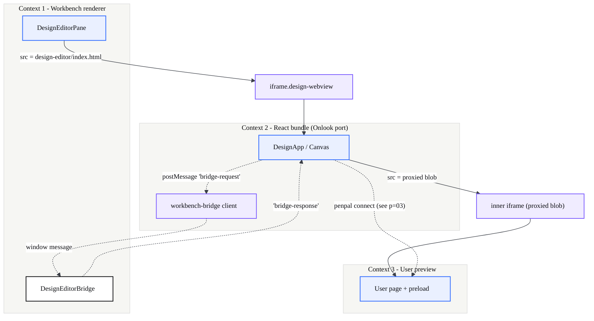
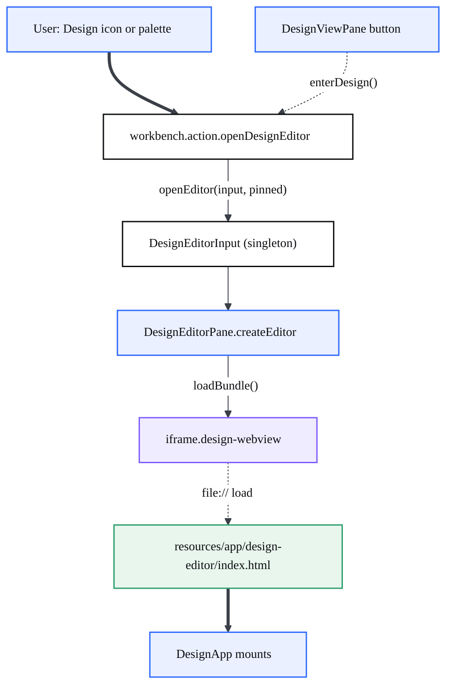
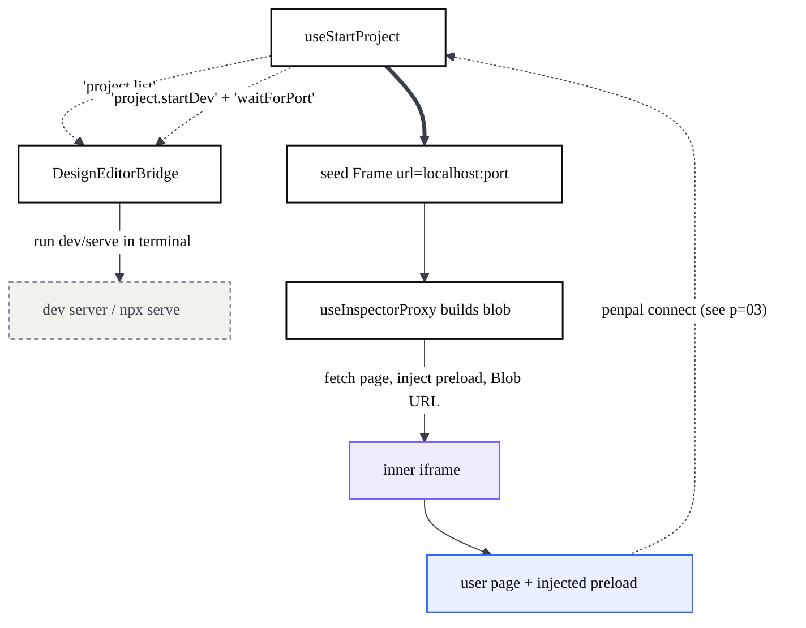
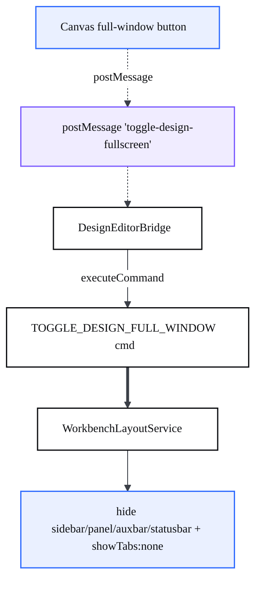
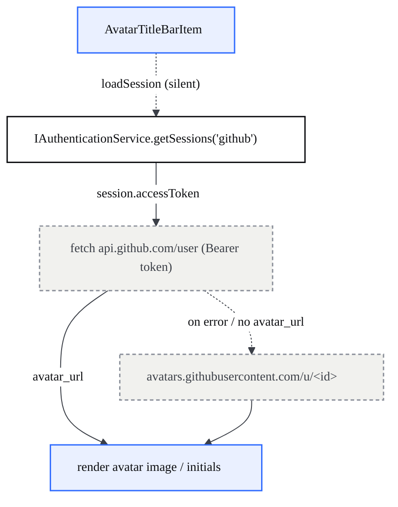
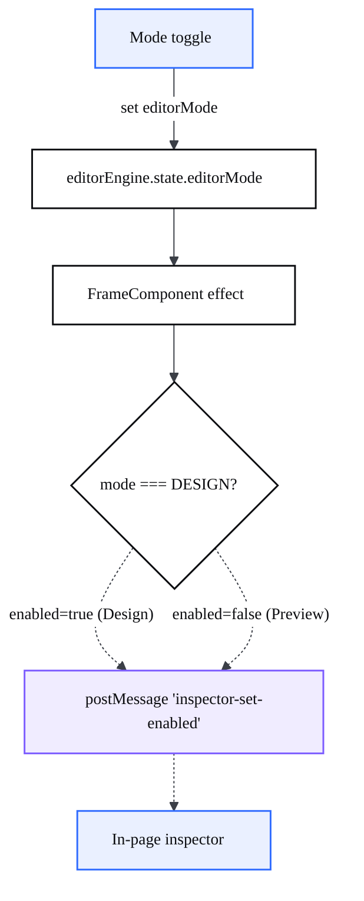

# Design Environment

> The shell that turns CodeCanvas into a visual canvas: a command opens a clean, chrome-free environment whose editor pane hosts a nested iframe stack — a React/Vite bundle (ported from Onlook) that in turn hosts a live iframe of the user's own page.

## At a glance

- **Design is an editor, not a sidebar.** Entering Design opens a singleton `DesignEditorInput` as a normal editor tab; the pane fills itself with one iframe and nothing else. An optional **full-window mode** hides the surrounding workbench chrome so the canvas is the whole window — this is the product differentiator (the future canvas), not a side column.
- **Three nested browsing contexts.** Context 1 is the workbench renderer (the `DesignEditorPane`). It loads context 2, the **Onlook-derived React bundle**, into an iframe. The bundle loads context 3, the **user's page**, into a second, inner iframe.
- **Two RPC boundaries.** Bundle ↔ workbench goes through `DesignEditorBridge` (`postMessage` request/response). Bundle ↔ user page goes through penpal (covered by [visual editing](?p=03-visual-editing-writeback)).
- **The bundle is built and shipped, not bundled at runtime.** `design-editor-src/` is a separate Vite project; `vite build` emits to `resources/app/design-editor/`, which the pane loads by a `vscode-file://` URL (`FileAccess.asBrowserUri`).
- **Modes gate behavior.** `Design` enables the in-page inspector (selectable, editable); `Preview` disables it so the iframe is the real, untouched page; `Pan` is canvas panning.
- This page documents the **container**. The visual-editing internals (penpal child, write-back, Moveable) live in [visual editing](?p=03-visual-editing-writeback); the separate native `codecanvasPreview` live-preview surface lives in [preview features](?p=05-codecanvas-preview); the process model is in [architecture](?p=01-architecture).

| File | Responsibility |
| --- | --- |
| `src/vs/workbench/contrib/codecanvasPreview/browser/designView.ts` | Registers the Design editor pane, the open command, and the activity-bar Design view container. |
| `src/vs/workbench/contrib/codecanvasPreview/browser/designEditorInput.ts` | Singleton editor input (`codecanvas-design://design_page`). |
| `src/vs/workbench/contrib/codecanvasPreview/browser/designEditorPane.ts` | The pane: builds the outer iframe and loads the shipped bundle. |
| `src/vs/workbench/contrib/codecanvasPreview/browser/designBridge.ts` | RPC bridge between the bundle iframe and workbench services (fs, projects, terminal, chat). |
| `src/vs/workbench/contrib/codecanvasPreview/browser/designFullWindowMode.ts` | Full-window layout toggle (hide chrome, hide tabs). |
| `design-editor-src/` | The Vite/React bundle (Onlook port): `index.html`, `vite.config.ts`, `src/main.tsx`, `src/DesignApp.tsx`. |
| `resources/app/design-editor/` | Build output the pane actually loads (`index.html`, `assets/`, `onlook-preload-script.js`). |

## Architecture

The Design environment is a stack of three browsing contexts joined by two message bridges. The outer iframe is owned by the workbench; the inner iframe is owned by the bundle. The boundary nodes (purple) are where one world talks to the next.

The pane is deliberately thin: `DesignEditorPane.createEditor` builds a flex container and a single `<iframe class="design-webview">`, then hands the iframe to `DesignEditorBridge` and calls `loadBundle()` (`designEditorPane.ts:43`). Everything visual happens inside the bundle; the workbench only provides the frame, the file system, and the dev-server terminals.

## How it works

### Entering Design

Two entry points converge on the same command, `workbench.action.openDesignEditor` (`designView.ts:40`). The command-palette action and the activity-bar **Design** view container both open the singleton `DesignEditorInput` as a pinned editor. The sidebar `DesignViewPane` shows project-analysis cards and an explicit "Open Design editor" button (`designView.ts:279`); it intentionally no longer force-opens the editor on visibility (`designView.ts:120`), so the user is always the one who enters Design.

`loadBundle()` (`designEditorPane.ts:66`) resolves the shipped bundle with `FileAccess.asBrowserUri(...)`, then `.with({ query: 'v=<timestamp>&locale=<locale>' })` appends a cache-buster and the `codecanvas.language` locale. The resource path it passes differs by build, branched on `environmentService.isBuilt` (`designEditorPane.ts:76-80`): a **dev** run resolves `vs/../../resources/app/design-editor/index.html` (the bundle sits under `resources/app/` next to the repo `out`), while a **packaged** build resolves `vs/../../design-editor/index.html` — because the app root already *is* `resources/app`, so the bundle lands directly beside the packaged `out`. Both paths use `vs/../../` to escape the file root (which ends in `/out/`). `FileAccess.asBrowserUri` rewrites the `file:` path to a **`vscode-file://`** URI in the native renderer (`network.ts:305-326`); that scheme carries an authority so chromium can use it as a loading/network origin, which is also why the bundle is a cross-origin caller against any localhost dev server (see the `--cors` gotcha). The input is a singleton: `DesignEditorInput.matches` returns true for any other instance (`designEditorInput.ts:44`), so re-running the command focuses the existing tab instead of opening a second one.

### Hosting the user's preview (the nested stack)

Once the bundle mounts (`main.tsx` → `DesignApp` → `Canvas` → `Frames` → `FrameComponent`), it has to discover what to show. It asks the workbench over the bridge, starts the project's server, then mounts the inner iframe against a **proxied** copy of the page.

`useStartProject` calls `workbench.listProjects()` (bridge `project.list`), filters runnable apps, and either opens the only one or shows a picker (`use-start-project.tsx:99`). Choosing an app runs `project.startDev` + `waitForPort` and seeds a `Frame` with `url: http://localhost:<port>/` (`use-start-project.tsx:81`). `FrameComponent` never loads that raw URL: `useInspectorProxy` fetches the HTML, injects the Onlook preload module plus a click-to-source inspector, and returns a `blob:` URL; the iframe's `src` is that blob (`view.tsx:483`). Only when the proxied blob is loaded does penpal connect to the preload child — the mechanics of that handshake are [visual editing](?p=03-visual-editing-writeback).

### Full-window mode

The Design editor is a normal tab by default; full-window is opt-in, toggled from a button inside the canvas. The iframe posts `codecanvas:toggle-design-fullscreen`; the bridge runs the toggle command, which hides the surrounding parts and the editor tabs to leave only the canvas (plus title bar and activity bar).

`HIDDEN_PARTS` is the sidebar, panel, auxiliary bar, and status bar (`designFullWindowMode.ts:21`); `enter()` records prior visibility and enforces `showTabs:'none'` on the main editor group (`designFullWindowMode.ts:84`). The mode auto-exits when the active editor is no longer Design, and restores the layout on shutdown, so a hidden-chrome layout is never persisted onto a non-Design tab (`designFullWindowMode.ts:47`).

### Title-bar controls and account

> `CodeCanvasTitleBarContribution` reshapes the workbench title bar: it strips a few vanilla VS Code chrome elements via default-config overrides and replaces the Accounts entry point with a GitHub-backed avatar that reaches out to the GitHub API.

The contribution lives beside the Design pane (`titleBarDeviceControl.ts`). On load it registers **default** configuration overrides (defaults only — no command or behavior is removed) that hide vanilla title-bar chrome the CodeCanvas design does not use (`titleBarDeviceControl.ts:44-51`):

| Override | Value | Effect |
| --- | --- | --- |
| `chat.titleBar.signIn.enabled` | `false` | Hides the Copilot sign-in indicator in the title bar. |
| `chat.titleBar.openInAgentsWindow.enabled` | `false` | Hides the "open in agents window" title-bar control. |
| `chat.agentsControl.enabled` | `'hidden'` | Hides the agents control. |
| `window.menuBarVisibility` | `'compact'` | Collapses the classic menu bar into a compact menu. |

Because the title-bar avatar becomes the single account entry point, the contribution also hides the default **Accounts** item at the bottom of the activity bar by storing `workbench.activity.showAccounts = false` (`titleBarDeviceControl.ts:299`). The command center (search) is intentionally left enabled.

`AvatarTitleBarItem` resolves its image from the **native GitHub session** — the same account VS Code/Copilot use. It calls `authService.getSessions('github', [], { silent: true })` and reloads whenever GitHub sessions change (`titleBarDeviceControl.ts:148-152`, `titleBarDeviceControl.ts:158`). To get the authoritative avatar it makes a network request to `https://api.github.com/user` with the session token as a `Bearer` header (`Accept: application/vnd.github+json`) and reads `avatar_url` from the JSON (`titleBarDeviceControl.ts:176-184`); if that call fails it falls back to the id-based `https://avatars.githubusercontent.com/u/<id>` URL, and if there is no session it renders a generic account icon (`titleBarDeviceControl.ts:188-190`). This `api.github.com` call is the title bar's only network egress. Clicking the avatar opens the **native Accounts menu** (`MenuId.AccountsContext`), with a "View profile photo" entry added on top when a photo is available (`titleBarDeviceControl.ts:211-240`). The auth model behind this session (and the rest of CodeCanvas's per-agent identity) is documented in [security & permissions](?p=11-security-permissions).

### Design vs Preview modes

Mode lives on `editorEngine.state.editorMode` (`EditorMode` enum: `design`/`code`/`preview`/`pan`, `packages/models/src/editor/index.ts:7`). CodeCanvas exposes only **Design** and **Preview** in the toggle (`mode-toggle.tsx:13`); `code` is removed (the workbench has its own editor) and the canvas coerces a stray `CODE` back to `DESIGN`. The mode gates the in-page inspector: `FrameComponent` posts `codecanvas:inspector-set-enabled` to the inner iframe whenever the mode changes and when the inspector first reports ready.

In Preview the inspector disables its outline, label, and click-capture so the iframe behaves as the real page; in Design it re-enables selection and editing (`view.tsx:405` and `view.tsx:421`). The fix exists because the inspector overlay used to persist into Preview.

### Build and ship pipeline

`design-editor-src/` is an independent project, not part of the gulp/`tsc` workbench build. It is built with Vite and the output is committed/shipped under `resources/app/design-editor/`, which the pane then loads by file URL.

```mermaid
%%{init: {'theme':'base','themeVariables':{'fontFamily':'Space Grotesk, Segoe UI, sans-serif','fontSize':'14px','primaryColor':'#ffffff','primaryTextColor':'#0c0d10','primaryBorderColor':'#0c0d10','lineColor':'#3b3f47','tertiaryColor':'#f6f6f3'}}}%%
flowchart LR
  SRC["design-editor-src (Vite/React)"]:::core
  VITE["vite build"]:::core
  OUT["resources/app/design-editor"]:::data
  ASSETS["index.html + assets + onlook-preload-script.js"]:::data
  COMPILE["npm run compile-client"]:::core
  PANE["DesignEditorPane.loadBundle"]:::ui
  IF["iframe.design-webview"]:::bridge

  SRC -->|"npm run build"| VITE
  VITE -->|"outDir + emptyOutDir"| OUT
  OUT --> ASSETS
  SRC -.-> COMPILE
  PANE -->|"FileAccess.asBrowserUri"| ASSETS
  ASSETS -.->|"src + ?v= cache-bust"| IF

  classDef ui fill:#eaf0ff,stroke:#2f6bff,stroke-width:1.5px,color:#0c0d10;
  classDef core fill:#ffffff,stroke:#0c0d10,stroke-width:1.5px,color:#0c0d10;
  classDef ai fill:#fdf0e6,stroke:#e8833a,stroke-width:1.5px,color:#0c0d10;
  classDef data fill:#e8f6ee,stroke:#2f9e6b,stroke-width:1.5px,color:#0c0d10;
  classDef ext fill:#f1f1ee,stroke:#8b909a,stroke-width:1.5px,stroke-dasharray:4 3,color:#3b3f47;
  classDef bridge fill:#f0ecff,stroke:#7c5cff,stroke-width:1.5px,color:#0c0d10;
```

`vite.config.ts` sets `build.outDir: '../resources/app/design-editor'` with `emptyOutDir` and `base: './'` (relative paths so the bundle loads from `file://`). A large `resolve.alias` table maps the vendored `@onlook/*` packages into `packages/` and **stubs out every cloud dependency** (db, git, stripe, ai, codesandbox, tRPC) so Design is 100% local (`vite.config.ts:46`). After `vite build`, rebuilding the workbench (`compile-client`) is what surfaces the new bundle to a running app.

## Key modules

| File | Responsibility |
| --- | --- |
| `designView.ts` | Open command `workbench.action.openDesignEditor`, editor-pane registration, sidebar Design view container + project-analysis cards. |
| `designEditorInput.ts` | Singleton `DesignEditorInput` with resource `codecanvas-design://design_page`. |
| `designEditorPane.ts` | Builds `iframe.design-webview`, loads the shipped bundle, owns the bridge. |
| `designBridge.ts` | `codecanvas:bridge-request` dispatcher: `project.*`, `fs.*`, `workbench.chat.openWithContext`, full-window toggle, click-to-source; restricts fs to the workspace. |
| `designFullWindowMode.ts` | `TOGGLE_DESIGN_FULL_WINDOW` command, hides chrome + tabs, auto-exit/restore. |
| `titleBarDeviceControl.ts` | Title-bar pills (View Preview/History/Share), chrome-override defaults, and the GitHub-backed account avatar (`api.github.com/user` fetch, native Accounts menu). |
| `design-editor-src/vite.config.ts` | Build output target, `@onlook/*` aliases, cloud-module stubs. |
| `design-editor-src/src/DesignApp.tsx` | Bundle root: `EditorEngineProvider` + `EditorLayout` (Canvas, TopBar, LeftPanel, BottomBar). |
| `design-editor-src/src/hooks/use-start-project.tsx` | Discovers the app via the bridge, starts its server, seeds the canvas frame. |
| `design-editor-src/src/components/canvas/frame/view.tsx` | The inner user-preview iframe + penpal connection + mode gating. |
| `design-editor-src/src/components/canvas/frame/use-inspector-proxy.ts` | Builds the proxied blob (inject preload + inspector) the inner iframe loads. |

## Extension points / reuse

- **Add a bridge capability** by extending the `dispatch` switch in `designBridge.ts:153` and adding a matching client call in `design-editor-src/src/lib/workbench-bridge.ts`. All traffic already validates `e.source === iframe.contentWindow` and confines paths to the workspace, so new methods inherit the security boundary.
- **Drive Design programmatically** via `workbench.action.openDesignEditor` (open) and `workbench.action.codecanvasToggleDesignFullWindow` (full-window).
- **Add a mode** by extending `EditorMode` and the toggle in `mode-toggle.tsx`; gate iframe behavior by posting a new `codecanvas:*` message in `view.tsx`.
- **Reuse the bundle standalone** with `npm run dev` in `design-editor-src/`; `isEmbeddedInWorkbench()` is false there, so it renders an empty canvas and the theme sync is a no-op — useful for UI work without rebuilding the workbench. See also [reusable code](?p=08-reusable-code).

## Gotchas

- **Bundle path escapes the file root, and differs by build.** The bundle lives next to `out`, so the pane resolves `vs/../../resources/app/design-editor/index.html` in dev but `vs/../../design-editor/index.html` in a packaged build (the app root already *is* `resources/app`), branched on `environmentService.isBuilt` (`designEditorPane.ts:76-80`). The `?v=<timestamp>` query is mandatory or a stale build is cached (`designEditorPane.ts:66`).
- **Never load the raw page in the inner iframe.** The iframe must only load the proxied blob (`status:'ready'`); loading `frame.url` directly means no penpal child and a permanent "view-only" canvas — the explicit proxy state machine exists to prevent exactly that (`use-inspector-proxy.ts:33`).
- **Charset must be on the blob's content-type.** The ~475 KB preload module injected after `<head>` pushes the page's own `<meta charset>` past the browser's 1024-byte pre-scan, so the blob is created as `text/html;charset=utf-8` or the page renders mojibake (`use-inspector-proxy.ts:193`).
- **The bundle is trusted; the user page is not.** The bridge only accepts messages whose `e.source` is the bundle iframe, and `resolveWorkspacePath` rejects paths outside the workspace folders, so a malicious preview page cannot drive the workbench or read arbitrary files (`designBridge.ts:113`, `designBridge.ts:338`).
- **Design suppresses its own write echoes.** Files Design writes are stamped for ~1.5 s so their `onDidFilesChange` events do not bounce back to the iframe as external changes and reload the very frame just patched (`designBridge.ts:88`).
- **Static folders need `--cors`.** Static HTML apps are served with `npx serve --cors` so the bundle (a `vscode-file://` origin) can fetch the HTML to build the proxy; without it the cross-origin fetch fails and the canvas is stuck view-only (`designBridge.ts:262`).
- **Full-window only restores parts it hid.** `enter()` snapshots prior visibility; `exit()` re-shows only those, and shutdown forces an exit so a hidden layout is never persisted (`designFullWindowMode.ts:73`).
- **`COMPILAR.md` paths are stale.** It still references the old `src/vs/codecanvas/.../onlook-ui` location; the project is now `design-editor-src/`. Trust `vite.config.ts` for the real output path.
- **Node-globals shim.** `index.html` defines `window.global`/`window.process` because several vendored packages read Node globals at runtime even in the browser (`index.html:7`).
