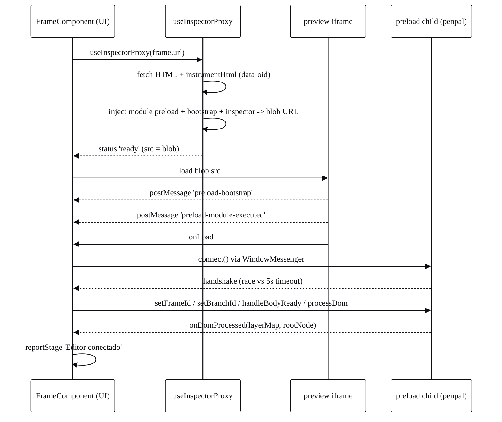
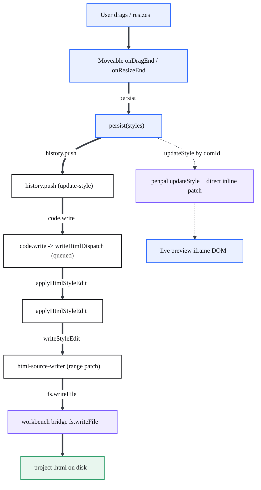
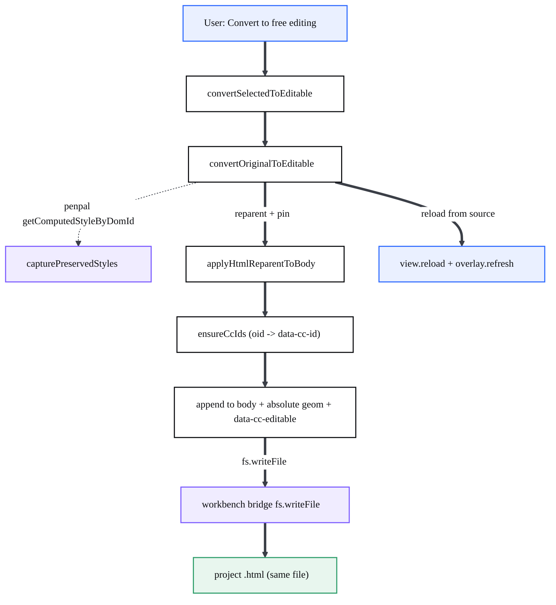
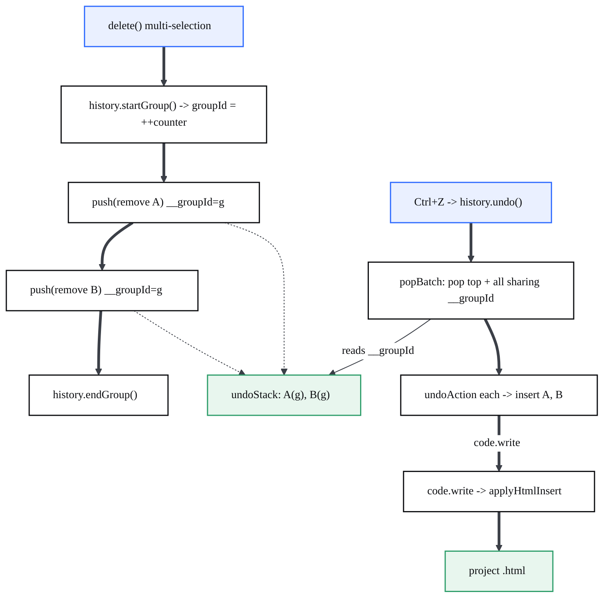
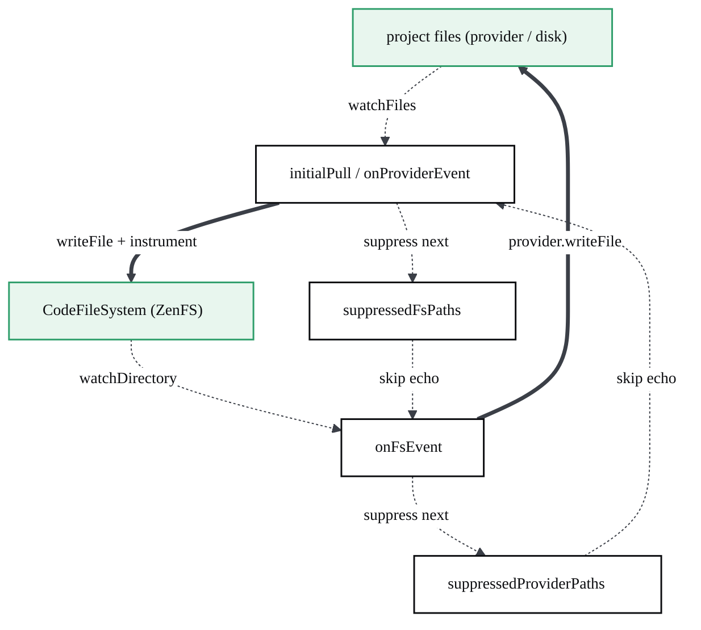

# Visual editing & write-back

> The bidirectional editor: it turns canvas gestures (drag, resize, delete, retype, convert) into real edits in the project's `.html` source, then re-derives the live preview from that source — code stays the single source of truth.

## At a glance

- The visual editor lives in the [Design environment](?p=02-design-environment) as a React bundle (Onlook fork) rendered inside a nested iframe. To make the user's page *editable* it injects a **penpal child** (the preload bundle) into the preview iframe. Without that child the handshake times out and the page is view-only.
- Selection and every edit are keyed by **identity** — a durable `data-cc-id` (the `oid`), with a positional index only as a legacy fallback — **never by screen coordinates**.
- Move/resize is a thin **Moveable** layer over a proxy `<div>`; it only attaches to `position:absolute|fixed` elements that CodeCanvas created or the user converted. It is not GrapesJS and not a second editor.
- Edits persist to the **same `.html` file** through `html-writeback.ts` (format-preserving range patch first, DOMParser + `outerHTML` fallback). This is what makes the editor bidirectional — upstream Onlook only persisted JSX/oid.
- A local **sync-engine** mirrors disk and the in-browser filesystem and instruments JSX with `data-oid`; for static HTML the instrumentation happens at proxy-build time instead.
- **History/undo** is the only safety net (the old checkpoint system was removed). `Ctrl+Z` reverses one action; a multi-delete is one **atomic** undo via a `__groupId` tag in the `HistoryManager`.

| File | Responsibility |
| --- | --- |
| `design-editor-src/src/lib/html-writeback.ts` | The write-back API: applies style/attr/text/insert/remove/move/group/reparent edits to the real `.html`. |
| `design-editor-src/src/lib/html-source-writer.ts` | Format-preserving range writer (parse5 + magic-string); the primary write path. |
| `design-editor-src/src/components/canvas/frame/use-inspector-proxy.ts` | Builds the proxied page: instruments `data-oid`, injects the penpal child + inspector, returns a blob URL. |
| `design-editor-src/src/components/canvas/frame/view.tsx` | The penpal **parent**: `WindowMessenger` + `connect()` handshake, promisified remote methods. |
| `design-editor-src/packages/penpal/src/{parent,child}.ts` | The penpal message contracts (`PenpalParentMethods`, `PenpalChildMethods`, channels). |
| `design-editor-src/src/components/canvas/overlay/moveable-selection-layer.tsx` | Move/resize gestures over a proxy div; persists via `update-style` then live-patches the iframe. |
| `design-editor-src/src/components/store/editor/code/index.ts` | Routes each `Action` to the HTML write-back (serialized) or the JSX request pipeline. |
| `design-editor-src/src/components/store/editor/element/index.ts` | Selection, convert-to-free-editing, z-order, atomic multi-delete. |
| `design-editor-src/src/components/store/editor/history/index.ts` | `HistoryManager`: undo/redo stacks, transactions, atomic groups (`__groupId`). |
| `design-editor-src/src/services/sync-engine/sync-engine.ts` | `CodeProviderSync`: disk ⇄ in-browser `CodeFileSystem`, with echo-loop suppression. |
| `src/vs/workbench/contrib/codecanvasPreview/common/EdicionVisual/diffEngine.ts` | Workbench-side helper: unified diff + CSS-rule patch + timestamped backup (see [preview](?p=05-codecanvas-preview)). |

## Architecture

Two worlds talk through one wire. The **canvas** (parent document) hosts the editor UI and the Moveable layer; the **preview iframe** hosts the user's real page plus the injected penpal child. The **penpal bridge** is how the parent reads and mutates the live DOM; the **write-back core** is how those mutations become bytes in the `.html`. The file — not the live DOM — is authoritative, so structural edits reload the frame from source.

```mermaid
%%{init: {'theme':'base','themeVariables':{'fontFamily':'Space Grotesk, Segoe UI, sans-serif','fontSize':'14px','primaryColor':'#ffffff','primaryTextColor':'#0c0d10','primaryBorderColor':'#0c0d10','lineColor':'#3b3f47','tertiaryColor':'#f6f6f3'}}}%%
flowchart TD
  Canvas["Design canvas / FrameComponent"]:::ui
  Moveable["Moveable layer"]:::ui
  Inspector["Injected inspector"]:::ui
  PParent["penpal parent"]:::bridge
  PChild["penpal child (preload)"]:::bridge
  Engine["EditorEngine: action/history/code/style/elements"]:::core
  WB["html-writeback"]:::core
  Range["html-source-writer (range)"]:::core
  Sync["sync-engine"]:::core
  Wbridge["workbench bridge (fs.*)"]:::bridge
  HTML["project .html on disk"]:::data
  ZenFS["CodeFileSystem (ZenFS)"]:::data

  Canvas -->|connect()| PParent
  PParent -.->|RPC: processDom / updateStyle| PChild
  PChild -.->|onDomProcessed| Engine
  Moveable -->|history.push| Engine
  Engine -->|code.write| WB
  WB -->|writeStyleEdit| Range
  WB -->|fs.writeFile| Wbridge
  Wbridge --> HTML
  Sync -.->|watch / pull / push| HTML
  Sync -.->|writeFile| ZenFS
  Inspector -.->|postMessage 'inspector-click'| Canvas

  classDef ui fill:#eaf0ff,stroke:#2f6bff,stroke-width:1.5px,color:#0c0d10;
  classDef core fill:#ffffff,stroke:#0c0d10,stroke-width:1.5px,color:#0c0d10;
  classDef ai fill:#fdf0e6,stroke:#e8833a,stroke-width:1.5px,color:#0c0d10;
  classDef data fill:#e8f6ee,stroke:#2f9e6b,stroke-width:1.5px,color:#0c0d10;
  classDef ext fill:#f1f1ee,stroke:#8b909a,stroke-width:1.5px,stroke-dasharray:4 3,color:#3b3f47;
  classDef bridge fill:#f0ecff,stroke:#7c5cff,stroke-width:1.5px,color:#0c0d10;
```

Two distinct message systems run side by side:

- **penpal RPC** — the typed editing bridge. The parent calls ~40 child methods (`processDom`, `getElementAtLoc`, `updateStyle`, `insertElement`, `removeElement`, `moveElement`, `groupElements`, `getComputedStyleByDomId`, `getActionElement`, `getRemoveAction`, `captureScreenshot`, …); the child calls back into `PenpalParentMethods` (`getFrameId`, `getBranchId`, `onWindowMutated`, `onWindowResized`, `onDomProcessed`). Channels are `PENPAL_PARENT` / `PENPAL_CHILD` (`design-editor-src/packages/penpal/src/parent.ts:21`, `child.ts:12`).
- **raw `window.postMessage`** — diagnostics and click-to-source, separate from penpal: `codecanvas:preload-bootstrap`, `codecanvas:preload-module-executed`, `codecanvas:preload-error`, `codecanvas:inspector-ready`, `codecanvas:inspector-set-enabled` (parent → iframe), `codecanvas:inspector-click` (iframe → parent), re-emitted to the workbench as `codecanvas:open-source` (`design-editor-src/src/hooks/use-inspector-bridge.ts:18`).

## How it works

### 1. The penpal handshake (making the page editable)

`useInspectorProxy` fetches the page's real HTML, instruments each editable element with `data-oid`, injects the preload bundle (penpal child) as a **module** plus a classic bootstrap and the click-to-source inspector, and hands back a blob URL. The iframe loads only that blob; `onLoad` triggers `setupPenpalConnection`, which races the connection against a 5 s timeout. On success the parent primes the child and asks it to map the DOM.



Key refs: `use-inspector-proxy.ts:110` (`useInspectorProxy`), `:14` (`instrumentHtml`), `:39` (`InspectorProxyState`); `view.tsx:139` (`setupPenpalConnection`), `:158` (`WindowMessenger`), `:198` (`Promise.race`).

### 2. A visual edit round-trip (drag → `.html` on disk)

When a drag ends, the Moveable layer builds an `update-style` action and **persists to the file first**, then live-patches the iframe so there is no reload flicker. Persisting first matters: a following insert reads the source, so the file must already be the committed state. Re-selection after the edit is always by identity, never by `clickRects[0]`.



The same `code.write` entry point serves both gestures and the editor-bar style controls: controls call `style.updateMultiple()` → `action.run()` → `history.push()` → `code.write()` (`action/index.ts:25`, `style/index.ts:56`). For HTML projects `code.write` dispatches to the write-back; for JSX projects it falls through to the request/diff pipeline (`code/index.ts:190`).

#### The write-back API (`html-writeback.ts`)

Every function targets a page file (resolved from the frame URL by `pageFileForPathname`) and an `oid`. The `oid` resolves to a durable `data-cc-id` first, then a positional index among editable elements. Each returns `HtmlWriteResult` (`{ ok; reason?; changed? }`); `changed: false` is a valid no-op so callers can skip the reload. Full signatures feed the [API reference](?p=09-api-reference).

| Function | Signature (trimmed) | Notes |
| --- | --- | --- |
| `applyHtmlStyleEdit` | `(oid, styleUpdates: Record<string, StyleWriteChange>, pageFile) => Promise<HtmlWriteResult>` | Inline-style edits; `remove`/empty value drops the prop. |
| `applyHtmlAttrEdit` | `(oid, attributes: Record<string, string \| null>, pageFile)` | `null` drops the attribute; skips `data-onlook*`. |
| `applyHtmlTextEdit` | `(oid, newText, pageFile)` | Refuses elements with element children → `reason:'has-children'`. |
| `applyHtmlInsert` | `(spec: InsertSpec, location: ActionLocation, pageFile)` | Mints/keeps `data-cc-id`; falls back to end of `<body>`. |
| `applyHtmlRemove` | `(oid, pageFile)` | Resolves by `data-cc-id`, so index-safe. |
| `applyHtmlMove` | `(oid, location: ActionLocation, pageFile)` | Refuses moving an element into itself/descendant. |
| `applyHtmlReparentToBody` | `(oid, styles: Record<string,string>, pageFile)` | Lifts to `<body>` + stamps `data-cc-editable`; the convert primitive. |
| `applyHtmlGroup` / `applyHtmlUngroup` | `(container, childOids, pageFile)` / `(oid, pageFile)` | Container `data-cc-id` = action oid so undo finds it. |
| `saveAsset` / `assetSrcForPage` | `(fileName, content?, originPath?)` / `(assetRelPath, pageFile)` | Collision-safe save into `/assets`; page-relative `src`. |
| `editableElements` / `ccIdOf` / `pageFileForPathname` | helpers | Shared walk/identity/path resolution. |

### 3. Convert flow → absolute (free editing)

A flow element cannot be dragged. "Convert to free editing" reparents the selected original to `<body>`, pins it `absolute` at its current document position, snapshots inherited typography so it does not restyle off its parent, and stamps the persistent `data-cc-editable` marker. The whole change is written to the **same** `.html`; the frame then reloads from source. Reparenting to `<body>` is deliberate — it puts every freed object in one stacking context so z-order works globally instead of being trapped in a card.



The Moveable gate is driven by three markers (all `data-c*` so the writer preserves them): `data-cc-created="design"` (elements Design inserts), `data-cc-editable="free"` (converted originals), and `data-cc-locked="true"` (pinned-in-place; keeps geometry but releases Moveable). A session-local `Set` of oids lights the gate up immediately after a convert; the source marker is what survives across sessions. Recognition is async via `getActionElement` because `DomElement` carries no arbitrary attributes. Refs: `element/index.ts:237` (`convertSelectedToEditable`), `:300` (`convertOriginalToEditable`), `:183` (`resolveDesignCreated`); markers in `html-writeback.ts:41-52`.

### 4. Atomic multi-delete undo

Delete opens a history **group**: every removed element is pushed with the same `__groupId`, so a single `Ctrl+Z` restores the whole batch. Deletes are resolved up front (phase 1) before any run (phase 2), because running a delete reloads the frame and tears down the penpal view — interleaving would drop everything after the first element.



Undo inverts each action through `undoAction` (a remove becomes an insert that restores the element with its `data-cc-id`, inline geometry and every original attribute preserved via `getCleanedElement`). Untagged actions still undo one at a time. Refs: `history/index.ts:42` (`startGroup`), `:129` (`undo`), `:164` (`popBatch`); `element/index.ts:633` (`delete`), `:655` (`deleteSelected` two-phase); `history/helpers.ts:49` (`undoAction`), `:194` (`getCleanedElement`).

### 5. The sync-engine (disk ⇄ in-browser filesystem)

`CodeProviderSync` keeps the real project on disk and the in-browser `CodeFileSystem` (ZenFS) in step in both directions, replacing Onlook's cloud sync. It instruments JSX with `data-oid` on pull and pushes the instrumented result back so the dev server serves canvas-mappable elements. Echo loops are broken with per-path suppression windows plus content-hash checks. (Static-HTML projects do their instrumentation at proxy-build time and write through the workbench bridge, so this engine is mainly the JSX path.)



Refs: `sync-engine.ts:42` (`CodeProviderSync`), `:113` (`initialPull`), `:198` (`onFsEvent`), `:235` (`onProviderEvent`), `:298-313` (suppression). Window is `SUPPRESS_WINDOW_MS = 2500`.

## Key modules

| File | Responsibility |
| --- | --- |
| `design-editor-src/src/lib/html-writeback.ts` | Public write-back functions; element identity (`data-cc-id`), `editableElements` walk, `ensureCcIds`, asset saving. |
| `design-editor-src/src/lib/html-source-writer.ts` | parse5 + magic-string range patches (`writeStyleEdit`, `writeInsert`, `writeMove`, …); returns `null` to fall back. |
| `design-editor-src/src/components/canvas/frame/use-inspector-proxy.ts` | `instrumentHtml`, preload/inspector injection, blob proxy state machine. |
| `design-editor-src/src/components/canvas/frame/view.tsx` | penpal parent: handshake, timeout race, `createSafeFallbackMethods`, promisified remote surface. |
| `design-editor-src/packages/penpal/src/parent.ts` / `child.ts` | `PenpalParentMethods`, `PenpalChildMethods`, `PENPAL_PARENT` / `PENPAL_CHILD`. |
| `design-editor-src/src/lib/inspector-script.ts` | Vanilla click-to-source inspector injected into the iframe (React fiber `_debugSource` → `inspector-click`). |
| `design-editor-src/src/hooks/use-inspector-bridge.ts` | Re-emits `inspector-click` up to the workbench as `open-source`. |
| `design-editor-src/src/components/canvas/overlay/moveable-selection-layer.tsx` | Proxy-div Moveable, direct same-origin inline patch, geometry verify + reload safety net. |
| `design-editor-src/src/components/store/editor/code/index.ts` | `CodeManager.write` / `writeHtmlDispatch`; serialized HTML write queue. |
| `design-editor-src/src/components/store/editor/action/index.ts` | `ActionManager.run/undo/redo`; live DOM dispatch via penpal. |
| `design-editor-src/src/components/store/editor/element/index.ts` | `ElementsManager`: selection, convert/lock, z-order, two-phase delete. |
| `design-editor-src/src/components/store/editor/history/index.ts` + `helpers.ts` | `HistoryManager`, `__groupId` batches, action inversion. |
| `design-editor-src/src/components/store/editor/style/index.ts` | `StyleManager.updateMultiple`; builds `update-style` actions. |
| `design-editor-src/src/services/sync-engine/sync-engine.ts` | `CodeProviderSync` bidirectional file sync. |
| `src/vs/workbench/contrib/codecanvasPreview/common/EdicionVisual/diffEngine.ts` | `generateDiff` (selector → CSS rule patch + unified diff) and `createBackup`; workbench-side helper for DOM deltas — see [preview internals](?p=05-codecanvas-preview). |

## Extension points / reuse

- **Static-HTML persistence** — the `html-writeback.ts` functions are self-contained (a page file + an `oid` + a payload). Any feature that needs to mutate user HTML should call them rather than touching the DOM, so the file stays authoritative.
- **Atomic batches** — wrap any sequence of actions in `history.startGroup()` / `endGroup()` to make them one undo step; the mechanism is action-type agnostic.
- **The penpal child surface** — `PenpalChildMethods` is the full RPC API for reading and mutating an instrumented iframe (hit-testing, computed styles, layer tree, screenshots). New canvas tools should add a method here rather than reaching into the iframe directly.
- **`useInspectorProxy`** — reusable recipe to instrument and inject into any same-origin iframe (data-oid + module preload + charset-safe blob).
- **`saveAsset` / `assetSrcForPage`** — collision-safe asset import + page-relative `src` rewriting for drops/swaps.
- **The Moveable proxy pattern** — proxy `<div>` + identity reselect + direct inline patch is a template for any absolute-element gesture layer without a reload.

## Gotchas

- **Load the proxy blob, never the raw URL.** The iframe must only ever load `proxy.src` at status `'ready'`. The raw `frame.url` has no penpal child, so the editor can never connect — that was the source of the permanent "view-only" state (`use-inspector-proxy.ts:33`, `view.tsx:492`).
- **The preload must be a `<script type="module">`.** It ends with `export { … }`; inside a classic `<script>` that is a `SyntaxError` and the whole bundle silently fails, leaving penpal unconnected (`use-inspector-proxy.ts:44`, `:156`).
- **Declare charset on the blob.** The ~475 KB preload pushes the page's `<meta charset>` past the browser's 1024-byte encoding pre-scan, so without `type:'text/html;charset=utf-8'` the page renders mojibake (`use-inspector-proxy.ts:193`).
- **Reselect by identity, never coordinates.** Moveable matches the click rect whose `id === el.domId`; using `clickRects[0]` mounted the control box on the wrong element during the async gap after selection (`moveable-selection-layer.tsx:116`). After any persist, re-selection is by `domId`/`oid`.
- **React must not own the Moveable proxy geometry.** Moveable writes `left/top/width/height/transform` straight onto its target; if React also drove them they fought — clearing on gesture end collapsed the proxy to a point (`moveable-selection-layer.tsx:8`).
- **Inline geometry needs a direct patch.** Onlook's `view.updateStyle` applies via a generated stylesheet rule, which cannot override the **inline** geometry on inserted media/text — so the element never moved and every gesture fell back to a full reload (the flicker). The same-origin iframe lets us set `element.style.*` directly (`moveable-selection-layer.tsx:351`).
- **Write the file before live-patching.** Persist to the source first; otherwise a following insert reads stale HTML and the page appears to revert to an older state (`moveable-selection-layer.tsx:310`).
- **Serialize HTML writes.** All HTML write-back runs through one queue — two read-modify-write patches racing the same file would let the later write erase the earlier move (`code/index.ts:67`).
- **Never let original flow content become movable.** The Moveable gate only opens for Design-created or converted elements; a corrupt op leaving flow content `absolute` must not enable dragging, or its layout breaks (`moveable-selection-layer.tsx:128`).
- **`oid` is durable, the index is not.** Positional indices drift on insert/move/delete, so the first edit of any kind calls `ensureCcIds` to migrate the page to durable `data-cc-id`s; resolution always tries the id before the index (`html-writeback.ts:84`, `:163`).
- **Text edits refuse mixed content.** Replacing `textContent` on an element with child elements would delete inner markup (icons, spans), so the write-back returns `reason:'has-children'` and the UI shows a non-destructive notice (`html-writeback.ts:303`).
- **"destroyed connection" rejections are expected.** A write-back reloads the frame and tears down penpal; calls already in flight reject with that message and are intentionally not logged as errors (`view.tsx:262`).
