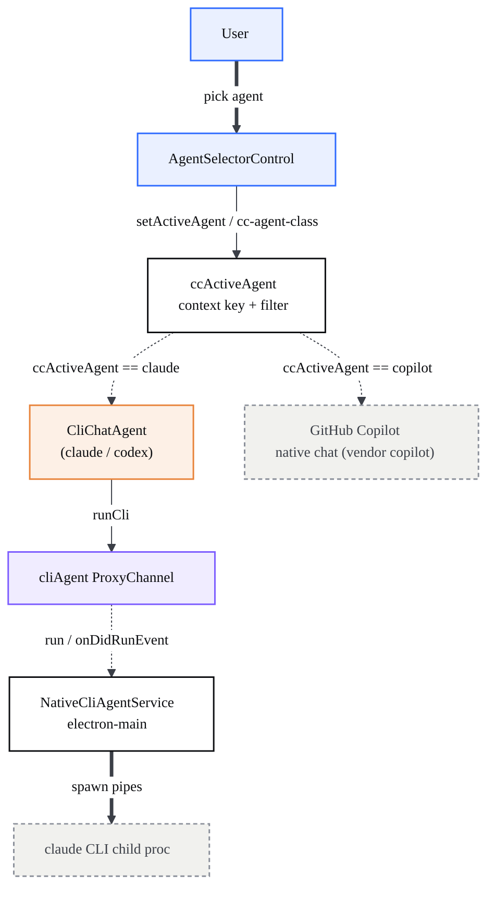
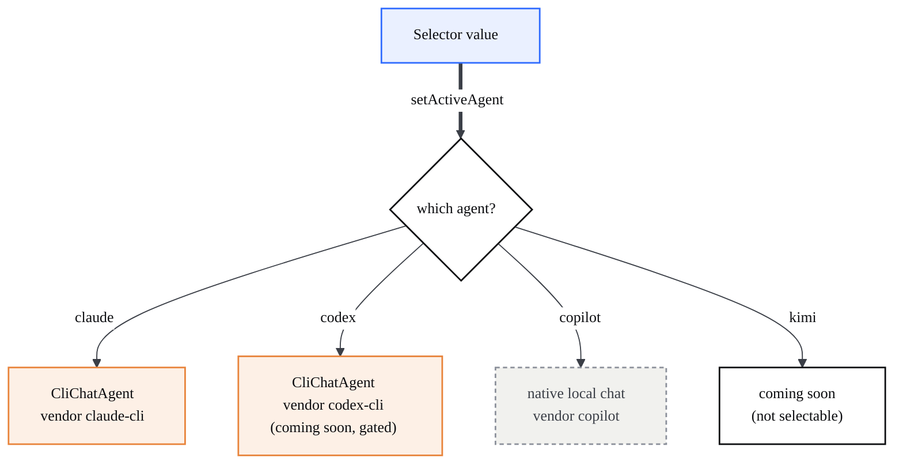
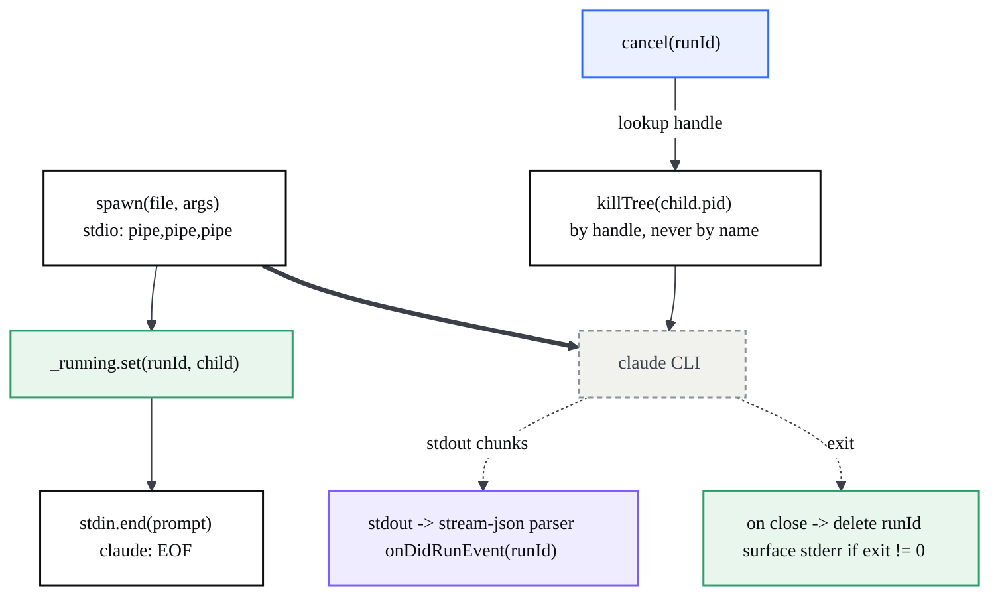

# Multi-agent AI chat

> The Design chat panel where you pick an AI agent (Claude / Kimi / Codex / Copilot) and each agent routes to its own backend — Claude to the Claude Code CLI over a piped child process, Copilot to VS Code's native local chat.

## At a glance

- The chat panel is a normal VS Code chat view (`chatViewPane.ts`) with a CodeCanvas **agent selector** bolted on top. Picking an agent themes the whole panel in that agent's color (Claude orange, Codex gray, Copilot blue, Kimi purple).
- Selection is **routing**, not cosmetics. Each agent answers through a different backend; the selector value decides which.
- **Claude** is served by its CLI, spawned as a `child_process` pipe from the **electron-main** process and reached over the `cliAgent` ProxyChannel. The CLI is the agent — it runs its own tools. Codex shares this exact backend shape (`cliModelsContribution.ts:72`) but its selector entry is gated off (see below).
- **Copilot** is a native local path: the bundled GitHub Copilot extension's own models (vendor `copilot`) authenticated through `IDefaultAccountService`. No process is spawned.
- **Kimi and Codex** are shown but flagged `comingSoon` (`agentSelectorControl.ts:26-27`), so `select` ignores them and they cannot be picked (`agentSelectorControl.ts:171`). Codex already has a CLI backend descriptor wired (`cliModelsContribution.ts:72`); Kimi has none yet.
- The agent is never a PTY. A TTY makes `claude` think it is interactive, ignore `-p`, and hang; plain pipes keep it one-shot. Processes are killed **by handle, never by name**.

| File | Responsibility |
| --- | --- |
| `src/vs/workbench/contrib/chat/browser/widgetHosts/viewPane/agentSelectorControl.ts` | The selector UI: agent list, dropdown, per-agent theming. |
| `src/vs/workbench/contrib/chat/browser/widgetHosts/viewPane/chatViewPane.ts` | Hosts the selector; wires agent change to a fresh local session + auth. |
| `src/vs/workbench/contrib/chat/browser/cliProviders/ccActiveAgent.ts` | The router: active-agent state + per-agent model-vendor filter. |
| `src/vs/workbench/contrib/chat/browser/cliProviders/cliChatAgent.ts` | The chat agent that answers in the panel via the CLI; gated by `ccActiveAgent`. |
| `src/vs/workbench/contrib/chat/browser/cliProviders/cliModelsContribution.ts` | Registers CLI vendors (Claude/Codex) as models + agents; the `CLI_MODELS` table. |
| `src/vs/workbench/contrib/chat/browser/cliProviders/cliProcess.ts` | `runCli` — thin renderer client over the `cliAgent` channel, dispatch by run id. |
| `src/vs/platform/cliAgent/common/cliAgent.ts` | `ICliAgentService` contract + the "pipes not PTY" rationale. |
| `src/vs/platform/cliAgent/electron-main/cliAgentMainService.ts` | The spawn: pipes, stream-json parsing, kill-by-handle, PATH-independent resolve. |
| `src/vs/workbench/contrib/chat/browser/widgetHosts/viewPane/ccAccountStatus.ts` | Per-agent link/unlink status; Copilot via `IDefaultAccountService`. |

## Architecture

The panel UI feeds a router. The router (a context key plus a model filter) decides which backend answers: a CLI-backed chat agent for Claude/Codex, or the native Copilot chat for Copilot. The CLI agent talks to a main-process service over an IPC channel; that service owns the spawned CLI child.



The CLI lives in electron-main on purpose: only there can it spawn through a plain pipe instead of a PTY. See the [process model](?p=01-architecture) for where main / renderer sit, the [API reference](?p=09-api-reference) for the `cliAgent` channel surface, and [Telemetry & operations](?p=12-operations) for the CLI's single-egress data-flow profile (no CodeCanvas analytics backend — the only outbound connection is the vendor CLI to its own provider).

## How it works

### Agent selector and per-agent theming

`AgentSelectorControl` renders the agent list `CC_AGENTS` (`agentSelectorControl.ts:24`): Claude, Kimi (`comingSoon`), Codex (`comingSoon`), Copilot. Selecting an agent (`select` → `_apply`, `agentSelectorControl.ts:169`) does three things: calls `setActiveAgent(id)` (the router), stamps `cc-agent-<id>` on the chat-viewpane root, and updates the trigger logo/label. The class is the entire theming mechanism — CSS maps it to one accent variable (`agentSelectorControl.css:18`):

```css
.chat-viewpane.cc-agent-claude  { --cc-agent-accent: #d97757; } /* orange */
.chat-viewpane.cc-agent-codex   { --cc-agent-accent: #9aa0a6; } /* gray   */
.chat-viewpane.cc-agent-copilot { --cc-agent-accent: #3794ff; } /* blue   */
.chat-viewpane.cc-agent-kimi    { --cc-agent-accent: #a855f7; } /* purple */
```

Every accent (input ring, glow, selection) reads `var(--cc-agent-accent)`, so one class swap re-themes the whole panel. The view pane also reacts to the change: `onDidChangeAgent` opens a fresh local chat session and re-checks account status (`chatViewPane.ts:337`).

### Per-agent routing decision

The selector value chooses a backend two ways at once: a **context key** that gates the CLI chat agent, and a **vendor filter** that scopes the model picker. Both are driven by `setActiveAgent` (`ccActiveAgent.ts:38`); `CliModelsContribution` mirrors the active agent into the `ccActiveAgent` context key (`cliModelsContribution.ts:122`).



The CLI chat agent registers as a **default, non-core** agent gated by `when: ccActiveAgent == <selectorId>` (`cliChatAgent.ts:129`). The chat's default-agent resolution prefers non-core agents, so when Claude is selected the request routes to the CLI agent instead of Copilot; pick Copilot and the CLI agents deactivate, restoring the built-in default. (Codex is wired identically and would route the same way, but its selector entry is `comingSoon`, so it cannot currently be chosen — `agentSelectorControl.ts:27`.) In parallel, `AGENT_FILTER` (`ccActiveAgent.ts:22`) narrows the model picker — `claude → claude-cli`, `codex → codex-cli`, `copilot → copilot` (the bundled extension's models, deliberately **not** `copilotcli`); an unmapped agent like Kimi shows everything.

### Claude turn, end to end

`CliChatAgent.invoke` (`cliChatAgent.ts:50`) flattens the prior turns plus the new message into one prompt — the CLI runs one-shot (`-p`) with no memory, so the transcript is replayed as text each turn — then calls `runCli`. `runCli` (`cliProcess.ts:40`) sends the run over the `cliAgent` ProxyChannel and keeps a single app-lifetime `onDidRunEvent` listener, dispatching chunks by run id.

```mermaid
%%{init: {'theme':'base','themeVariables':{'fontFamily':'Space Grotesk, Segoe UI, sans-serif','fontSize':'14px','primaryColor':'#ffffff','primaryTextColor':'#0c0d10','primaryBorderColor':'#0c0d10','lineColor':'#3b3f47','tertiaryColor':'#f6f6f3'}}}%%
sequenceDiagram
  participant R as Renderer (CliChatAgent)
  participant CH as cliAgent ProxyChannel
  participant M as electron-main (NativeCliAgentService)
  participant C as claude CLI (child proc)
  R->>R: buildPrompt(history + request)
  R->>CH: run(runId, spec)
  CH-->>M: run(runId, spec)
  M->>C: spawn(pipes); stdin = prompt, then EOF
  C-->>M: stdout NDJSON (assistant deltas)
  M-->>CH: onDidRunEvent(runId, text)
  CH-->>R: onText(delta) -> markdownContent
  C-->>M: close(exitCode)
  M-->>R: run() resolves
```

For Claude the prompt rides **stdin** (then stdin closes, giving EOF) to dodge the Windows command-line length limit; for Codex it rides argv, because `codex exec` blocks forever reading an open non-TTY pipe (`cliModelsContribution.ts:78`). The flags are built per vendor: Claude uses `-p --output-format stream-json --verbose [--permission-mode] [--model]` (`cliModelsContribution.ts:61`); the optional `--permission-mode` comes from the `codecanvas.design.permissionMode` setting, which defaults to `acceptEdits` (`cliModelsContribution.ts:33`) — see [Security & permissions](?p=11-security-permissions) for the full mode table and its security implications. Codex's flags are just `exec [-m <model>]` (`cliModelsContribution.ts:85`); its `buildArgs` never receives `permissionMode`, so the setting affects Claude only. The main-process `makeStreamJsonHandler` (`cliAgentMainService.ts:196`) buffers chunks, splits on newlines, parses each NDJSON line, and for `type === 'assistant'` emits text blocks verbatim plus `tool_use` blocks as a compact, **non-executable** markdown line (e.g. `**Edit** \`src/foo.ts\``) — the tools already ran inside the CLI, so they must not become chat tool-use parts that the panel tries to run again.

### Process lifecycle: spawn with pipes, stream, kill by handle

`NativeCliAgentService.run` (`cliAgentMainService.ts:45`) spawns with `stdio: ['pipe'|'ignore','pipe','pipe']` — never a PTY — registers the child in a `Map<runId, ChildProcess>`, and streams stdout. `cancel(runId)` looks the child up by its handle and kills the tree by pid.



The binary is resolved PATH-independently (`resolveCli`, `cliAgentMainService.ts:157`): a GUI-launched app does not inherit the shell PATH, so it probes known install dirs (`~/.local/bin`, `~/AppData/Roaming/npm`, ...) before falling back to the bare name. On Windows a `.cmd`/`.bat` shim is routed through `cmd.exe` because Node refuses to spawn it directly (CVE-2024-27980); this is safe only because every argv element is program-controlled and the prompt rides stdin. A non-zero exit surfaces the CLI's own stderr as an inline error chunk rather than throwing, so auth/flag/PATH failures show in the chat.

### Copilot: the native local path

Copilot is intentionally **not** a CLI descriptor (`cliModelsContribution.ts:68`). When Copilot is selected the CLI agents deactivate and the panel falls back to VS Code's standard local chat session, served by the bundled GitHub Copilot extension's own models (vendor `copilot`) against Copilot's servers with the user's existing session. Auth flows through `IDefaultAccountService` — the same service behind VS Code's profile menu: status is `getDefaultAccount()` (`ccAccountStatus.ts:78`), "Link now" runs the first-party `triggerSetupForceSignIn` GitHub OAuth path, and sign-out calls `defaultAccountService.signOut()` (`chatViewPane.ts:368`). Claude/Codex, by contrast, link/unlink by running `claude auth login` / `codex login` in a terminal. The full per-agent authentication model is documented in [Security & permissions](?p=11-security-permissions).

### Sessions and the agent host

The panel deliberately keeps every agent on the **normal local chat session** (`openNewChatSessionInPlace.local`, `chatViewPane.ts:334`). In particular Copilot must not be routed to `agent-host-copilotcli` — that is a separate Copilot CLI background-session integration that would replace the standard model picker. A heavier, SDK-based **Claude Agent Host** also exists under `src/vs/platform/agentHost/node/claude/` (session lifecycle, proxy auth, stream mapping via the Claude Agent SDK) with renderer plumbing under `src/vs/sessions/contrib/providers/agentHost/`; the Design chat panel's per-turn answers go through the lighter CLI path above, not this host.

## Key modules

| File | Responsibility |
| --- | --- |
| `src/vs/workbench/contrib/chat/browser/widgetHosts/viewPane/agentSelectorControl.ts` | Selector UI + `CC_AGENTS` + `cc-agent-<id>` theming. |
| `src/vs/workbench/contrib/chat/browser/widgetHosts/viewPane/media/agentSelectorControl.css` | Per-agent accent colors (`--cc-agent-accent`). |
| `src/vs/workbench/contrib/chat/browser/cliProviders/ccActiveAgent.ts` | Active-agent state, `AGENT_FILTER` model-vendor scoping. |
| `src/vs/workbench/contrib/chat/browser/cliProviders/cliChatAgent.ts` | `CliChatAgent.invoke`; registers the gated default agent. |
| `src/vs/workbench/contrib/chat/browser/cliProviders/cliLanguageModelProvider.ts` | Exposes CLI models in the model picker (`ICliModelDescriptor`). |
| `src/vs/workbench/contrib/chat/browser/cliProviders/cliModelsContribution.ts` | `CLI_MODELS` table (Claude/Codex flags); context-key sync. |
| `src/vs/workbench/contrib/chat/browser/cliProviders/cliProcess.ts` | `runCli` renderer client; per-run dispatch over one listener. |
| `src/vs/platform/cliAgent/common/cliAgent.ts` | `ICliAgentService`, `ICliRunSpec`, "pipes not PTY" doc. |
| `src/vs/platform/cliAgent/electron-browser/cliAgentService.ts` | Registers the `cliAgent` main-process remote service. |
| `src/vs/platform/cliAgent/electron-main/cliAgentMainService.ts` | Spawn, stream-json parse, `cancel` by handle, `resolveCli`. |
| `src/vs/code/electron-main/app.ts` | `ProxyChannel.fromService` → `registerChannel('cliAgent')` (`:1324`). |
| `src/vs/workbench/contrib/chat/browser/widgetHosts/viewPane/ccAccountStatus.ts` | Per-agent account status; Copilot via `IDefaultAccountService`. |

## Extension points / reuse

- **Add a CLI-backed agent.** Append an `ICliModelDescriptor` to `CLI_MODELS` (`cliModelsContribution.ts:43`): set `vendor`, `agentId`, `executable`, `promptVia`, `buildArgs`, and `format`. Add a matching entry to `CC_AGENTS` (`agentSelectorControl.ts:24`), an `AGENT_FILTER` predicate (`ccActiveAgent.ts:22`), an accent rule in the CSS, and (optional) login/logout commands in `AGENT_LOGIN_COMMAND` / `AGENT_LOGOUT_COMMAND`. No new IPC is needed — the `cliAgent` channel is generic.
- **Reuse the runner.** `runCli` (`cliProcess.ts`) and `ICliAgentService` are vendor-agnostic; any feature that needs a streamed, cancellable headless CLI run can call them.
- **Output formats.** `CliFormat` is `'text' | 'claude-stream-json'`. A new agent with a different stream protocol adds a format and a handler in `cliAgentMainService.ts`.

## Gotchas

- **Never a PTY.** A TTY makes `claude` go interactive, ignore `-p`, and hang forever. The service exists in electron-main precisely so it can spawn with plain pipes (`cliAgent.ts:40`).
- **Kill by handle, not by name.** `cancel(runId)` kills the child tracked in `_running` by its pid (`cliAgentMainService.ts:130`). Killing by process name would take out unrelated `claude`/`codex` processes the user is running elsewhere.
- **One persistent stream listener.** `runCli` subscribes to `onDidRunEvent` once for the app lifetime and dispatches by run id. Subscribing/unsubscribing per turn broke delivery: after the first run's listener was disposed, the re-subscription never redelivered, so only the first turn ever streamed (`cliProcess.ts:31`).
- **No memory between turns.** The CLI is one-shot (`-p`); `buildPrompt` replays the whole transcript as text each turn (`cliChatAgent.ts:91`). Long conversations get linearly more expensive.
- **Prompt delivery differs per CLI.** Claude reads the prompt from stdin (EOF + dodges the Windows cmdline limit); Codex must take it on argv because `codex exec` blocks reading an open non-TTY pipe (`cliModelsContribution.ts:78`).
- **Tool events are rendered, not executed.** `tool_use` blocks from the stream become plain markdown lines; emitting them as chat tool-use parts would make the panel try to run tools the CLI already ran (`cliAgentMainService.ts:196`).
- **Copilot is not `copilotcli`.** The selector routes Copilot to the standard local session and vendor `copilot`; `copilotcli` is a separate background-session integration and must stay out of `AGENT_FILTER` and the session opener (`ccActiveAgent.ts:26`, `chatViewPane.ts:330`).
- **GUI launch has no shell PATH.** Bare `spawn('claude')` fails ENOENT under a GUI launch; `resolveCli` probes known install dirs first and widens PATH for the child's sibling tools (`cliAgentMainService.ts:157`).
