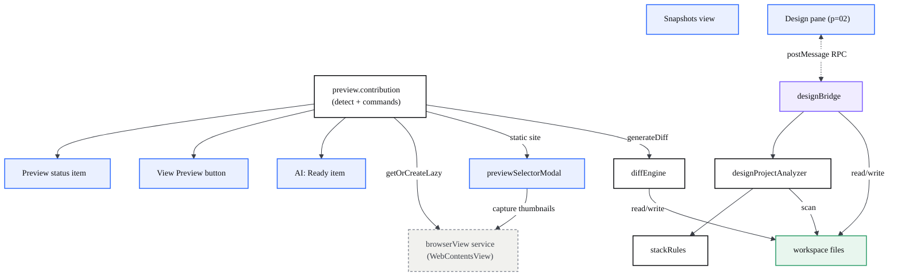
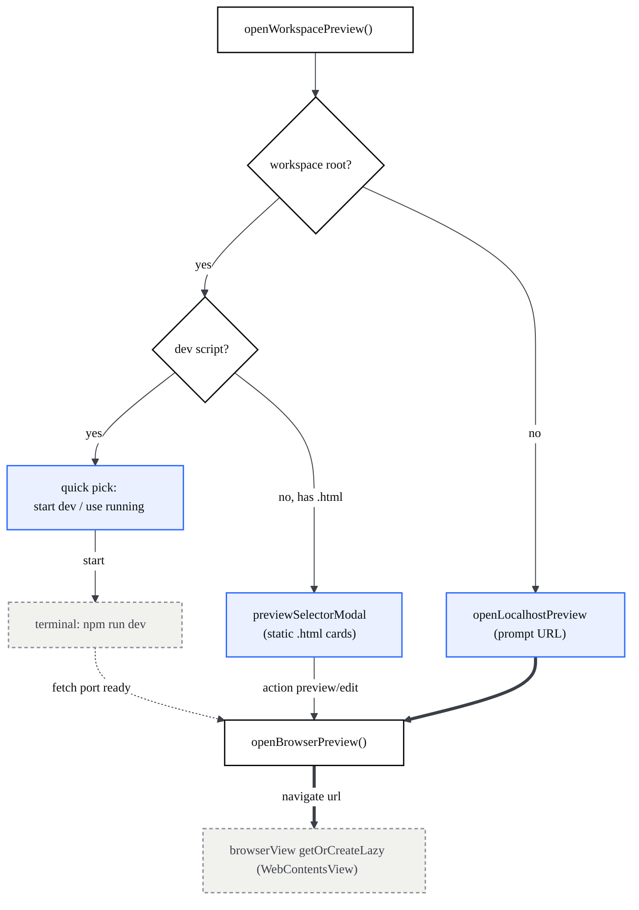
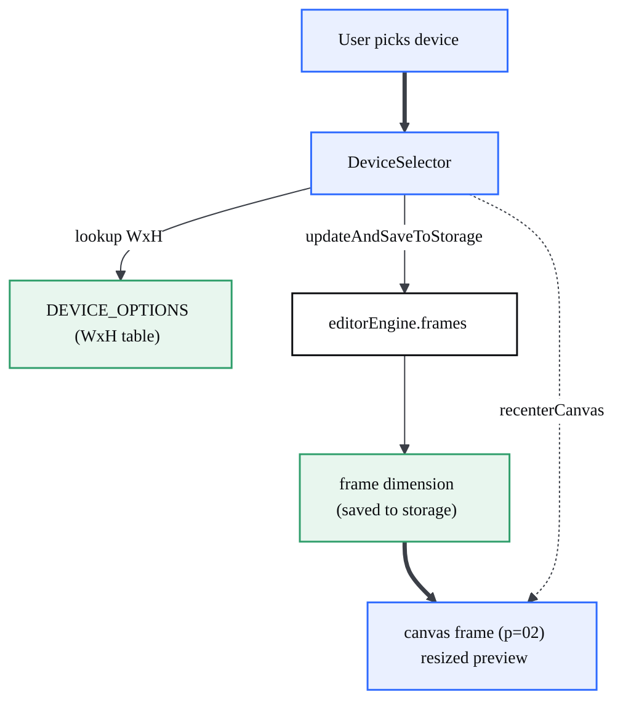
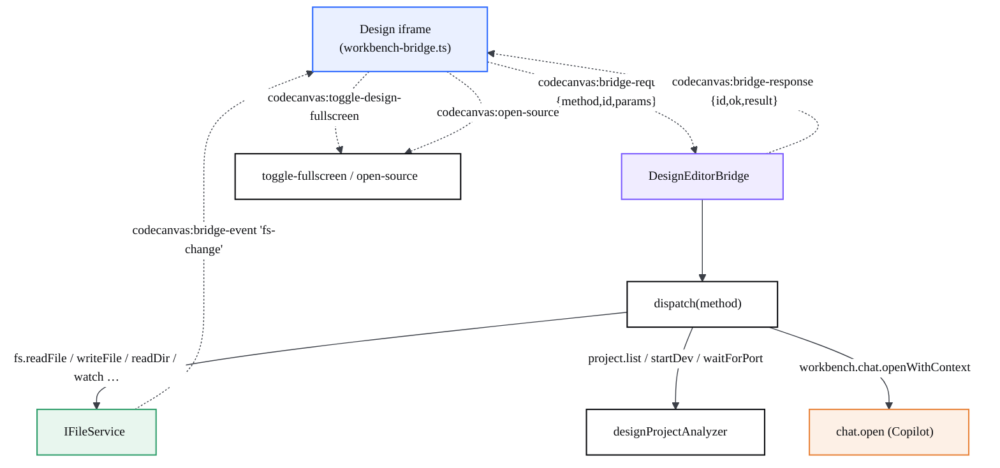
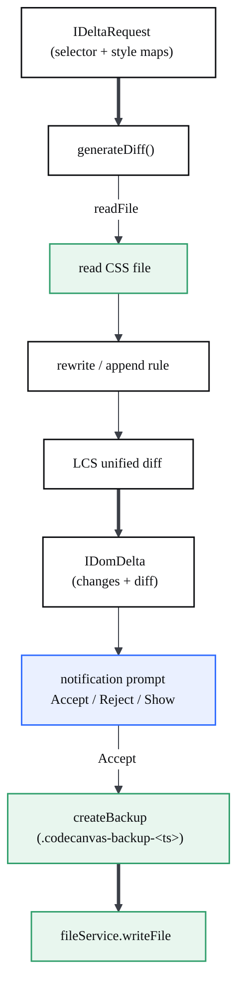

# CodeCanvas Preview contrib

> The workbench-side tooling that surrounds the Design canvas: it detects whether the open folder is a web project, opens a live preview, drives device/viewport switching, exposes status-bar entries and a Snapshots view, and carries the RPC bridge that lets the Design bundle talk to the workbench.

This page documents the **features** of the `codecanvasPreview` contribution. The Design shell, the nested iframe stack and the Onlook React bundle are [the Design environment](?p=02-design-environment); the visual editing + persistence path is [visual editing & write-back](?p=03-visual-editing-writeback). This page cross-links those rather than repeating them.

## At a glance

- The contribution is a set of workbench contributions + actions + a view registered from one entry file (`codecanvasPreview.contribution.ts`). It detects web projects, opens previews, and wires the status bar.
- **Live preview** renders through the `browserView` service (a native `WebContentsView`), not an iframe. The contrib only decides *what URL* to open and *in which editor group*.
- **Three status-bar items**: a left "Preview" state pill (loading/error/connected, click to reload), a left "View Preview" launcher (only on web projects), and a right "AI: Ready" indicator.
- **designBridge** is a `postMessage` RPC: the Design iframe sends `codecanvas:bridge-request`, the workbench replies `codecanvas:bridge-response`, and file changes are pushed as `codecanvas:bridge-event`.
- **designProjectAnalyzer** walks the workspace, classifies each app via **stackRules**, and reports which apps are editable and what pages they have.
- **diffEngine** backs the *Edit CSS of Selected Element* / *Move/Resize* commands: it turns a CSS style delta into a rewritten **`.css` file** + unified diff and, on Accept, first writes a `<file>.codecanvas-backup-<ts>` copy. It is *not* the inline-style / HTML write-back that persists Design's visual edits (that is [visual editing & write-back](?p=03-visual-editing-writeback)). Unit-tested (6 cases).
- The title-bar **device control** is styled here but currently *unwired* in workbench TS; the working responsive switch is the bundle's `DeviceSelector`. The **Snapshots** view is a static mock timeline. (See Gotchas.)

| File | Responsibility |
| --- | --- |
| `src/vs/workbench/contrib/codecanvasPreview/browser/codecanvasPreview.contribution.ts` | Entry point: web-project detection, open-preview commands, the preview status item, contribution/action/view/config registration. |
| `src/vs/workbench/contrib/codecanvasPreview/browser/codecanvasStatusBar.ts` | The right-aligned "AI: Ready" status-bar item. |
| `src/vs/workbench/contrib/codecanvasPreview/browser/designBridge.ts` | `postMessage` RPC bridge between the Design iframe and workbench services (fs, projects, chat). |
| `src/vs/workbench/contrib/codecanvasPreview/browser/titleBarDeviceControl.ts` | Title-bar pills (History, Share, account avatar) + default chrome overrides. |
| `src/vs/workbench/contrib/codecanvasPreview/browser/snapshotsView.ts` | Snapshots panel view (currently a static timeline). |
| `src/vs/workbench/contrib/codecanvasPreview/browser/previewSelectorModal.ts` | Visual "pick an entry file" modal with live thumbnails for static sites. |
| `src/vs/workbench/contrib/codecanvasPreview/browser/designProjectAnalyzer.ts` | Scans the workspace, classifies apps, lists pages, decides "editable". |
| `src/vs/workbench/contrib/codecanvasPreview/browser/stackRules.ts` | Declarative tech-detection rules (deps + config files) consumed by the analyzer. |
| `src/vs/workbench/contrib/codecanvasPreview/browser/shinyText.ts` | Native (no-React) shimmer-text helper used by the selector's loading states. |
| `src/vs/workbench/contrib/codecanvasPreview/common/EdicionVisual/diffEngine.ts` | Builds a CSS rule rewrite + LCS unified diff + timestamped backup. |
| `src/vs/workbench/contrib/codecanvasPreview/test/common/diffEngine.test.ts` | Unit tests for `generateDiff` / `createBackup`. |

## Architecture

The contrib is a thin coordination layer. It owns no rendering surface of its own: the preview is a `WebContentsView` owned by the `browserView` service, and the editable canvas is the Design pane (page 02). Everything here either *decides what to show* or *relays messages*.

Everything is registered from the bottom of `codecanvasPreview.contribution.ts:1349`: five workbench contributions (`registerWorkbenchContribution2`), the Snapshots view container/view (`codecanvasPreview.contribution.ts:779`), the actions (`registerAction2`), and the `codecanvas.language` setting (`en`/`es`, default `en`, application-scoped; non-English falls back to English until translated — `codecanvasPreview.contribution.ts:1361`). The file ends by importing `designView.js` and `designFullWindowMode.js` so the Design editor registers too.

## How it works

### Opening a live preview

`OpenCodeCanvasPreviewAction` (`codecanvasPreview.contribution.ts:802`) calls `openWorkspacePreview` (`codecanvasPreview.contribution.ts:485`). The flow branches on what kind of project is open: a dev-server project (a `dev` script in `package.json`) offers to run `npm run dev` and waits for the port; a static site opens the visual selector; an empty workspace prompts for a localhost URL. The actual surface is requested from the `browserView` service via `getOrCreateLazy(PREVIEW_ID, …)` and opened in a side editor group when real editors already exist (`openBrowserPreview`, `codecanvasPreview.contribution.ts:247`).

Whether the folder is "web" is computed by `CodeCanvasWebProjectContribution` (`codecanvasPreview.contribution.ts:1263`), which sets the `codecanvasIsWebProject` context key and the `webProjectUrl` observable. The context key gates both the "View Preview" launcher and the editor-title preview button.

### Dev-server orchestration & port detection

> Before a dev-server preview opens, the contrib has to know *which framework* and *which port*: it reads the project's config files, falls back to per-tool defaults, starts the server in a terminal, then polls until the URL answers.

`detectWebProject` (`codecanvasPreview.contribution.ts:66`) classifies the folder: a `dev` script in `package.json` ⇒ dev-server project; otherwise any `.html` ⇒ static site. For dev-server projects the port is resolved in two steps — **config first**, then **defaults**:

- `detectConfigPort` (`codecanvasPreview.contribution.ts:212`) reads `vite.config.{ts,js,mjs}`, `next.config.{ts,mjs,js}` and `astro.config.mjs` and regex-extracts `server.port` / `port`.
- `getDefaultUrlsFromPackageScripts` guesses from the dev script when no config port is found (Vite `5173`, Next/CRA `3000`, Angular `4200`, wmr `8080`, else those three in order).

When the user picks "Start npm run dev", a terminal runs `npm run dev`; after a 3 s grace the contrib `fetch`es the resolved URL (15 s abort) and opens the preview once it answers (`codecanvasPreview.contribution.ts:567-602`). Once a preview surface exists, `waitForPreviewIdle` (`codecanvasPreview.contribution.ts:357`) races the model's loading-done event against an **8 s load cap** (`PREVIEW_LOAD_TIMEOUT = 8000`, `:49`) and then waits a **250 ms settle** (`PREVIEW_SETTLE_DELAY = 250`, `:50`) before driving the canvas. While the preview is idle, a workspace file watcher reloads it **500 ms** after any change (`startFileWatcher`, `:723-738`). Terminal/dev-server lifecycle is covered in [operations](?p=12-operations).

### Static preview server (`npx serve --cors`)

> A static HTML/CSS folder has no dev server, so the Design canvas spins one up itself — and it must be CORS-open, or the editor can't read the page to make it editable.

When the Design canvas previews a static folder, `DesignEditorBridge.startStaticServer` (`designBridge.ts:233`) picks a free port in **5500–5540** (`findFreePort`, `designBridge.ts:251`/`270`) and launches `npx --yes serve -n --cors -l <port> .` in a hidden terminal. The `--cors` flag is load-bearing: it makes `serve` send `Access-Control-Allow-Origin: *` so the Design editor (a `vscode-file://` origin) can `fetch` the served HTML to inject the inspector/preload bundle and turn the page editable. Without it the cross-origin fetch fails with "Failed to fetch" and the canvas is stuck view-only (`designBridge.ts:262-265`). A per-folder port is remembered; if the port is taken but unreachable, `serve` is re-issued in the existing terminal so a crashed server recovers (`designBridge.ts:243-248`). The wide-open `*` CORS is a deliberate local-only trade-off — see [security & permissions](?p=11-security-permissions).

### The status-bar items

There are three, registered independently:

- **Preview state** — `CodeCanvasPreviewStatusContribution` (`codecanvasPreview.contribution.ts:617`), left-aligned, id `status.codecanvasPreview`. It mirrors the preview model: `$(sync~spin) Preview Loading…`, `$(error) Preview Error`, or `$(eye) Preview` with the URL as tooltip. Clicking runs `codecanvas.preview.reload`. While the preview is idle it installs a workspace file watcher that auto-reloads the preview 500 ms after any change (`startFileWatcher`, `codecanvasPreview.contribution.ts:723`).
- **View Preview launcher** — `CodeCanvasPreviewButtonContribution` (`codecanvasPreview.contribution.ts:1312`), left-aligned, only present when `codecanvasIsWebProject` is true; runs `codecanvas.preview.open`.
- **AI: Ready** — `CodeCanvasStatusBarContribution` (`codecanvasStatusBar.ts:13`), right-aligned at priority 50, a static `$(sparkle) AI: Ready` indicator.

### Device / viewport switching

The responsive switch changes the **frame dimensions** of the canvas, which resizes the rendered preview. In the shipping Design bundle this is the `DeviceSelector` (`design-editor-src/src/components/editor-bar/frame-selected/device-selector.tsx`): picking a device looks up `WxH` from `DEVICE_OPTIONS` (`design-editor-src/packages/constants/src/frame.ts:14`) and calls `editorEngine.frames.updateAndSaveToStorage(frameId, { dimension })`, then re-centers the canvas. The new dimension flows to the frame element in the canvas stack (page 02).

This contrib *also* ships a title-bar device control's styling (a segmented desktop/tablet/mobile group plus a viewport-width pill, `media/titleBarDeviceControl.css:21`), intended to live centered in the title bar. As of now no workbench TS instantiates those `.cc-device-*` classes (see Gotchas) — `titleBarDeviceControl.ts` only renders the History/Share/avatar pills.

### designBridge message passing

`DesignEditorBridge` (`designBridge.ts:69`) listens for `message` events on the main window and *only* accepts those whose `source` is the Design iframe (`designBridge.ts:116`) — the untrusted app preview cannot drive the workbench. It handles three inbound message types and emits two outbound ones.

The RPC methods (`dispatch`, `designBridge.ts:153`) cover the file system (`fs.readFile`, `fs.writeFile`, `fs.readDir`, `fs.exists`, `fs.stat`, `fs.rename`, `fs.delete`, `fs.mkdir`, `fs.copy`, `fs.watch`), projects (`project.list`, `project.startDev`, `project.waitForPort`), and chat (`workbench.chat.openWithContext`). Every path argument is forced through `resolveWorkspacePath` (`designBridge.ts:338`), which rejects anything outside the open folders. Writes are tracked for a "saving / saved" pill (`DesignSaveState`) and stamped in `recentSelfWrites` so Design's own writes are not echoed back as `fs-change` events (which would reload the frame it just patched, `designBridge.ts:88`). The client half lives in `design-editor-src/src/lib/workbench-bridge.ts`. The full method catalogue is in the [API reference](?p=09-api-reference).

### diffEngine: style delta to diff

`generateDiff` (`diffEngine.ts:32`) is pure logic over an `IFileService`. Given a selector and before/after style maps, it computes the changed properties, reads the target CSS, rewrites the first matching rule (or appends a new one when the selector is absent), and produces an LCS-based unified diff. The CSS-editing actions in the contribution (`EditCSSAction` at `codecanvasPreview.contribution.ts:1145` and `MoveResizeElementAction` at `:1071`) call it, show the diff in a notification prompt, and only on **Accept** write the file — after `createBackup` saves a timestamped copy (`diffEngine.ts:59`).

**Test coverage** — `test/common/diffEngine.test.ts` runs the engine against an in-memory file service (6 cases): a unified diff for changed properties, no-op when styles are equal, detecting added properties, replacing one rule while preserving unrelated rules, appending a new rule when the selector is missing, and `createBackup` writing a same-content timestamped copy.

### Project analysis (designProjectAnalyzer)

`analyze()` (`designProjectAnalyzer.ts:158`) scans every workspace folder (depth-capped, skipping `node_modules`/build output and the Design bundle's own source), parses each `package.json`, and matches dependencies + config files against `STACK_RULES` (`stackRules.ts:16`) to build a `stack`. From the stack it derives the `framework`, infers the dev port, decides `editable` (React **and** real `.tsx/.jsx` files present, `designProjectAnalyzer.ts:347`), and enumerates pages — the Next.js app/pages routers, or, for static folders, each `index.html`/`*.html` as a page. Folders with only an `index.html` register as a static `html` app. It also follows **monorepo workspaces**: when a `package.json` declares `workspaces` (an array, or `{ packages: [...] }`), those globs are prioritized as scan roots (`designProjectAnalyzer.ts:260-265`, `:300-313`). Results are **cached per `workspaceId`** (`designProjectAnalyzer.ts:160`/`:188`); the cache is cleared via `invalidate()` and tested with `isStale()` (`:192`/`:196`). The Design view drives **live re-analysis** — it invalidates and re-runs `analyze()` when the panel becomes visible on a stale cache, and again on a debounced (500 ms) project-file watcher (`designView.ts:120-141`). The bridge's `project.list`/`startDev` are thin wrappers over this.

### Preview selector modal

For static sites, `PreviewSelectorModal` (`previewSelectorModal.ts:114`) shows a grid of entry-file cards, each with a **live** thumbnail captured by laying a hidden `WebContentsView` exactly over the card and screenshotting it (falling back to CDP `Page.captureScreenshot`). Picking a file parses its `<section>`/`[id]` blocks and `<a href>` routes (DOM parse with a regex fallback), optionally maps a section to its source component, and offers Open-in-preview / Edit / Go-to-code / Copy-link. It resolves an `IPreviewSelectorResult` (`previewSelectorModal.ts:38`) that `openPreviewSelector` acts on. Loading placeholders use the `shinyText` shimmer helper (`shinyText.ts:39`).

## Key modules

| File | Responsibility |
| --- | --- |
| `codecanvasPreview.contribution.ts` | Web detection, open-preview flows, preview status item, the inspect/edit-CSS/move-resize actions, and all registration. |
| `designBridge.ts` | Iframe↔workbench RPC: fs, projects, chat; save-state tracking; self-write echo suppression; `fs-change` push. |
| `designProjectAnalyzer.ts` | Workspace scan → `AnalyzedApp[]` (framework, stack, devPort, editable, pages); cached per workspace. |
| `stackRules.ts` | Declarative `STACK_RULES` (tech / deps / files), ported from stack-analyser; data only, no engine. |
| `diffEngine.ts` (`common/EdicionVisual/`) | `generateDiff` (rule rewrite + LCS unified diff) and `createBackup`. |
| `previewSelectorModal.ts` | Live-thumbnail entry-file picker for static sites; section/route parsing; live section preview. |
| `codecanvasStatusBar.ts` | "AI: Ready" right-side status item. |
| `titleBarDeviceControl.ts` | Title-bar History/Share/avatar pills + chrome overrides (note: device control itself is unwired). |
| `snapshotsView.ts` | Snapshots panel (static timeline placeholder). |
| `shinyText.ts` | Reusable shimmer-text element (no React). |

## Extension points / reuse

- **diffEngine is dependency-light** — it takes only an `IFileService`, so any feature that needs "rewrite a CSS rule + show a diff + back up the file" can reuse `generateDiff`/`createBackup`. The test shows how to drive it with an in-memory file service.
- **stackRules is pure data** — add an entry to `STACK_RULES` to teach the analyzer a new framework/tool; nothing else changes.
- **Add a bridge method** by extending the `switch` in `dispatch` (`designBridge.ts:153`) and the client in `workbench-bridge.ts`. Keep using `resolveWorkspacePath` for any path argument.
- **shinyText** (`createShinyText`/`applyShinyText`) is a generic UI helper reusable anywhere a shimmer label is wanted; see the [reusable-code reference](?p=08-reusable-code).
- **Context key `codecanvasIsWebProject`** and the `webProjectUrl` observable are exported and can gate other UI on "is this a web project".

## Gotchas

- **The title-bar device control is styled but not wired.** `media/titleBarDeviceControl.css` defines `.cc-device-seg` / `.cc-device-btn` / `.cc-device-viewport`, but no workbench TS instantiates them (a repo-wide search finds the classes only in that CSS). The functional responsive switch is the bundle's `DeviceSelector`, which resizes the canvas frame. Don't assume the title-bar segmented control is live.
- **Snapshots is a mock.** `snapshotsView.ts:64` renders a hardcoded timeline ("Initial", "Hero update", "AI: Improve contrast"), and Restore/Compare have no handlers. It is a visual placeholder, not wired to real history. (The safety net is Ctrl+Z / write-back, page 03.)
- **Self-write echo suppression matters.** `designBridge` stamps files it writes in `recentSelfWrites` (1.5 s) so its own saves don't come back as `fs-change` and reload the very frame it patched. Restores deliberately *don't* stamp, so a rollback does reload. Breaking this loop is subtle.
- **Click-to-source is React/JSX-only — inert on static HTML.** The injected inspector resolves a source location by reading the hovered element's React fiber `_debugSource` (`design-editor-src/src/lib/inspector-script.ts:48-55`); for a plain DOM node with no fiber, `getSourceForInstance` returns `undefined`, and `onClick` bails on `if (!source) return;` before posting `codecanvas:inspector-click` (`inspector-script.ts:181-185`), so no `codecanvas:open-source` ever reaches the workbench (`use-inspector-bridge.ts:18-25`). Because `_debugSource` only exists in React *development* builds, jump-to-code works only for a running React/JSX app — for the primary static-HTML scenario it is silently inert (hover/select still work, but clicking never opens the source).
- **CSS editing is positioned-only.** `EditCSSAction`/`MoveResizeElementAction` bail unless the element is `position: absolute|fixed` (`codecanvasPreview.contribution.ts:1092`), because only then do move/resize deltas map cleanly to CSS.
- **diffEngine rule matching is first-match, brace-naive.** The rule regex is `selector\s*\{[^}]*\}` (no global flag), so it rewrites only the first matching rule and cannot see nested braces; an unmatched selector is appended at the end of the file (`diffEngine.ts:66`).
- **Capture views must overlap their slot.** In the selector modal a fully off-screen `WebContentsView` paints black, so thumbnails are captured by positioning the view exactly over the card (`previewSelectorModal.ts:1025`); it is force-hidden/disposed when the modal closes or the user leaves the gallery.
- **Preview-selector re-entrancy.** `openPreviewSelector` guards with `previewSelectorOpen` and hides any existing preview while the modal is up; the guard is released in a `finally` so a throw can't wedge it (`codecanvasPreview.contribution.ts:385`).
