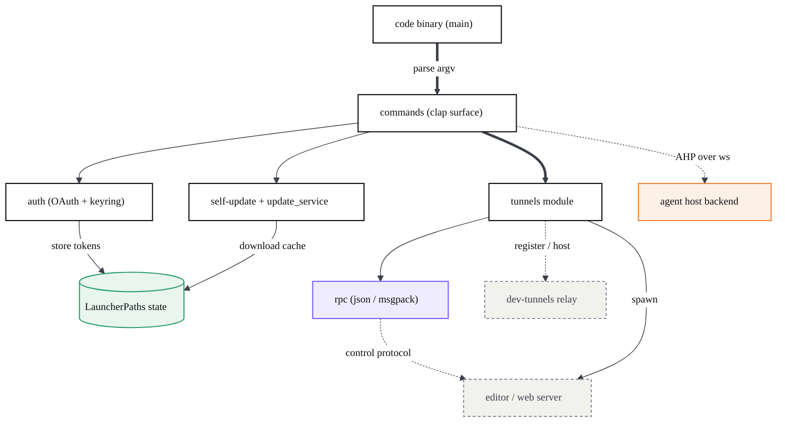
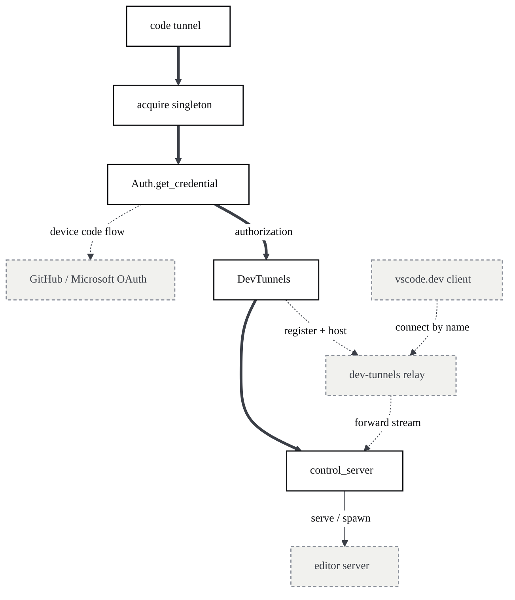
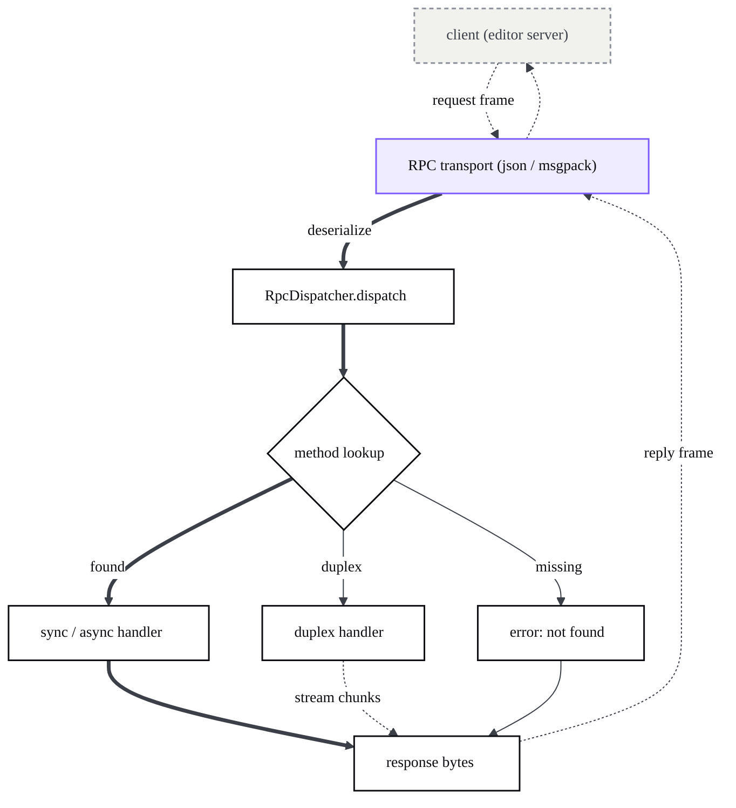
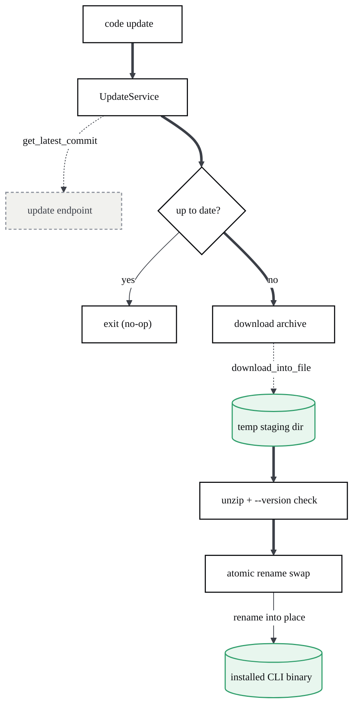
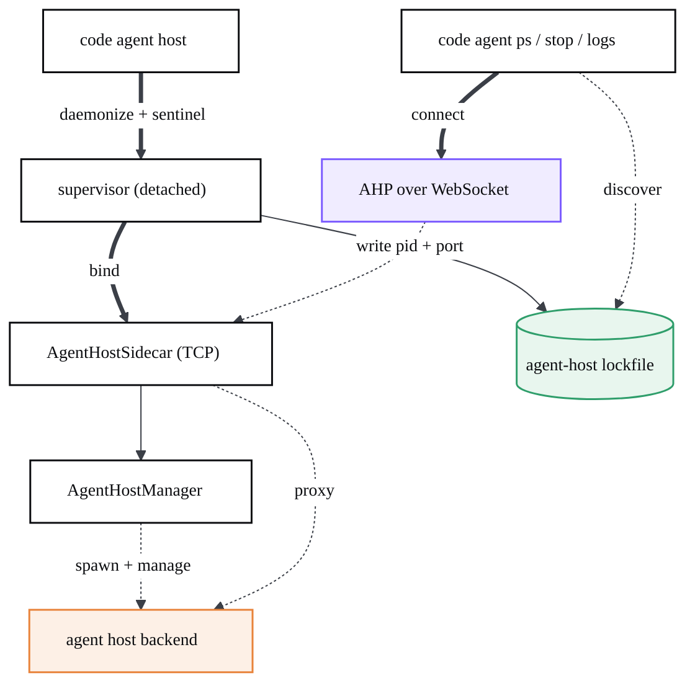

# The Rust CLI

> `code` is a small, self-updating Rust binary that launches the desktop editor, serves it over the web or a secure tunnel, and (in CodeCanvas) supervises the AI agent host — all without bundling Node.

## At a glance

- **What it is:** the `code` command-line companion, a Cargo crate under `cli/` forked from VS Code's CLI and extended with an `agent` command family. One binary, `default-run = "code"` (`cli/Cargo.toml:5`).
- **Two personalities:** an *integrated* CLI (shipped inside an editor install) and a *standalone* CLI (downloaded on its own). Argv parsing picks one at startup; both expose the full command set, and only the *standalone* build additionally exposes `update` (self-update) (`cli/src/commands/args.rs:94-100,151-155`).
- **Three jobs:** (1) proxy desktop/extension commands to an installed editor, (2) run servers — `tunnel`, `serve-web`, `command-shell`, (3) supervise the CodeCanvas `agent` host.
- **Talks two protocols:** a transport-agnostic JSON / msgpack RPC for the editor server (`cli/src/rpc.rs`), and AHP-over-WebSocket for the agent host (`cli/src/commands/agent.rs`).
- **Self-contained networking:** OAuth device-flow auth (GitHub / Microsoft), the `microsoft/dev-tunnels` relay crate, and an LRU download cache for server payloads.
- **Async runtime:** Tokio throughout; `clap` (derive) for the command surface.

| File | Responsibility |
| --- | --- |
| `cli/Cargo.toml` | Crate manifest: deps (tokio, clap, reqwest, dev-tunnels, ahp), release profile, features. |
| `cli/src/bin/code/main.rs` | Process entry: argv parse, build `CommandContext`, dispatch to a command. |
| `cli/src/commands/args.rs` | The entire `clap` command surface (every flag and subcommand). |
| `cli/src/rpc.rs` | Transport-agnostic RPC builder/dispatcher (sync, async, duplex streams). |
| `cli/src/tunnels/control_server.rs` | The server-side RPC method table the editor server drives over a tunnel. |
| `cli/src/tunnels/dev_tunnels.rs` | Wraps the dev-tunnels relay: create / host / connect named tunnels. |
| `cli/src/commands/agent_host.rs` | CodeCanvas agent-host supervisor: daemonize, lockfile, sidecar, updates. |
| `cli/src/self_update.rs` | Self-replacement of the CLI binary. |
| `cli/src/auth.rs` | OAuth device-flow login + keyring/file credential storage. |

## Architecture

The crate is a thin `clap` front end (`commands/`) over four service areas: the **tunnels** subsystem (control server, relay, server lifecycle, singleton), the **RPC** layer (the wire to the editor server), **auth**, and **update**. `LauncherPaths` (`cli/src/state.rs`) is the on-disk root that ties them together (caches, lockfiles, tokens). Everything outside the binary — the dev-tunnels relay, the editor/web server it spawns, and the agent-host backend — is external.

**Build.** It is an ordinary Cargo crate (edition 2021). The product identity — application name, quality, version, update endpoints — is injected at build time through `option_env!` constants (`cli/src/constants.rs:32`), so the same source builds the OSS `code` and a branded binary. On Windows the build requires OpenSSL via vcpkg, used for the tunnel key exchange (`cli/CONTRIBUTING.md:9`). Release builds strip symbols and use thin LTO (`cli/Cargo.toml:83`).

**Dispatch.** `main` collects raw argv and tries `try_parse_legacy` first (back-compat for the old Node CLI flags); otherwise it parses either `IntegratedCli` or `StandaloneCli` depending on `is_integrated_cli()`. It then builds a `CommandContext` (http client, `LauncherPaths`, logger, parsed args) and matches the subcommand to its handler (`cli/src/bin/code/main.rs:63`). With no subcommand, it forwards to an installed editor via `start_code`.

### Command surface

| Command | What it does |
| --- | --- |
| `code [paths]` | Launch the preferred installed editor with the given files/folders (`start_code`). |
| `code ext <list\|install\|uninstall\|update>` | Manage editor extensions (translated to `--*-extension` editor args). |
| `code status` | Print editor process/diagnostics (`--status`). |
| `code version <use\|show>` | Pick/print which editor install this CLI launches (`commands/version.rs`). |
| `code serve-web` | Run a local web build: a "server of servers" that proxies the right version per client (`commands/serve_web.rs`). |
| `code command-shell` | Hidden: run the control server over stdin/stdout (or socket/port). Used by SSH remote (`commands/tunnels.rs:146`). |
| `code tunnel` | Create a secure tunnel reachable from vscode.dev anywhere (`commands/tunnels.rs:469`). |
| `code tunnel <prune\|kill\|restart\|status\|rename\|unregister>` | Manage the local/running tunnel via singleton RPC. |
| `code tunnel user <login\|logout\|show>` | Manage tunnel auth credentials. |
| `code tunnel service <install\|uninstall\|log\|internal-run>` | Run the tunnel as an OS service (preview). |
| `code update [--check]` | (Standalone only) self-update the CLI binary; `--check` reports whether an update is available without applying it (`commands/update.rs`, `commands/args.rs:157-162`). |
| `code agent host` | **CodeCanvas:** start/daemonize the agent-host supervisor (`commands/agent_host.rs`). |
| `code agent ps` | List sessions on a running agent host. |
| `code agent stop <session>` | Cancel the active turn of a session. |
| `code agent logs <session>` | Stream live session events. |
| `code agent kill` | Force-kill the agent-host process tree. |

The `agent` family is the CodeCanvas-specific addition; everything else is inherited from VS Code's CLI. The agent host is the CLI-side half of the editor's [multi-agent AI chat](?p=04-ai-chat-multiagent).

## How it works

### Establishing a tunnel

`code tunnel` makes the local machine reachable from the web. It first acquires a **singleton** (one tunnel process per machine; later invocations become thin clients of the running one — `commands/tunnels.rs:626`). It authenticates (device-flow if needed), asks the dev-tunnels relay to host a named tunnel, then runs the control server. The editor server is downloaded/spawned lazily when a client actually connects and issues the `serve` RPC. The connection token handed to the server is a SHA-256 of the tunnel id (`commands/tunnels.rs:579`).

A connecting client must pass an auth challenge before any privileged RPC runs: the client calls `challenge_issue`, signs the returned nonce, and calls `challenge_verify`; only then does `ensure_auth` let `serve`, `fs_*`, `spawn`, etc. through (`tunnels/control_server.rs:565`). The same control server runs over stdin/stdout for SSH remote via `command-shell`.

### An RPC call to the editor server

The CLI and the editor server speak a small JSON-RPC-shaped protocol. `cli/src/rpc.rs` is transport- and serialization-agnostic: an `RpcBuilder` registers methods (`register_sync`, `register_async`, `register_duplex`), and a `Serialization` impl decides the byte format. There are two: line-delimited JSON (`cli/src/json_rpc.rs`) and length-free msgpack (`cli/src/msgpack_rpc.rs`). `dispatch` deserializes a `PartialIncoming` to learn the message kind (request / response / error), looks up the method, and returns a `MaybeSync` (an immediate reply, a future, or a future plus a duplex stream).

Duplex methods open in-process `tokio::io::duplex` pipes and announce them with a `streams_started` notification; subsequent `stream_data` / `stream_ended` frames pump bytes (`cli/src/rpc.rs:453`). This is how `fs_read`, `fs_write`, `net_connect`, and `spawn` tunnel binary streams over a single message channel.

**Control-server methods** (defined in `tunnels/control_server.rs:411`, shapes in `tunnels/protocol.rs`):

| Method | Params -> Result |
| --- | --- |
| `ping` | `{}` -> `{}` |
| `version` | `{}` -> `VersionResponse {version, protocol_version}` |
| `gethostname` | `{}` -> `{value}` |
| `get_env` | `{}` -> `{env, os_platform, os_release}` |
| `sys_kill` | `{pid}` -> `{success}` |
| `fs_stat` / `fs_readdir` | `{path}` -> stat / dir entries |
| `fs_read` / `fs_write` / `fs_connect` | `{path}` + duplex stream |
| `net_connect` | `{port, host}` + duplex stream |
| `fs_rm` / `fs_mkdirp` | `{path}` |
| `fs_rename` | `{from_path, to_path}` |
| `serve` | `ServeParams {socket_id, commit_id, quality, extensions, connection_token, compress}` |
| `update` | `{do_update}` -> `{up_to_date, did_update}` |
| `servermsg` / `prune` | server bridge message / prune stopped servers |
| `callserverhttp` | `{path, method, headers, body}` -> `{status, body, headers}` |
| `forward` / `unforward` | `{port, public}` -> `{uri}` / `{port}` |
| `acquire_cli` | `AcquireCliParams` -> `SpawnResult` |
| `spawn` / `spawn_cli` | `SpawnParams {command, args, cwd, env}` + 3 duplex streams -> `{message, exit_code}` |
| `httpheaders` / `httpbody` | delegated-HTTP response plumbing |

The server can also call *back* to the client: `servermsg`, `serverclose`, `serverlog`, `makehttpreq`, `version` (`ClientRequestMethod`, `tunnels/protocol.rs:17`). The **singleton** control channel uses a separate tiny method set — `restart`, `shutdown`, `status`, `log`, `log_done` (`tunnels/protocol.rs:354`) — which is what `code tunnel kill/restart/status` invoke via `do_single_rpc_call`. Port forwarding adds `set_ports` (`tunnels/protocol.rs:332`).

### Self-update

The standalone CLI updates itself. `SelfUpdate` asks the update service for the latest CLI commit for this platform/quality, compares it to the baked-in `VSCODE_CLI_COMMIT`, and — if different — downloads the archive into a temp dir, unzips the single binary, copies file metadata, **validates the new binary by running `--version`**, then atomically renames the old binary aside and moves the new one into place (`cli/src/self_update.rs:78`).

Passing **`--check`** turns `code update` into a dry run: the command still cleans up any stale update and fetches the latest release, but after the comparison it stops before downloading. If a newer build exists it prints `Update to <version> is available` and exits `0`; if the CLI is already current it prints the already-up-to-date message and exits `1` (the up-to-date check runs before the `--check` branch). The binary is never downloaded or swapped (`cli/src/commands/update.rs:37`, flag defined at `cli/src/commands/args.rs:157-162`).

That path replaces the *CLI itself*. **Server** payloads (the editor server for `serve-web` and the agent host) are a different mechanism: `DownloadCache` (`cli/src/download_cache.rs`) keeps an LRU of the last `KEEP_LRU = 5` downloaded server builds keyed by commit, staging each download in a `*.staging` dir then renaming it in (with WoA rename retries). `serve-web` and the agent host run a background loop that re-checks for new server commits and swaps versions live, so old clients keep their version while new ones get the latest.

### Supervising the agent host (CodeCanvas)

`code agent host` runs a long-lived **supervisor** that the editor's renderer reaches over an internal channel — the CLI half of the [AI chat agent host](?p=04-ai-chat-multiagent). The foreground invocation classifies the canonical lockfile: if a compatible supervisor is already running it just prints its banner; otherwise it re-execs itself **detached** with `VSCODE_AGENT_HOST_SUPERVISOR=1`, waits for the child to print a `__VSCODE_AGENT_HOST_READY__` sentinel, then exits. The detached supervisor binds a TCP `AgentHostSidecar`, writes the lockfile (pid + port + token), and has an `AgentHostManager` download and manage the backend process, restarting/upgrading it as needed (`cli/src/commands/agent_host.rs:141`).

The `ps` / `stop` / `logs` subcommands are AHP **clients**: they discover the endpoint from the lockfile (or `--address` / `--tunnel`), open a WebSocket, run the AHP `initialize` handshake, and call methods — `listSessions`, `subscribe`, `dispatch` (turn cancel) — retrying once through a device-flow login if the server answers `AUTH_REQUIRED` (`cli/src/commands/agent.rs:158`). With `--tunnel`, the same supervisor is reachable remotely by opening a direct-tcpip channel to `AGENT_HOST_PORT` over the dev-tunnels relay and running the WebSocket over it.

### Credential storage

OAuth tokens from the device-code flow are persisted as a `StoredCredential` (provider, access token, optional refresh token, expiry — serialized with one-letter JSON keys, `cli/src/auth.rs:101`). Two backends implement the `StorageImplementation` trait: the OS keyring (`KeyringStorage`, `cli/src/auth.rs:298`) and a plain JSON file (`FileStorage` over `PersistedState`, `cli/src/auth.rs:386`). The keyring is preferred; the CLI falls back to file storage when the keyring read fails, when a `token.json` already exists, or when `VSCODE_CLI_USE_FILE_KEYCHAIN` is set (`cli/src/auth.rs:457`). The file is written with `0600` permissions (`cli/src/auth.rs:452`), and keyring entries are namespaced by a `vscode-cli` prefix (`vscode-cli-<ns>` for an isolated namespace via `Auth::with_namespace`, `cli/src/auth.rs:419`).

**Encryption at rest.** Before a credential is written to either backend it is run through `seal` — serialize to JSON, then `encrypt` (`cli/src/auth.rs:202`); reads go through the inverse `unseal`, which first tries to parse the value as plain JSON (back-compat for older, unencrypted entries) and only then decrypts (`cli/src/auth.rs:214`). Encryption is gated behind the `vscode-encrypt` build feature, which is **off in the default OSS build** (`cli/Cargo.toml:88`): with the feature disabled `encrypt` / `decrypt` are identity functions (`cli/src/auth.rs:931`); with it enabled the payload is encrypted with key material derived from the machine hostname (`cli/src/auth.rs:912`), so a sealed credential is bound to the host that wrote it. Setting `VSCODE_CLI_DISABLE_KEYCHAIN_ENCRYPT` forces the plaintext path even in an encrypting build (`cli/src/auth.rs:207`). Keyring values larger than the per-entry limit (1 KB on Windows, 128 KB elsewhere) are split across numbered entries joined by a `<MORE>` continuation marker (`cli/src/auth.rs:227`).

See [Security & Permissions](?p=11-security-permissions) for the agent-side auth model, and [Telemetry, Limits & Operations](?p=12-operations) for how the CLI is built, signed, and packaged.

## Key modules

| File | Responsibility |
| --- | --- |
| `cli/src/lib.rs` | Crate root; declares the public module surface. |
| `cli/src/commands/args.rs` | `clap` definitions for every command, subcommand, and flag. |
| `cli/src/commands/context.rs` | `CommandContext` (http, paths, args, logger) passed to every handler. |
| `cli/src/rpc.rs` | RPC builder + dispatcher + duplex stream machinery. |
| `cli/src/json_rpc.rs` / `msgpack_rpc.rs` | The two `Serialization` impls and their read/write loops. |
| `cli/src/tunnels/control_server.rs` | Registers the editor-server RPC method table; per-socket auth state. |
| `cli/src/tunnels/dev_tunnels.rs` | Relay client/host: create, name, host, and connect tunnels. |
| `cli/src/tunnels/code_server.rs` | Downloads/launches the editor server; `CodeServerArgs`. |
| `cli/src/tunnels/local_forwarding.rs` | Port-forwarding singleton client/server. |
| `cli/src/tunnels/singleton_server.rs` / `singleton_client.rs` | One-process-per-machine coordination + status/restart/kill RPC. |
| `cli/src/tunnels/agent_host.rs` | `AgentHostManager` / `AgentHostSidecar`: backend lifecycle + TCP proxy. |
| `cli/src/tunnels/protocol.rs` | All RPC message structs + method-name constants. |
| `cli/src/commands/serve_web.rs` | Local "server of servers" web host with per-version routing. |
| `cli/src/auth.rs` | OAuth device flow + keyring/file credential storage + token refresh. |
| `cli/src/self_update.rs` / `update_service.rs` | CLI self-replacement and the update endpoint client. |
| `cli/src/download_cache.rs` | LRU cache of downloaded server builds. |
| `cli/src/desktop/version_manager.rs` | Resolves which installed editor `code [paths]` launches. |
| `cli/src/state.rs` | `LauncherPaths` (data root, lockfiles) + `PersistedState` JSON store. |
| `cli/src/constants.rs` | Build-time identity, ports (`CONTROL_PORT 31545`, `AGENT_HOST_PORT 31546`), `PROTOCOL_VERSION 5`. |

## Extension points / reuse

- **The RPC layer is generic.** `RpcBuilder` + the `Serialization` trait (`cli/src/rpc.rs:42`) are independent of tunnels — register your own methods and pick JSON or msgpack to add a new protocol surface or a new client.
- **`Auth::with_namespace`** (`cli/src/auth.rs:410`) gives an isolated credential store (separate keyring prefix + `token-<ns>.json`), the way the agent host keeps its login out of the tunnel's. Reuse it for any new authenticated feature.
- **`PersistedState<T>`** (`cli/src/state.rs:90`) is a tiny atomic JSON-on-disk store (load/save/update under a mutex, optional `0600` mode) usable for any small CLI state.
- **`DownloadCache`** is a drop-in LRU for "download once, keep N, stage-then-rename" payloads.
- **`ensure_supervisor_running`** (`cli/src/commands/agent_host.rs:521`) is the public way other commands (e.g. `tunnel`, `command-shell`) get a live agent-host endpoint without owning its lifecycle.

## Gotchas

- **Integrated vs standalone changes the grammar.** Only the standalone CLI exposes `update`; the integrated one assumes an editor is present. The choice is made by `is_integrated_cli()` after `try_parse_legacy`, so adding a subcommand means touching both `Commands` and the dispatch match (`cli/src/bin/code/main.rs:63`).
- **Windows needs OpenSSL (vcpkg)** to build — it is used for the tunnel key exchange, not optional (`cli/CONTRIBUTING.md:9`).
- **The agent-host lockfile is deliberately *not* under `--cli-data-dir`.** It is anchored on the machine-wide server-data folder (`agent_host_root`, `cli/src/state.rs:268`) so a locally-run `code agent host` and the supervisor spawned by the SSH `command-shell` path agree on one lockfile instead of racing on two.
- **The detached supervisor severs its stdio** after printing the ready sentinel (`redirect_stdio_to_null`, `cli/src/commands/agent_host.rs:665`) — otherwise later writes `BrokenPipe` once the foreground parent exits. Post-handoff debugging only shows up in the supervisor's file log.
- **`dial_host` remaps wildcards.** A supervisor bound to `0.0.0.0` / `::` must be *dialed* on loopback, not the wildcard; older lockfiles omit the host and fall back to IPv4 loopback (`cli/src/commands/agent_host.rs:654`).
- **Token enforcement lives at the proxy edge.** The agent-host backend runs token-less on an internal socket; the supervisor's loopback accept loop is what checks the user-facing connection token (`cli/src/commands/agent_host.rs:200`).
- **msgpack is no longer length-prefixed** (protocol v4). Because `rmp_serde` has no async reader, `MsgPackCodec` decodes incrementally from a `BytesMut`, returning `None` on `UnexpectedEof` until a full object arrives (`cli/src/msgpack_rpc.rs:139`).
- **Only one tunnel/forwarding process per machine.** Extra invocations become singleton *clients*; command-line options (name, extensions, tunnel id) "will not be applied until the existing tunnel exits" (`cli/src/commands/tunnels.rs:634`).
- **Linux keyring can hang.** Access is wrapped with a 5-second timeout on a worker thread; on timeout (or when `token.json` already exists) it falls back to file storage (`cli/src/auth.rs:236`).
- **Self-update can cross drives.** If the temp dir is on a different volume than the install, the old binary can't be renamed into temp and is instead renamed to a `.Updating CLI` sibling; `cleanup_old_update` must run on later launches to remove it (`cli/src/self_update.rs:67`).
- **`PROTOCOL_VERSION` gates capabilities.** It is `5` (agent-host connection added); the tunnel advertises it as a `protocolv5` tag, and the server connection token is a SHA-256 of the tunnel id from v3 on (`cli/src/constants.rs:25`).

See also: [system architecture](?p=01-architecture) for where the CLI sits in the process model, and [AI chat (multi-agent)](?p=04-ai-chat-multiagent) for the editor side of the agent host.
