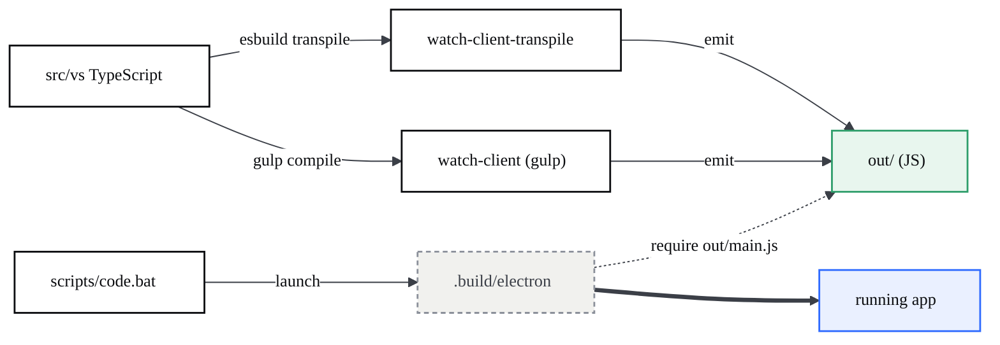

# Core platform & build

> The inherited VS Code layering (base / platform / workbench / editor), the small set of things CodeCanvas changed on top, and how to build and watch the app.

## At a glance

- CodeCanvas inherits VS Code's four-layer core: **base** (utilities) -> **platform** (DI services) -> **workbench** (UI shell) and **editor** (Monaco) on top.
- The fork's changes are deliberately thin: **branding in `product.json`**, the **`codecanvasPreview`** contribution, the **`sessions/`** surface, the **`agentHost`** platform subsystem, and the chat **`cliProviders`**. Each is situated below and detailed on its own page.
- The build runs on **gulp** (`gulpfile.mjs` -> `build/gulpfile.ts`). There is a production **Windows installer** target.
- For day-to-day dev, the reliable flow on Windows is **`watch-client`** + **`watch-client-transpile`**, launched with **`scripts\code.bat`**.

## The base / platform / workbench / editor layering

VS Code is layered so that lower layers never depend on higher ones. CodeCanvas keeps this intact.

| Layer | Path | What it is |
| --- | --- | --- |
| **base** | `src/vs/base` | Foundation utilities — collections, async, lifecycle, DOM helpers. No platform or UI dependencies. |
| **platform** | `src/vs/platform` | Dependency-injection **services** and OS/platform abstractions: files, storage, configuration, IPC, and CodeCanvas's `agentHost`. |
| **workbench** | `src/vs/workbench` | The IDE **UI shell** (renderer): parts, views, panels, and `contrib/*` features. CodeCanvas features live here. |
| **editor** | `src/vs/editor` | The **Monaco** text editor, usable standalone or hosted by the workbench. |

Entry points (`src/vs/code`) and the remote/server layer (`src/vs/server`) sit alongside; the dependency-injection model that ties contributions to services is described on the [architecture page](?p=01-architecture).

## What CodeCanvas changed vs stock VS Code

The fork **rebrands and extends** — it does not rewrite. The changes are concentrated; deep-dives live on the linked pages.

| Change | Where | Detail on |
| --- | --- | --- |
| **Branding & product config** | `product.json` (`nameShort`/`nameLong` "CodeCanvas AI", `applicationName` "codecanvas", `urlProtocol` "codecanvas", `dataFolderName` ".codecanvas"), `enableTelemetry: false`, agent host disabled by default | this page |
| **`codecanvasPreview` contribution** | `src/vs/workbench/contrib/codecanvasPreview/` — the Design pane, live preview, status bar, device control | [Design](?p=02-design-environment), [Preview](?p=05-codecanvas-preview) |
| **Design canvas bundle** | `design-editor-src/` (Vite + React) built into `resources/app/design-editor/` | [Visual editing](?p=03-visual-editing-writeback) |
| **`sessions/` surface** | `src/vs/sessions/` — an agent-sessions workbench variant | [AI chat](?p=04-ai-chat-multiagent) |
| **`agentHost` subsystem** | `src/vs/platform/agentHost/` — Claude/Codex/Copilot backends as child processes | [AI chat](?p=04-ai-chat-multiagent) |
| **chat `cliProviders`** | `src/vs/workbench/contrib/chat/browser/cliProviders/` — the Claude CLI chat backend | [AI chat](?p=04-ai-chat-multiagent) |
| **Build helpers** | `build/next/` (the transpiler), `build/codecanvas/` (e.g. `fix-node-pty.mjs`) | this page |

Telemetry is off at the product level (`enableTelemetry: false`), and the forced Copilot onboarding/agent-host on first run is disabled (`chat.agentHost.enabled: false`, `workbench.welcomePage.experimentalOnboarding: false`).

## The build & watch pipeline

The build is gulp-driven: `gulpfile.mjs` is a one-line shim that imports `build/gulpfile.ts` (`gulpfile.mjs:5`). That file defines the client `transpile-client` / `compile-client` / `watch-client` tasks **inline** (`build/gulpfile.ts:33,37,40`) and then glob-loads every sibling `gulpfile.*.ts` (`build/gulpfile.ts:58`) — `gulpfile.compile.ts` (the production `compile-build-*` tasks), `gulpfile.vscode.ts`, `gulpfile.vscode.win32.ts`, `gulpfile.vscode.linux.ts`, `gulpfile.extensions.ts`, `gulpfile.cli.ts`, `gulpfile.reh.ts`, and more. `npm run gulp <task>` runs gulp under `node --experimental-strip-types --max-old-space-size=8192` (`package.json:49`).



### Dev flow (watch)

The all-in-one `npm run watch` fans out to four watchers (`watch-client-transpile`, `watch-client`, `watch-extensions`, `watch-copilot`) and is unreliable on Windows. The dependable flow is the two client watchers, run separately:

```bash
# fast TS -> JS transpile into out/  (build/next/index.ts transpile --watch)
npm run watch-client-transpile

# gulp client watch                 (npm run gulp watch-client)
npm run watch-client
```

Both write into `out/`. The app's entry is `out/main.js` (`package.json` `main`). Launch the built Electron with the dev launcher:

```bash
scripts\code.bat
```

`code.bat` runs `build/lib/preLaunch.ts` (unless `VSCODE_SKIP_PRELAUNCH` is set), reads `nameShort` from `product.json`, and starts `.build\electron\CodeCanvas AI.exe .` against the working tree (`scripts/code.bat:10,14,17,37`). One-shot (non-watch) variants exist too: `npm run transpile-client` (`build/next/index.ts transpile`) and `npm run compile-client`; the umbrella `npm run compile` additionally builds the Copilot extension (`compile-client` + `compile-copilot`, `package.json:23`).

### Production build & Windows installer

The packaged app and the user-scoped installer are gulp targets:

```bash
# build the app -> ../VSCode-win32-x64/CodeCanvas AI.exe
npm run gulp vscode-win32-x64-min

# build the installer -> .build/win32-x64/user-setup/CodeCanvasAISetup.exe
npm run gulp vscode-win32-x64-inno-updater
npm run gulp vscode-win32-x64-user-setup
```

The Windows setup tasks are generated in `build/gulpfile.vscode.win32.ts` (`defineWin32SetupTasks('x64', 'user')` -> `vscode-win32-x64-user-setup`, plus `system` and `arm64` variants; `build/gulpfile.vscode.win32.ts:130,135`). The installer's `OutputBaseFilename` is `CodeCanvasAISetup` (`build/win32/code.iss:18`), and the Inno Setup compiler is the **bundled** `ISCC.exe` from the npm `innosetup` package, not a system install (`build/gulpfile.vscode.win32.ts:25`). Signing is **optional**: code-signing only runs under `--sign` (`#ifdef Sign` -> `SignTool=esrp`, `build/win32/code.iss:43`); default builds are unsigned. See [Operations](?p=12-operations) for the full packaging + signing deep-dive.

## Key modules

| File | Responsibility |
| --- | --- |
| `gulpfile.mjs` | Gulp entry; imports `build/gulpfile.ts`. |
| `build/gulpfile.ts` | Loads the compile / vscode / win32 / extensions task graphs. |
| `build/gulpfile.vscode.win32.ts` | Defines the Windows packaging + installer tasks. |
| `build/next/index.ts` | The `transpile` command behind `watch-client-transpile` / `transpile-client`. |
| `build/codecanvas/fix-node-pty.mjs` | `npm run fix-terminal`; rebuilds `node-pty` for the Electron ABI. |
| `scripts/code.bat` | Dev launcher: pre-launch, then `.build\electron\<nameShort>.exe`. |
| `product.json` | Branding, telemetry, protocol, default chat config. |

## Gotchas

- **`npm run watch` breaks on Windows.** Use `watch-client` + `watch-client-transpile` as separate processes; the combined watcher (which also starts the extension/copilot watchers) is the unreliable part.
- **UI changes need a watcher running.** Without an active transpile/compile watch, edits to workbench code do not reach `out/` and the app shows stale UI.
- **Native module ABI mismatch.** The terminal can fail to load `node-pty`/`conpty.node` (MSB8040 Spectre). Strip `SpectreMitigation` from `node-pty/binding.gyp` and run `npm run fix-terminal` to rebuild against the Electron ABI.
- **Hygiene requires the Microsoft copyright header.** The pre-commit `hygiene` check enforces the exact upstream header on versioned files; a "Copyright (c) CodeCanvas" header fails the hook.
- **Default builds are unsigned — no `signtool` required.** Signing is opt-in via `--sign` (`build/gulpfile.vscode.win32.ts:35`). The win32 packaging step only uses `signtool.exe` to *strip* an invalidated signature before `rcedit`, and treats a missing tool (`ENOENT`) as "no signature" so the build still completes (`build/gulpfile.vscode.ts:531-535`). Unsigned installers trip Windows SmartScreen ("unknown publisher"); the deep-dive is on [Operations](?p=12-operations).

## Gaps

> Audited against `build/`, `package.json`, and `product.json` on 2026-06-28. Deltas between this page and the tree.

**Corrected on this page (was inaccurate):**

- The build pipeline no longer implies the dev compile/watch tasks live in `gulpfile.compile.ts`. They are defined **inline** in `build/gulpfile.ts:33,37,40`; `gulpfile.compile.ts` holds only the production `compile-build-without-mangling` / `compile-build-with-mangling` tasks (`build/gulpfile.compile.ts:21,25`).
- The old "packaging needs `signtool.exe` on `PATH`" claim was wrong — signing is opt-in and a missing tool is tolerated (`build/gulpfile.vscode.ts:531-535`).

**Present in the tree but not detailed here (by design — out of scope for the dev-build focus):**

- `build/next/` ships two transpiler companions beyond `index.ts`: `build/next/nls-plugin.ts` (NLS/localization extraction) and `build/next/private-to-property.ts` (private-field lowering).
- Non-Windows packaging exists but is not documented here: `build/gulpfile.vscode.linux.ts` and the darwin/linux entries in `BUILD_TARGETS` (`build/gulpfile.vscode.ts:621`). This page covers only the Windows targets.
- Server/remote, web, and CLI build graphs: `build/gulpfile.reh.ts`, `build/gulpfile.vscode.web.ts`, `build/gulpfile.cli.ts`.
- Daemonized watch variants via `deemon` (`watchd`, `watch-clientd`, `watch-client-transpiled`, ...; `package.json:29-47`) for running detached watchers.
- A second CodeCanvas-specific build helper beside `fix-node-pty.mjs`: `npm run codex:gen-protocol` -> `build/codex/generate-protocol.mjs` (`package.json:27`).

**Cross-references:** the end-to-end packaging, code-signing, `--no-sandbox`, and CLI self-update flows are covered in depth on [Operations](?p=12-operations); the sandbox/trust posture and telemetry-off stance on [Security & permissions](?p=11-security-permissions). The internal IPC / DI / CLI surface (now **511 operations, v2.1.0**) is catalogued in the [API reference](?p=09-api-reference).
