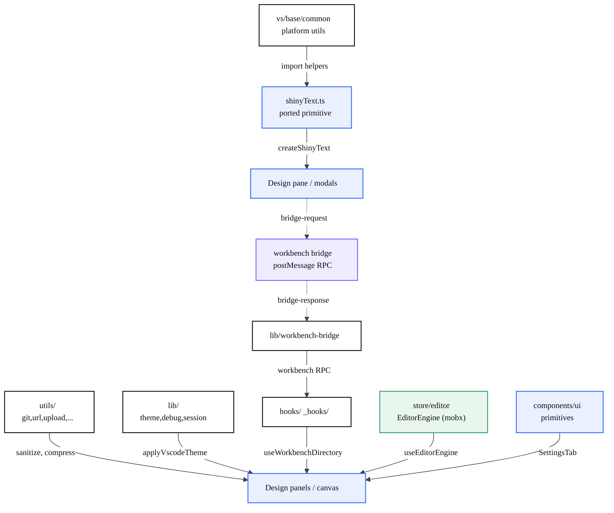

# Reusable code

> The shared utilities, bridges, hooks, stores and UI primitives a CodeCanvas developer can reuse — with emphasis on what CodeCanvas adds on top of upstream VS Code, especially inside the Design editor bundle.

## At a glance

- CodeCanvas has **two reuse worlds**: the **workbench host** (the VS Code OSS fork, TypeScript/Electron, reuses `src/vs/base/common`) and the **Design editor bundle** (`design-editor-src/`, a React/Onlook app reusing its own `utils` / `lib` / `hooks` / `store` / `components`). They are wired together by the postMessage bridge.
- The host has **no React, no framer-motion, no Tailwind installed**. Any reactbits/React component the project wants in the workbench UI is **ported to native TS + CSS** (imperative DOM helper + a stylesheet). `shinyText.ts` is the canonical example.
- The most reused CodeCanvas-specific units are the **workbench bridge** (`lib/workbench-bridge.ts`), the **VS Code theme sync** (`lib/vscode-theme.ts`), the **filesystem hooks** (`lib/workbench-fs-hooks.ts`) and the **debug gate** (`lib/debug.ts`).
- The **EditorEngine** (`components/store/editor/engine.ts`) is the central reusable store: one mobx object aggregating ~25 domain managers, handed to every panel through React context.
- The **landing site** (separate repo) ships reusable GL/animation building blocks in `src/lib/` (`anim.js`, `smooth.js`, `reveal.js`, `videoPanelGL.js`, `codeCanvasDualityGL.js`).
- Write-back libs (`html-writeback.ts`, `html-source-writer.ts`, `inspector-script.ts`) are owned by [Visual editing & write-back](?p=03-visual-editing-writeback); the bridge/RPC method surface is catalogued in the [API reference](?p=09-api-reference).

## Architecture

The reuse layers and how a feature reaches them. The platform base utils and a ported primitive live in the workbench host; the Design bundle has its own utils/lib/hooks/store/components layer; the two cross the postMessage bridge.



## The React -> native porting convention

The workbench host is plain TypeScript + DOM; it has no React/motion/Tailwind. When the project wants a reactbits/React effect in the workbench UI, the convention is: **split the component into an imperative TS helper (logic, returns/decorates a DOM node) and a CSS file (the animation via keyframes + custom properties)**. Options become typed function arguments; framer-motion springs become CSS transitions/keyframes. The result is a tiny dependency-free unit any view can call.

```mermaid
%%{init: {'theme':'base','themeVariables':{'fontFamily':'Space Grotesk, Segoe UI, sans-serif','fontSize':'14px','primaryColor':'#ffffff','primaryTextColor':'#0c0d10','primaryBorderColor':'#0c0d10','lineColor':'#3b3f47','tertiaryColor':'#f6f6f3'}}}%%
flowchart TD
  SRC["reactbits ShinyText<br/>React + motion"]:::ext
  PORT["manual port<br/>logic to TS, motion to CSS"]:::core
  TS["shinyText.ts<br/>createShinyText()"]:::core
  CSS["shinyText.css<br/>.cc-shiny-text + vars"]:::data
  VIEW["previewSelectorModal<br/>workbench view"]:::ui

  SRC ==>|rewrite| PORT
  PORT -->|imperative DOM helper| TS
  PORT -->|keyframes + --cc-shiny-*| CSS
  TS -->|createShinyText(text, opts)| VIEW
  CSS -.->|class cc-shiny-text| VIEW

  classDef ui fill:#eaf0ff,stroke:#2f6bff,stroke-width:1.5px,color:#0c0d10;
  classDef core fill:#ffffff,stroke:#0c0d10,stroke-width:1.5px,color:#0c0d10;
  classDef ai fill:#fdf0e6,stroke:#e8833a,stroke-width:1.5px,color:#0c0d10;
  classDef data fill:#e8f6ee,stroke:#2f9e6b,stroke-width:1.5px,color:#0c0d10;
  classDef ext fill:#f1f1ee,stroke:#8b909a,stroke-width:1.5px,stroke-dasharray:4 3,color:#3b3f47;
  classDef bridge fill:#f0ecff,stroke:#7c5cff,stroke-width:1.5px,color:#0c0d10;
```

| Unit | File | Signature / shape | How to reuse |
| --- | --- | --- | --- |
| `createShinyText` | `src/vs/workbench/contrib/codecanvasPreview/browser/shinyText.ts:39` | `(text: string, opts?: IShinyTextOptions) => HTMLElement` | Build a shimmering `<span>` in any workbench view without React; pass `speed`/`color`/`shineColor`. |
| `applyShinyText` | `shinyText.ts:47` | `(el: HTMLElement, opts?: IShinyTextOptions) => void` | Decorate an existing element with the shimmer (keeps its text). |
| `IShinyTextOptions` | `shinyText.ts:7` | `{ speed?, spread?, color?, shineColor?, direction?, pauseOnHover?, disabled?, className? }` | The typed equivalent of the original component props. |
| `cc-shiny-text` styles | `codecanvasPreview/browser/media/shinyText.css` | CSS class + `--cc-shiny-*` custom properties | Drives the animation; the TS helper only sets variables. Load once with the view's CSS. |

## Reusable utilities — `design-editor-src/src/utils/`

Grouped by folder. These are framework-agnostic helpers (no Onlook coupling unless noted).

| Group / Unit | File | Signature / shape | How to reuse |
| --- | --- | --- | --- |
| **git** `sanitizeCommitMessage` | `utils/git/index.ts:7` | `(message: string) => string` | Strip control chars + truncate a commit subject/body to git limits. |
| **git** `escapeShellString` | `utils/git/index.ts:53` | `(str: string) => string` | POSIX-safe shell quoting for arbitrary strings. |
| **git** `prepareCommitMessage` | `utils/git/index.ts:72` | `(message: string) => string` | Sanitize + escape in one call before passing to a git command. |
| **git** `withSyncPaused` | `utils/git/index.ts:81` | `<T>(sync, op: () => Promise<T>, delayMs?) => Promise<T>` | Wrap any rapid-filechange git op so a watcher/sync is paused around it. |
| **url** `sanitizeReturnUrl` | `utils/url/index.ts:7` | `(returnUrl, opts?: {origin?}) => string` | Open-redirect guard: only same-origin/relative URLs survive. |
| **url** `getReturnUrlQueryParam` | `utils/url/index.ts:3` | `(returnUrl: string \| null) => string` | Build the encoded `returnUrl=` query fragment. |
| **upload** `compressImage` | `utils/upload/image-compression.ts:38` | `(file, opts?, onProgress?) => Promise<CompressionResult>` | Canvas-based client-side image downscale/recompress with a size budget. |
| **upload** `compressMultipleImages` | `image-compression.ts:146` | `(files, opts?, onProgress?) => Promise<CompressionResult[]>` | Batch compress; non-images pass through untouched. |
| **upload** `canCompressFile` | `image-compression.ts:26` | `(file: File) => boolean` | Guard before compressing (jpeg/png/webp/bmp/tiff). |
| **constants** `Routes` / `ExternalRoutes` / `Git` / `LocalForageKeys` | `utils/constants/index.ts` | `const` maps | Central route + limit constants; import instead of hardcoding paths. |
| **constants** navigation | `utils/constants/navigation.ts` | `NavigationLink`, `PRODUCT_LINKS`, `NAVIGATION_CATEGORIES` | Reusable nav-menu data shape. |
| **analytics** `trackEvent` | `utils/analytics/server.ts:26` | `(props: EventMessage) => void` | PostHog singleton capture (server-side); no-op if key unset. |
| **n8n** `callUserWebhook` | `utils/n8n/webhook.ts:3` | `(user: {...}) => Promise<void>` | Fire-and-forget user webhook; skips cleanly when env unset. |
| **telemetry** stubs | `utils/telemetry/index.ts` | `resetTelemetry()`, `openFeedbackWidget()` | Intentional no-ops — the local editor ships no telemetry; keep imports satisfied. |

## Reusable libs — `design-editor-src/src/lib/`

The bridge + environment glue that makes the Onlook bundle run inside CodeCanvas. (Write-back libs are documented in [Visual editing & write-back](?p=03-visual-editing-writeback) — see the note below.)

| Unit | File | Signature / shape | How to reuse |
| --- | --- | --- | --- |
| `workbench` RPC client | `lib/workbench-bridge.ts:134` | object: `readFile/writeFile/readDir/exists/stat/rename/delete/mkdir/copy/watchFs/listProjects/startDevServer/...` | The single typed entry point to call the workbench host over postMessage. |
| `callWorkbench` | `workbench-bridge.ts:77` | `<T>(method, params?, timeoutMs?) => Promise<T>` | Low-level request helper for any new bridge method; auto-rejects when standalone. |
| `isEmbeddedInWorkbench` | `workbench-bridge.ts:48` | `() => boolean` | Branch behaviour between embedded vs. standalone (vite dev). |
| `onWorkbenchFsChange` | `workbench-bridge.ts:128` | `(listener) => () => void` | Subscribe to host-pushed file changes; returns unsubscribe. |
| `applyVscodeTheme` / `startVscodeThemeSync` | `lib/vscode-theme.ts:102,125` | `() => void` | Map the host's `--vscode-*` CSS vars onto the bundle's design tokens and follow theme changes. |
| `debugLog` / `debugWarn` / `isDebugEnabled` / `isHudEnabled` | `lib/debug.ts:39,46,26,31` | `(...args) => void` / `() => boolean` | Logging is gated to dev builds or `localStorage 'cc-debug'='1'` (`debug.ts:10-18`); the on-screen HUD (`isHudEnabled`) is a **separate** opt-in via `localStorage 'cc-hud'='1'` (`debug.ts:31-37`). Use for all `[CC-*]` logs. |
| design session | `lib/design-session.ts` | `setActiveProject` / `getActiveProject` / `getActiveProjectRoot` / `getActiveProjectPages` | Module-level holder for the project currently open in Design. |
| workbench fs hooks | `lib/workbench-fs-hooks.ts` | `useWorkbenchDirectory`, `useWorkbenchFile`, `uploadFilesToWorkbench`, `renameWorkbenchFile`, `deleteWorkbenchFile` | React hooks/helpers that read/write real project files over the bridge (power the Images panel). |
| workbench chat | `lib/workbench-chat.ts` | `sendToWorkbenchChat(engine, prompt?)`, `isWorkbenchChatAvailable()` | Hand the selected element + app context to the native workbench chat. |
| local code provider | `lib/bridge-provider.ts` | Onlook `Provider` impl backed by the bridge | Replaces Onlook's CodeSandbox provider so file ops hit the real disk. |
| moveable debug | `lib/cc-moveable-debug.ts` | event ring buffer + log flush | Debug-gated gesture diagnostics; mirror to HUD/log only when `isDebugEnabled()`. |
| write-back (linked) | `lib/html-writeback.ts`, `lib/html-source-writer.ts`, `lib/inspector-script.ts` | — | Owned by [page 03](?p=03-visual-editing-writeback); do not re-document here. |

## Reusable hooks — `src/hooks/` and `src/_hooks/`

| Hook | File | Signature / shape | How to reuse |
| --- | --- | --- | --- |
| `useStartProject` | `hooks/use-start-project.tsx:31` | `() => { isProjectReady, needsProjectChoice, apps, chooseApp, error }` | Drive the Design start flow: list runnable apps, pick one, boot its server, seed the canvas. |
| `isOpenableApp` | `use-start-project.tsx:21` | `(app: DesignProjectInfo) => boolean` | Filter analyzed apps to those Design can open (dev server or static HTML). |
| `usePanelMeasurements` | `hooks/use-panel-measure.tsx:5` | `(leftRef, rightRef) => { toolbarLeft, toolbarRight, editorBarAvailableWidth }` | Keep a floating toolbar sized to the gap between two side panels (resize/mutation/poll fallbacks). |
| `useTabActive` | `hooks/use-tab-active.tsx:5` | `() => { tabState: 'active'\|'inactive'\|'reactivated' }` | React to tab visibility, distinguishing first-active from re-activation. |
| `useInspectorBridge` | `hooks/use-inspector-bridge.ts:12` | `() => void` | Re-emit inspector clicks from the preview iframe up to the workbench as `open-source`. |
| `useChat` (stub) | `_hooks/use-chat/index.tsx:7` | `() => { status, sendMessage, messages, ... }` | Inert chat surface placeholder; keeps the chat panel rendering until wired to a backend. |

## Shared UI primitives — `src/components/ui/`

| Unit | File | Signature / shape | How to reuse |
| --- | --- | --- | --- |
| `SettingsTabValue` | `components/ui/settings-modal/helpers.tsx:1` | `enum` (DOMAIN, PROJECT, PREFERENCES, VERSIONS, ...) | Stable tab keys shared by the modal and the state store. |
| `SettingTab` | `helpers.tsx:11` | `{ label, icon: ReactNode, component: ReactNode }` | Shape for registering a new settings tab. |
| `ComingSoonTab` | `helpers.tsx:17` | `() => JSX.Element` | Placeholder body for not-yet-built tabs. |
| Settings modal parts | `settings-modal/project/`, `settings-modal/versions/` (`versions.tsx`, `version-row.tsx`, `empty-state/version.tsx`) | React components | Reusable settings/versions panels for the project settings surface. |

> Note: the host's reusable UI primitives are plain DOM builders, not these React components — see the porting table above (`shinyText`). The `components/ui` set is reusable only inside the Design React bundle.

## Shared state stores — `src/components/store/`

| Store | File | Signature / shape | How to reuse |
| --- | --- | --- | --- |
| `EditorEngine` | `store/editor/engine.ts:33` | mobx class aggregating ~25 managers (`elements`, `frames`, `style`, `history`, `move`, `overlay`, `sandbox`, `code`, `ast`, `chat`, `theme`, `font`, ...) | The single source of editor truth; every panel reads/writes through it. |
| `useEditorEngine` / `EditorEngineProvider` | `store/editor/index.tsx:10,16` | `() => EditorEngine` / context provider | Inject and consume the engine in any Design view (throws if used outside the provider). |
| `StateManager` | `store/state/manager.ts:4` | mobx class: `isSettingsModalOpen`, `settingsTab`, `isSubscriptionModalOpen` | Lightweight global UI flags (modals/tabs). |
| `useStateManager` | `store/state/index.ts:6` | `() => StateManager` | Read the shared UI-flag store from any component. |

The per-domain managers under `store/editor/*` (e.g. `frames/manager.ts`, `branch/manager.ts`, `history/index.ts`, `font/*`, `sandbox/*`) are individually reusable units accessed through `EditorEngine`; treat the engine as the public API rather than importing managers directly.

## Landing site GL/anim helpers — `src/lib/` (landing repo)

These live in the same project family (the marketing/landing site) and are reusable front-end building blocks. Paths are relative to the landing repo root.

| Unit | File | Signature / shape | How to reuse |
| --- | --- | --- | --- |
| `initSiteAnim` | `src/lib/anim.js:22` | `() => () => void` | Register the whole scroll-animation system (skew, masked reveals, parallax, magnetic CTAs, pinned horizontal track); returns a cleanup. gsap + `matchMedia`, reduced-motion safe. |
| `initSmoothScroll` | `src/lib/smooth.js:9` | `() => Lenis \| null` | Lenis smooth-scroll wired to gsap ticker/ScrollTrigger; null when reduced-motion. |
| `useReveal` | `src/lib/reveal.js:15` | `() => React.RefObject` | One shared `[data-reveal]` rise+fade hook; attach the returned ref to a section root. |
| `mountVideoPanelGL` | `src/lib/videoPanelGL.js:142` | `(canvas, videoSrc, opts?) => disposer` | WebGL video panel that morphs between two DOM anchor rects on scroll (three.js + ScrollTrigger). |
| `mountCodeCanvasDualityGL` | `src/lib/codeCanvasDualityGL.js:353` | `(canvas, opts?) => disposer` | Code-canvas "duality" plane: scanline-wipe mix of a code panel and a UI mock, velocity chromatic split. |

## Platform base utilities — `src/vs/base/common/`

This is upstream VS Code's shared utility layer (~109 modules: `arrays`, `async`, `buffer`, `cancellation`, `event`, `lifecycle`, `uri`, `color`, `codicons`, ...). It is **the host's primary reuse layer** — prefer it before writing new helpers in any workbench-side code. It is not enumerated here because it is upstream, not CodeCanvas-specific.

What CodeCanvas **adds on top** of this base (and reuses it from) lives outside `base/common`, e.g.:
- `src/vs/workbench/contrib/codecanvasPreview/` — the Design pane, `designBridge`, project analyzer, status bar, snapshots, and the ported `shinyText` primitive.
- `src/vs/platform/agentHost/` — the Claude CLI / agent backend.

For the cross-process method surface these expose (bridge requests, ProxyChannel, DI services, CLI RPC, penpal/design-editor API), see the [API reference](?p=09-api-reference).

## Gotchas

- **The host has no React.** Do not reach for a React/motion/Tailwind dependency in workbench code; port to a TS helper + CSS instead (see `shinyText`). The `components/ui` React primitives only work inside `design-editor-src`.
- **Two separate bundles, one bridge.** `design-editor-src/src/lib` units do not run in the host and `vs/base/common` is not imported by the bundle. Cross only through `workbench-bridge` / `designBridge`; everything rejects cleanly when `isEmbeddedInWorkbench()` is false (standalone vite dev). The bridge enforces a message-origin trust boundary (`event.source !== window.parent`, `workbench-bridge.ts:62,112`) so a nested preview iframe cannot forge a response — see [Security & permissions](?p=11-security-permissions).
- **Debug traces must be gated.** Use `debugLog`/`debugWarn` (and `isDebugEnabled()` / `isHudEnabled()`), never raw `console.log`, for `[CC-*]` traces — they must stay silent in packaged builds unless the user opts in via `localStorage 'cc-debug'='1'` (logging) or `'cc-hud'='1'` (the on-screen HUD).
- **`cc-moveable-debug` is temporary.** It writes a `cc-moveable-debug.log` into the project root; it is diagnostic scaffolding for the Moveable gesture work, not a stable API.
- **Telemetry helpers are stubs by design.** `utils/telemetry` and `_hooks/use-chat` are inert local replacements for Onlook's cloud features; reusing them gets you a no-op, not behaviour.
- **Theme tokens are scoped to `.monaco-workbench`.** `vscode-theme.ts` reads `--vscode-*` from that element (not `:root`); a same-origin parent is required, so it silently no-ops standalone.
- **`workbench-fs-hooks` never overwrites silently.** `uploadFilesToWorkbench` / `renameWorkbenchFile` throw on an existing destination — handle the error in the UI rather than assuming success.

## Gaps

> Audited against `design-editor-src/src/`, the host `shinyText` primitive, and `src/vs/base/common` on 2026-06-28.

**Documented but not part of this repo:**

- The **landing-site GL/anim helpers** (`src/lib/anim.js`, `smooth.js`, `reveal.js`, `videoPanelGL.js`, `codeCanvasDualityGL.js`) live in the **separate landing/marketing repository** — no `anim.js` (or any sibling) exists anywhere in the CodeCanvas tree. Those `file:line` citations are relative to the landing repo's root and cannot be verified from here; keep the "(landing repo)" qualifier when reusing.

**Corrected on this page:**

- The `isHudEnabled` HUD gate uses a **distinct** `localStorage 'cc-hud'` key (`debug.ts:31-37`), not `'cc-debug'` — the latter only gates `debugLog` / `debugWarn` / `isDebugEnabled` (`debug.ts:10-18`).

**Present but intentionally not enumerated:**

- The host reuse layer is upstream `src/vs/base/common` plus CodeCanvas additions under `codecanvasPreview/` and `platform/agentHost/`; only the canonical ported primitive (`shinyText.ts`) is tabled here. Other `codecanvasPreview/browser` helpers are documented on [Design](?p=02-design-environment) / [Preview](?p=05-codecanvas-preview).
- Write-back libs (`html-writeback.ts`, `html-source-writer.ts`, `inspector-script.ts`) are owned by [Visual editing & write-back](?p=03-visual-editing-writeback) and not re-documented here.
- The per-domain `store/editor/*` managers (26 in total: `action`, `api`, `ast`, `branch`, `canvas`, `chat`, `code`, `copy`, `element`, `font`, `frame-events`, `frames`, `group`, `ide`, `image`, `insert`, `move`, `overlay`, `pages`, `sandbox`, `screenshot`, `snap`, `state`, `style`, `text`, `theme`; imported at `store/editor/engine.ts:6-31`) are reachable through `EditorEngine` and treated as a single public API rather than tabled individually.

**Cross-references:** the bridge/RPC method surface, penpal API, and write-back functions are catalogued in the [API reference](?p=09-api-reference) (now **511 operations, v2.1.0**); the bridge trust boundary, workspace confinement, and origin checks are on [Security & permissions](?p=11-security-permissions).
