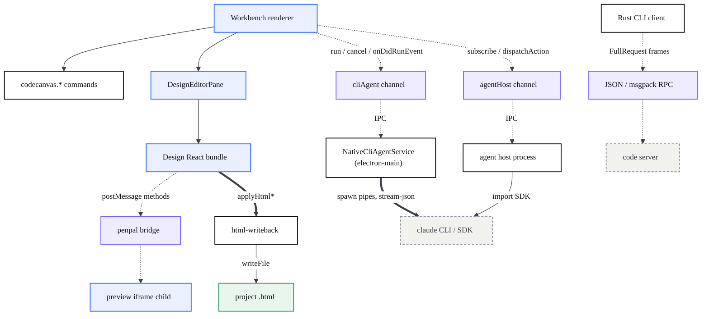
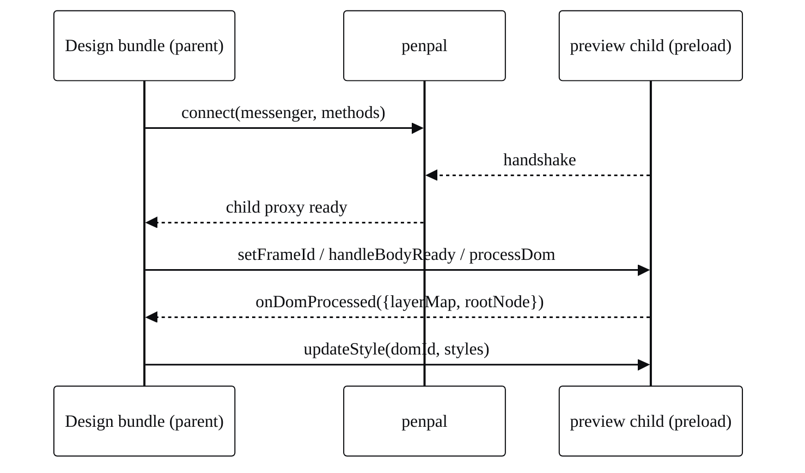

# API reference

> CodeCanvas has no public HTTP API. This page catalogs its *internal* surface — IPC channels, DI services, commands, the Claude stream-json protocol, the Design penpal bridge, the HTML write-back functions, and the Rust CLI's RPC methods — and the companion [API console](docs-api.html) renders the same catalog as OpenAPI in Swagger UI.

## At a glance

- There is **nothing to `curl`**. Every operation here is an in-process call (IPC across Electron processes, a DI service method, a postMessage over penpal, or a JSON/msgpack RPC frame to the CLI's code server). None of it is reachable over the network.
- The matching spec is [`public/docs/api/openapi.yaml`](api/openapi.yaml): **19 tags, 510 operations** (OpenAPI 3.0.3, v2.1.0), grouped via `x-tagGroups` into six sections — **Electron IPC**, **AI / Agent Host**, **Workbench Commands**, **Design Editor**, **Rust CLI**, **Agent Sessions**. Every operation cites its real source `file:line` in an `x-source` extension. It exists so the surface is *browsable* in a Swagger-style console, not because these are HTTP endpoints. It is a curated index, not a guarantee of completeness — large tags (Commands, Sessions) surface a representative subset of the underlying surface, not every id.
- Modelling convention: each operation is a `POST` to a **synthetic path** (`/ipc/{channel}/{method}`, `/service/{name}/{method}`, `/command/{id}`, `/agent-host/claude/{message}`, `/penpal/{method}`, `/writeback/{fn}`, `/cli-rpc/{method}`). The request body is the parameter shape; the `200` response is the return type. Read a path as "call method X on surface Y".
- The surfaces, by section: **Electron IPC** — IPC Channels, Services; **AI / Agent Host** — Agent Host (Claude), plus the Agent Host Protocol channel families (AHP Lifecycle, Root, Session, Terminal, Changeset, Resource, Resource Watch, Telemetry/OTLP); **Workbench Commands** — Commands; **Design Editor** — Design Bridge (penpal), HTML Write-back, Design Bridge (workbench), Editor Engine; **Rust CLI** — CLI RPC, CLI Commands; **Agent Sessions** — Sessions.

| File | Responsibility |
| --- | --- |
| `public/docs/api/openapi.yaml` | The OpenAPI 3.0 spec rendered by the console. |
| `public/docs-api.html` | Swagger UI that loads the spec above. |
| `src/vs/platform/cliAgent/common/cliAgent.ts` | `ICliAgentService` — the `cliAgent` IPC channel contract. |
| `src/vs/platform/agentHost/common/agentService.ts` | `IAgentService` / `IAgentHostService` + the `AgentHostIpcChannels` enum. |
| `src/vs/workbench/contrib/codecanvasPreview/browser/codecanvasPreview.contribution.ts` | The `codecanvas.preview.*` commands. |
| `src/vs/platform/cliAgent/electron-main/cliAgentMainService.ts` | The Claude `stream-json` parser. |
| `design-editor-src/src/components/canvas/frame/view.tsx` | The penpal parent/child method surface. |
| `design-editor-src/src/lib/html-writeback.ts` | The `applyHtml*` write-back functions. |
| `cli/src/tunnels/control_server.rs` | Where the CLI RPC methods are registered. |

## How the API console works (what these operations really are)

The console at [`docs-api.html`](docs-api.html) is a stock Swagger UI pointed at `api/openapi.yaml`. Swagger UI is built for HTTP, so the spec **borrows HTTP shapes to describe non-HTTP calls** — an honest fiction that makes the surface searchable, groupable, and linkable. Concretely:

- The HTTP verb is always `POST`. It carries no meaning; it is just the verb Swagger needs to render a body.
- The `path` is an identifier, not a URL. `/ipc/cliAgent/run` means "the `run` method of the `cliAgent` IPC channel", not a route.
- "Try it out" will not work — there is no server. The value is the schema and the source citation on every operation.

If you want the real thing, follow the source-file reference on each operation back into the repo. The tables below give you the same information in prose.

## Architecture — the API surfaces

Four transports, color-coded as `bridge`, sit between callers and implementations: the Electron IPC channels (renderer to main), penpal (Design bundle to preview iframe), and the CLI's JSON/msgpack RPC (CLI client to code server). Services and commands are plain in-process calls with no transport.



## IPC channels

main <-> renderer channels registered with `server.registerChannel` / `ProxyChannel.fromService` and consumed with `getChannel` / `ProxyChannel.toService`. The CodeCanvas-relevant channel names:

| Channel | Constant | Purpose | Source |
| --- | --- | --- | --- |
| `cliAgent` | (string literal) | Spawn coding-agent CLIs from electron-main. | `cliAgentService.ts:11` |
| `agentHost` | `AgentHostIpcChannels.AgentHost` | The proxied `IAgentService` (sessions, state, completions). | `agentService.ts:30` |
| `agentHostLogger` | `AgentHostIpcChannels.Logger` | Log forwarding from the agent-host process. | `agentService.ts:32` |
| `agentHostConnectionTracker` | `AgentHostIpcChannels.ConnectionTracker` | WebSocket client count (server process only). | `agentService.ts:34` |
| `agentHostProxy` | `AgentHostIpcChannels.RemoteProxy` | Proxies AHP JSON-RPC frames renderer<->server. | `agentService.ts:40` |
| `agentHostClientResource` | `AGENT_HOST_CLIENT_RESOURCE_CHANNEL` | Client-side filesystem provider for the agent host. | `agentHostClientResourceChannel.ts:28` |
| `sshRemoteAgentHost` | `SSH_REMOTE_AGENT_HOST_CHANNEL` | SSH remote agent-host main service. | `sshRemoteAgentHost.ts:16` |

### `cliAgent` channel — `ICliAgentService`

Lives in electron-main so it can spawn through a plain pipe, **not a PTY** (a TTY makes `claude` think it is interactive, ignore `-p`, and hang). The renderer reaches it via `runCli` (`cliProcess.ts:40`).

| Operation | Params | Returns | Source |
| --- | --- | --- | --- |
| `run` | `runId: string`, `spec: ICliRunSpec` | `ICliRunResult { exitCode }` | `cliAgentMainService.ts:45` |
| `cancel` | `runId: string` | `void` (kills the tree by handle, never by name) | `cliAgentMainService.ts:130` |
| `onDidRunEvent` | event | `ICliRunEvent { runId, kind:'text'|'error', value }` | `cliAgent.ts:49` |

```ts
// renderer side (cliProcess.ts) — one persistent listener, dispatch by run id
cliAgentService.onDidRunEvent(e => runHandlers.get(e.runId)?.(e.value));
await cliAgentService.run(runId, { executable: 'claude', args, cwd, format: 'claude-stream-json', stdin: prompt });
```

### `agentHost` channel — `IAgentService` (selected methods)

`ProxyChannel.fromService(agentService)` registered at `agentHostMain.ts:194`. State is kept in sync with a subscribe / dispatchAction / `onDidAction` protocol.

| Operation | Params | Returns | Source |
| --- | --- | --- | --- |
| `subscribe` | `resource: URI`, `clientId: string` | `IStateSnapshot` | `agentService.ts:838` |
| `unsubscribe` | `resource: URI`, `clientId: string` | `void` | `agentService.ts:845` |
| `dispatchAction` | `channel: string`, `action` | `void` (echoed via `onDidAction`) | `agentService.ts:880` |
| `listSessions` | — | `IAgentSessionMetadata[]` | `agentService.ts:784` |
| `createSession` | `config?` | `URI` | `agentService.ts:787` |
| `completions` | `CompletionsParams` | `CompletionsResult` | `agentService.ts:807` |
| `disposeSession` | `session: URI` | `void` | `agentService.ts:817` |
| `shutdown` | — | `void` | `agentService.ts:826` |

## Services

CodeCanvas-specific DI services (`createDecorator<I...>`). Plain in-process async calls.

| Service | Operation | Params | Returns | Source |
| --- | --- | --- | --- | --- |
| `IClaudeAgentSdkService` | `startup` | `{ options, initializeTimeoutMs? }` | `WarmQuery` | `claudeAgentSdkService.ts:32` |
| `IClaudeAgentSdkService` | `listSessions` | — | `SDKSessionInfo[]` | `claudeAgentSdkService.ts:30` |
| `IClaudeAgentSdkService` | `getSessionMessages` | `sessionId`, `options?` | `SessionMessage[]` | `claudeAgentSdkService.ts:33` |
| `IClaudeAgentSdkService` | `createSdkMcpServer` | `{ name, version?, tools? }` | `McpSdkServerConfigWithInstance` | `claudeAgentSdkService.ts:37` |
| `IClaudeAgentSdkService` | `tool` | `name, description, inputSchema, handler` | `SdkMcpToolDefinition` | `claudeAgentSdkService.ts:47` |
| `IAgentHostService` | `restartAgentHost` | — | `void` | `agentService.ts:1054` |
| `IAgentHostService` | `startWebSocketServer` | — | `IAgentHostSocketInfo` | `agentService.ts:1056` |
| `IAgentHostService` | `getInspectInfo` | `tryEnable: boolean` | `IAgentHostInspectInfo?` | `agentService.ts:1064` |
| `IAgentHostFilterService` | `setSelectedProviderId` | `providerId: string` | `void` | `agentHostFilter.ts:67` |
| `IAgentHostFilterService` | `reconnect` / `disconnect` | `providerId: string` | `void` | `agentHostFilter.ts:73` |
| `IAgentHostFilterService` | `rediscover` | — | `Promise<void>` | `agentHostFilter.ts:86` |
| `IAgentHostCustomizationService` | `getCustomAgents` | `sessionResource: URI` | `AgentCustomization[]` | `agentHostCustomizationService.ts:55` |
| `IAgentHostCustomizationService` | `getCustomizations` | `sessionResource: URI` | `Customization[]` | `agentHostCustomizationService.ts:68` |

> `IClaudeAgentSdkService` is a pure 1:1 passthrough over `@anthropic-ai/claude-agent-sdk`; the SDK is not bundled, so it is `import()`-ed from the path in `chat.agentHost.claudeAgent.path` (`claudeAgentSdkService.ts:170`).

## Commands

> The table below is the CodeCanvas-specific subset — the live-preview and Design commands. The console's **Commands** tag is broader: ~101 command ids covering these plus the agent-sessions / chat command surface under `src/vs/workbench/contrib/chat`, several of which *do* take arguments. The dedicated session-window command ids live under their own **Sessions** tag — see [Agent Sessions](#agent-sessions).

Registered with `registerAction2` / `CommandsRegistry.registerCommand`. Invoke via the command palette or `commandService.executeCommand(id)`. The preview/Design commands listed here take no arguments — they act on the active preview/Design state.

| Command id | Effect | Source |
| --- | --- | --- |
| `codecanvas.preview.open` | Open the workspace live preview. | `codecanvasPreview.contribution.ts:802` |
| `codecanvas.preview.choosePage` | Open preview after picking a page. | `codecanvasPreview.contribution.ts:823` |
| `codecanvas.preview.openLocalhost` | Open a preview of the localhost dev server. | `codecanvasPreview.contribution.ts:839` |
| `codecanvas.preview.reload` | Reload the preview view. | `codecanvasPreview.contribution.ts:857` |
| `codecanvas.preview.inspectElement` | Click-to-inspect; updates `currentElementData`. | `codecanvasPreview.contribution.ts:881` |
| `codecanvas.preview.stopInspect` | Disable inspection, clear selection. | `codecanvasPreview.contribution.ts:937` |
| `codecanvas.preview.moveResizeElement` | Drag move/resize the inspected element, commit CSS. | `codecanvasPreview.contribution.ts:1071` |
| `codecanvas.preview.editCSS` | Quick-input edit of a positioned element's CSS. | `codecanvasPreview.contribution.ts:1145` |
| `workbench.action.openDesignEditor` | Open the Design editor (empty canvas). | `designView.ts:40` |
| `workbench.action.codecanvasToggleDesignFullWindow` | Toggle clean full-window Design layout. | `designFullWindowMode.ts:18` |

> The chat CLI providers (`cliProviders/`) register chat *agents*, *models*, and one setting — `codecanvas.design.permissionMode` (`cliLanguageModelProvider.ts:32`) — plus the `ccActiveAgent` context key (`cliChatAgent.ts:28`); they do not register palette commands.

## Agent Host (Claude) — stream-json

The chat spawns Claude one-shot and parses its NDJSON. Invocation flags from `CLI_MODELS` (`cliModelsContribution.ts:61`):

```bash
claude -p --output-format stream-json --verbose \
  [--permission-mode <default|acceptEdits|plan|bypassPermissions>] \
  [--model <opus|sonnet|haiku>]   # prompt is written to stdin
```

The parser reads one JSON object per line and only consumes `assistant` events; `system` and `result` lines are dropped.

| Message | Shape | Handling | Source |
| --- | --- | --- | --- |
| assistant event | `{ type:'assistant', message:{ content:[...] } }` | iterate `content` blocks | `cliAgentMainService.ts:213` |
| text block | `{ type:'text', text }` | forwarded verbatim as markdown | `cliAgentMainService.ts:215` |
| tool_use block | `{ type:'tool_use', name, input }` | rendered as a compact non-executable line (e.g. **Edit** `src/foo.ts`) | `cliAgentMainService.ts:217` |

```mermaid
%%{init: {'theme':'base','themeVariables':{'fontFamily':'Space Grotesk, Segoe UI, sans-serif','fontSize':'14px','primaryColor':'#ffffff','primaryTextColor':'#0c0d10','primaryBorderColor':'#0c0d10','lineColor':'#3b3f47','tertiaryColor':'#f6f6f3'}}}%%
sequenceDiagram
  participant R as Renderer (chat)
  participant M as NativeCliAgentService (main)
  participant C as claude CLI (child proc)
  R->>M: run(runId, spec) over cliAgent channel
  M->>C: spawn pipes; stdin = prompt, then EOF
  C-->>M: stdout NDJSON: {type:'assistant', content:[...]}
  M-->>R: onDidRunEvent {runId, kind:'text', value}
  C-->>M: close (exit code)
  M-->>R: resolve run({exitCode})
```

> The CLI ran the tools itself, so `tool_use` is shown as plain text — never re-emitted as a chat tool-use part, which would make the chat try to execute it again (`cliAgentMainService.ts:189`).

## Design Bridge (penpal)

The Design React bundle (parent) connects penpal to the preload script injected into the preview iframe (child). The parent exposes a handful of callbacks; the child exposes the editing surface. Names from `PENPAL_CHILD_METHOD_NAMES` (`view.tsx:32`).

**Parent methods** (bundle exposes, child calls):

| Method | Params | Returns | Source |
| --- | --- | --- | --- |
| `getFrameId` / `getBranchId` | — | `string` | `view.tsx:166` |
| `onDomProcessed` | `{ layerMap, rootNode }` | `void` | `view.tsx:174` |
| `onWindowMutated` / `onWindowResized` | — | `void` | `view.tsx:168` |

**Child methods** (preload exposes, parent calls — selected):

| Method | Params | Returns | Source |
| --- | --- | --- | --- |
| `processDom` | — | `void` (triggers `onDomProcessed`) | `view.tsx:280` |
| `getElementAtLoc` | `x, y` | element info | `view.tsx:281` |
| `getElementByDomId` | `domId` | element info | `view.tsx:282` |
| `getComputedStyleByDomId` | `domId` | style map | `view.tsx:286` |
| `updateStyle` | `domId, styles` | `void` | `view.tsx:309` |
| `startEditingText` / `editText` / `stopEditingText` | `domId, content` | `void` | `view.tsx:306` |
| `insertElement` / `removeElement` / `moveElement` | element/location | result | `view.tsx:310` |
| `groupElements` / `ungroupElements` | element set | result | `view.tsx:313` |
| `insertImage` / `removeImage` | image spec | `void` | `view.tsx:315` |
| `startDrag` / `drag` / `dragAbsolute` / `endDrag` / `endAllDrag` | drag state | `void` | `view.tsx:300` |
| `getTheme` / `setTheme` | — / theme | `string` / `void` | `view.tsx:298` |
| `captureScreenshot` | — | data URL | `view.tsx:319` |
| `buildLayerTree` | — | layer tree | `view.tsx:320` |



> Selection is keyed by `domId`, not `oid` (`view.tsx:282`). If the preload bundle is missing the parent never connects and the canvas drops to a view-only state (`use-inspector-proxy.ts:39`).

## HTML Write-back

Public functions that persist visual edits into the real `.html` source. Identity is the durable `data-cc-id` (else a positional index); the format-preserving range writer is tried first, then a DOMParser fallback. All return `HtmlWriteResult { ok, reason?, changed? }` (`html-writeback.ts:119`).

| Function | Params | Source |
| --- | --- | --- |
| `applyHtmlStyleEdit` | `oid, styleUpdates: Record<string, StyleWriteChange>, pageFile` | `html-writeback.ts:195` |
| `applyHtmlAttrEdit` | `oid, attributes: Record<string, string|null>, pageFile` | `html-writeback.ts:236` |
| `applyHtmlReparentToBody` | `oid, styles, pageFile` | `html-writeback.ts:269` |
| `applyHtmlTextEdit` | `oid, newText, pageFile` (refuses `has-children`) | `html-writeback.ts:303` |
| `applyHtmlInsert` | `spec: InsertSpec, location: ActionLocation, pageFile` | `html-writeback.ts:458` |
| `applyHtmlRemove` | `oid, pageFile` | `html-writeback.ts:506` |
| `applyHtmlMove` | `oid, location, pageFile` | `html-writeback.ts:524` |
| `applyHtmlGroup` | `container {oid,tagName,attributes}, childOids, pageFile` | `html-writeback.ts:566` |
| `applyHtmlUngroup` | `oid, pageFile` | `html-writeback.ts:610` |
| `saveAsset` | `fileName, content?, originPath?` -> `string|null` | `html-writeback.ts:352` |

Helpers worth reusing: `editableElements(doc)` (`:61`), `ccIdOf(el)` (`:70`), `pageFileForPathname(pathname)` (`:109`), `assetSrcForPage(rel, pageFile)` (`:410`).

```ts
const res = await applyHtmlStyleEdit('c8f3a21', { left: { value: '120px' } }, 'index.html');
if (!res.ok) console.warn(res.reason);      // 'not-found' | 'has-children' | ...
else if (res.changed === false) { /* no-op: skip the reload */ }
```

## CLI RPC

Methods registered on the CLI's transport-agnostic dispatcher (`cli/src/rpc.rs`) and reached over JSON-RPC NDJSON (`json_rpc.rs`) or msgpack (`msgpack_rpc.rs`). Most fs/serve methods require auth (`ensure_auth`). Frames are `{ id?, method, params }` (`rpc.rs:669`); fs/net duplex methods open side streams.

| Method | Params | Kind | Source |
| --- | --- | --- | --- |
| `ping` | `{}` | sync | `control_server.rs:411` |
| `version` | `{}` | sync | `control_server.rs:557` |
| `gethostname` | `{}` | sync | `control_server.rs:412` |
| `sys_kill` | `{ pid }` | sync (auth) | `control_server.rs:413` |
| `fs_stat` | `{ path }` | sync (auth) | `control_server.rs:417` |
| `fs_read` / `fs_write` / `fs_connect` | `{ path }` | duplex (auth) | `control_server.rs:421` |
| `net_connect` | `NetConnectRequest` | duplex (auth) | `control_server.rs:445` |
| `fs_rm` | `{ path }` | async (auth) | `control_server.rs:453` |
| `fs_mkdirp` | `{ path }` | sync (auth) | `control_server.rs:457` |
| `fs_rename` | `{ from_path, to_path }` | sync (auth) | `control_server.rs:461` |
| `fs_readdir` | `{ path }` | sync (auth) | `control_server.rs:465` |
| `get_env` | `{}` | sync (auth) | `control_server.rs:469` |
| `challenge_issue` / `challenge_verify` | challenge params | sync | `control_server.rs:473` |
| `serve` | `ServeParams` | async (auth) | `control_server.rs:479` |
| `update` | `UpdateParams` | async | `control_server.rs:483` |
| `servermsg` | `ServerMessageParams` | sync | `control_server.rs:486` |
| `prune` | `{}` | sync | `control_server.rs:492` |
| `callserverhttp` | `CallServerHttpParams` | async | `control_server.rs:493` |
| `forward` / `unforward` | `ForwardParams` | async (auth) | `control_server.rs:497` |
| `acquire_cli` | `AcquireCliParams` | async (auth) | `control_server.rs:505` |
| `spawn` / `spawn_cli` | `SpawnParams` | duplex, 3 streams (auth) | `control_server.rs:509` |
| `httpheaders` / `httpbody` | delegated-HTTP params | sync | `control_server.rs:535` |
| `streams_started` / `stream_data` / `stream_ended` | framework stream control | built-in | `rpc.rs:633` |

## Agent Host Protocol (AHP)

The agent host is driven by a JSON-RPC 2.0, version-negotiated, channel-multiplexed **state-sync protocol** (`src/vs/platform/agentHost/common/state/protocol/`). It is the largest surface in the catalog: every channel family contributes its own `StateAction` discriminants and command types, which the console groups into eight tags. The signature move is **write-ahead optimistic dispatch** — the client runs the reducer locally, allocates a `clientSeq`, sends `dispatchAction`, and reconciles when the server echoes the authoritative `action` envelope by `origin.clientSeq`.

| AHP tag | Ops | Covers | Source |
| --- | --- | --- | --- |
| AHP Lifecycle | 10 | `initialize` / version-negotiate, `subscribe` / `unsubscribe`, `dispatchAction`, the `ActionEnvelope` / `ActionOrigin` plumbing | `protocol/common/`, `protocol/messages.ts` |
| AHP Root | 10 | root-channel actions (session list, workspace, account, global state) | `protocol/channels-root/` |
| AHP Session | 44 | the turn / tool-call state machine — the busiest channel | `protocol/channels-session/` |
| AHP Terminal | 13 | terminal channel: create / write / resize / data / exit | `protocol/channels-terminal/` |
| AHP Changeset | 6 | changeset channel: file edits proposed by the agent | `protocol/channels-changeset/` |
| AHP Resource / Resource Watch | 9 / 2 | reverse-RPC filesystem reads + watch notifications | `protocol/channels-resource-watch/`, `agentHostClientResourceChannel.ts` |
| AHP Telemetry (OTLP) | 3 | OpenTelemetry log/trace export over the OTLP channel | `protocol/channels-otlp/` |

The full per-action request/response shapes are in the [console](docs-api.html); read a path as `/ahp/{family}/{action}`.

## Design Bridge (workbench)

Distinct from the penpal bridge above (which talks to the *preview* iframe), the **workbench bridge** is the `codecanvas:bridge` `window.postMessage` RPC between the Design React bundle and the workbench host (`designBridge.ts`, `designEditorPane.ts`). It is how the sandboxed bundle reaches real workbench services. Modeled under `/bridge/{group}/{method}` (17 ops).

| Group | Methods | What it does |
| --- | --- | --- |
| `fs.*` | `readFile`, `writeFile`, `readdir`, `stat`, `watch` / `unwatch` | the bundle's only path to the real project on disk, via `IFileService` |
| `project.*` | `startDev`, `analyze`, `getInfo` | start the dev server in a terminal; run the project analyzer |
| `workbench.*` | `chat.openWithContext`, `openSource`, `toggleFullWindow` | open the AI chat with a selected element, jump to source, toggle full-window |

## Editor Engine

The design bundle's edit core — a MobX `EditorEngine` root and its managers (`design-editor-src/src/components/store/editor/`). These are the in-bundle methods the canvas, Moveable layer, and inspector call to mutate the document; they feed [write-back](#html-write-back). Modeled under `/engine/{manager}/{method}` (23 ops).

| Manager | Key methods | Role |
| --- | --- | --- |
| `StyleManager` | `update`, `updateMultiple`, `updateStyleNoUndo` | batch style writes -> `update-style` action |
| `ActionManager` | `run`, `undo`, `redo` | dispatch/replay edit actions |
| `HistoryManager` | `push`, `undo`, `redo`, `startTransaction` (`__groupId`) | the undo stack; atomic multi-edit grouping |
| `CodeManager` | `write`, `writeHtml` | serialize edits to the write-back queue |
| `ElementsManager` | `select`, `delete`, `move`, `group` / `ungroup` | selection + structural ops |

## CLI Commands

The Rust CLI's user-facing **command tree** (`cli/src/commands/`), separate from the [RPC methods](#cli-rpc) above. Modeled under `/cli/{command}` (23 ops) so the headless surface is browsable alongside everything else.

| Command group | Commands | Source |
| --- | --- | --- |
| `agent` | `ps`, `stop`, `kill`, `logs`, `host` | `commands/agent_ps.rs`, `agent_stop.rs`, `agent_kill.rs`, `agent_logs.rs`, `agent_host.rs` |
| `tunnel` | `serve`, `forward`, `status`, `rename`, `unregister`, service install | `commands/tunnels.rs` |
| top-level | `serve-web`, `update`, `version` | `commands/serve_web.rs`, `update.rs`, `version.rs` |

## Agent Sessions

> The **Sessions** tag catalogs the *Agents Window* — the `vs/sessions` layer, a distinct top-level workbench that sits alongside `vs/workbench` for agent-session workflows (`src/vs/sessions/README.md:5`).

The console models this surface as `/service/{name}/{method}` for its DI singletons and `/cmd/{id}` for its command ids. It is **not exhaustive**: the layer declares 17 `createDecorator<I...>` services and registers command ids across ~135 `registerAction2` / `CommandsRegistry.registerCommand` call sites; the tag surfaces the representative ones (75 ops). `IAgentHostFilterService` is shared with — and documented under — [Services](#services) above.

**DI services** (`createDecorator<I...>` under `src/vs/sessions/`):

| Service | Role | Source |
| --- | --- | --- |
| `ISessionsManagementService` | Aggregate sessions across registered providers. | `services/sessions/common/sessionsManagement.ts:339` |
| `ISessionsProvidersService` | Register/resolve session backends (local CLI, cloud, remote). | `services/sessions/browser/sessionsProvidersService.ts:12` |
| `ISessionsPartService` | The Sessions Part — the primary content surface. | `browser/parts/sessionsPartService.ts:20` |
| `ISessionsSetUpService` | First-run welcome / set-up gating. | `browser/sessionsSetUpService.ts:40` |
| `IChatDashboardService` | The chat dashboard surface. | `browser/chatDashboardService.ts:10` |
| `IChatViewFactory` | Build the per-session chat views. | `services/chatView/browser/chatViewFactory.ts:9` |
| `ITunnelHostService` | Share a session over a tunnel. | `contrib/tunnelHost/common/tunnelHost.ts:10` |
| `ICodeReviewService` | Request/track code review of a session's changes. | `contrib/codeReview/browser/codeReviewService.ts:157` |
| `ISessionsTasksService` | Per-session task runners. | `contrib/chat/browser/sessionsTasksService.ts:184` |

**Command groups** (paths under `src/vs/sessions/`):

| Group | Sample ids | Source |
| --- | --- | --- |
| sessions list / view | sort, group, pin/unpin, archive, rename, mark read/unread | `contrib/sessions/browser/views/sessionsViewActions.ts:166` |
| navigation / composite bar | go back/forward, close all, add/pin/maximize chat | `contrib/sessions/browser/sessionsActions.ts:122` |
| changes view | open changes / file / pull request, list vs tree view mode | `contrib/changes/browser/changesViewActions.ts:25`, `changesView.ts:1280` |
| terminal | open in terminal, show all terminals, dump tracking | `contrib/terminal/browser/sessionsTerminalContribution.ts:602` |

> Sessions ties into the broader operational surface: tunnel sharing and tunnel-host CLI flows are covered in [Operations](12-operations.md), and the provider/auth and code-review permission model in [Security & permissions](11-security-permissions.md).

## Key modules

| File | Responsibility |
| --- | --- |
| `src/vs/platform/cliAgent/electron-main/cliAgentMainService.ts` | Spawn CLIs (pipes), parse `claude-stream-json`, kill-by-handle, PATH-independent resolve. |
| `src/vs/platform/agentHost/node/agentHostMain.ts` | Registers the `agentHost` / logger / connection-tracker channels. |
| `src/vs/platform/agentHost/common/agentService.ts` | `IAgentService` + `IAgentHostService` + the channel-name enum. |
| `design-editor-src/src/components/canvas/frame/view.tsx` | penpal connect, parent methods, the child method proxy. |
| `design-editor-src/src/lib/html-writeback.ts` | All `applyHtml*` persistence + identity helpers. |
| `cli/src/rpc.rs` | The RPC builder/dispatcher and the stream-control methods. |
| `cli/src/tunnels/control_server.rs` | Registration of every domain CLI RPC method. |

## Extension points / reuse

- **Add a CLI agent:** push an `ICliModelDescriptor` into `CLI_MODELS` (`cliModelsContribution.ts:43`) — a vendor, executable, model list, and `buildArgs`. The model picker, chat agent, and routing context key are wired automatically.
- **Add a preview command:** `registerAction2` in `codecanvasPreview.contribution.ts` with a `codecanvas.preview.*` id; read `currentElementData` for the current inspector selection.
- **Reuse the write-back:** `applyHtml*` functions are framework-agnostic and only depend on the workbench filesystem bridge; call them directly for any HTML-source edit.
- **Add a CLI RPC method:** `rpc.register_sync|register_async|register_duplex(name, handler)` in `control_server.rs`; gate with `ensure_auth` where it touches the filesystem or processes.

## Gotchas

- **It is not HTTP.** The Swagger console cannot execute anything; "Try it out" is dead. Treat the spec as a typed index, and follow the source citations.
- **Never a PTY.** The `cliAgent` channel spawns through plain pipes on purpose — a TTY makes `claude` ignore `-p` and hang (`cliAgent.ts:40`). Runs are cancelled **by handle, never by name** (`cliAgentMainService.ts:130`).
- **`tool_use` is display-only.** The CLI already ran its tools; the parser renders them as markdown, not chat tool-use parts, so the chat does not re-run them (`cliAgentMainService.ts:189`).
- **penpal needs the preload child.** Loading the raw page (not the proxied blob) means no penpal child and a permanent view-only state (`use-inspector-proxy.ts:39`).
- **Write-back identity drifts.** `oid` is the durable `data-cc-id` when present, else a positional index that shifts on insert/move/delete — which is why every structural op calls `ensureCcIds` first (`html-writeback.ts:84`).
- **`changed: false` is success, not failure.** A valid no-op returns `{ ok: true, changed: false }`; callers must skip the frame reload in that case (`html-writeback.ts:118`).
- **CLI auth gating.** Most `fs_*` / `serve` / `forward` methods return `ServerAuthRequired` until `challenge_verify` succeeds (`control_server.rs:565`).
