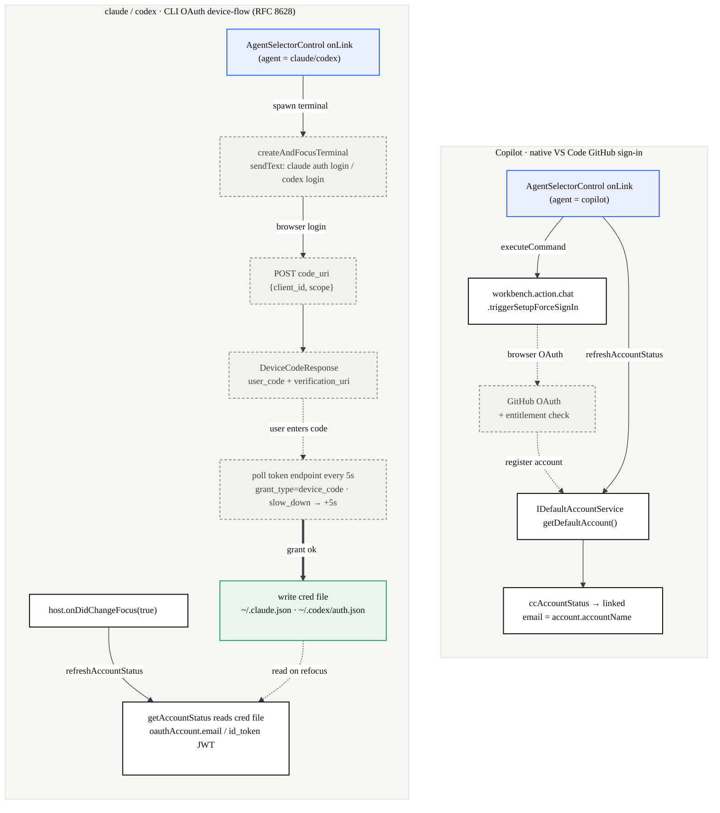
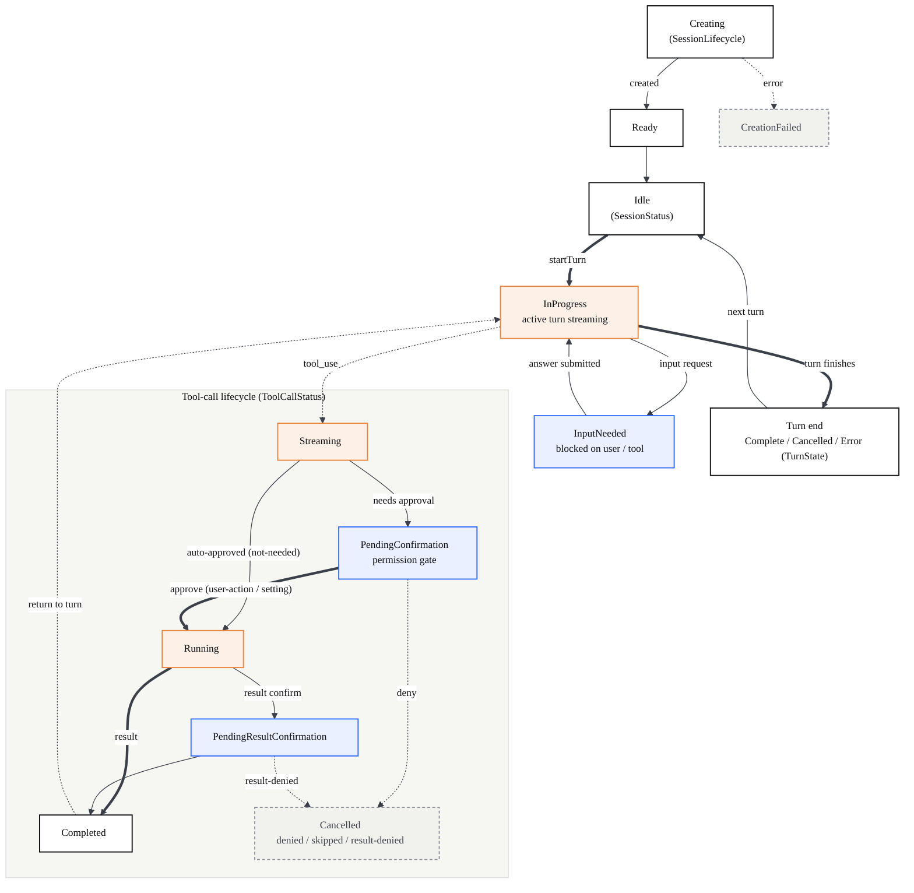
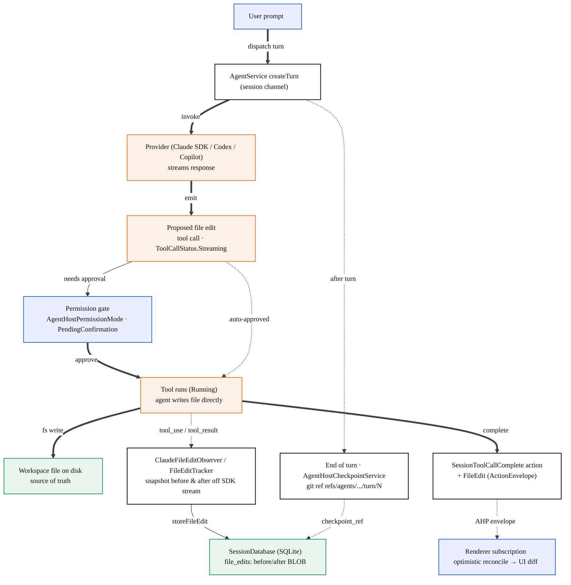
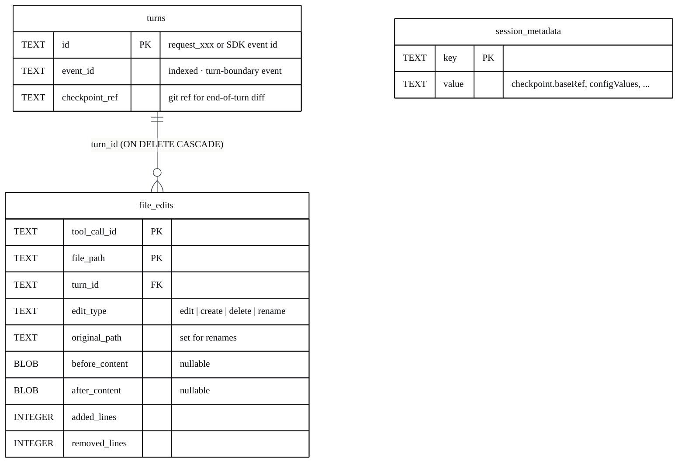
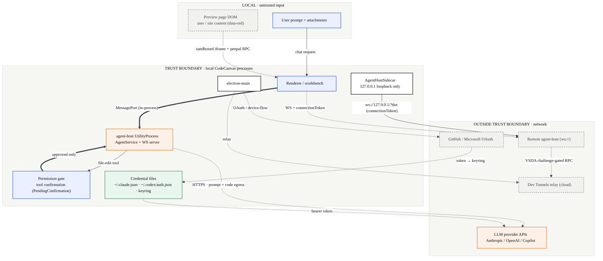
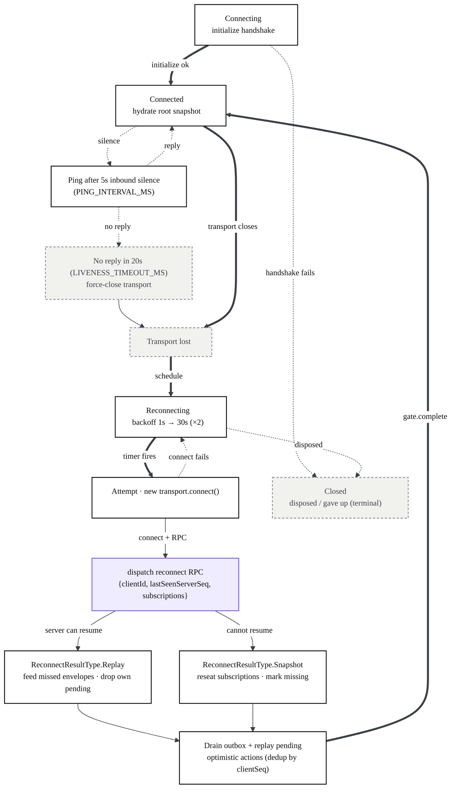

# Diagrams

> Progressive disclosure: start at the system map, then drill into a subsystem.

This page is the visual index for the whole book. Read the legend once, study the
mega diagram to place every part in context, then jump into a subsystem page for
the per-function flows. Every diagram in the docs uses the same color code and the
same arrow grammar, so the legend below applies everywhere.

## How to read these diagrams

Color is meaning, never decoration. A node's fill tells you *what kind of thing*
it is; the arrow tells you *how* two things talk.

### Semantic palette

| Class | Color | Used for |
| --- | --- | --- |
| `ui` | Blue | Renderer UI, panes, views, the canvas — anything the user sees ("surface"). |
| `core` | Ink / white | Core logic, services, controllers, plain modules ("engine"). |
| `ai` | Orange | AI agents, LLM / CLI backends, chat providers ("intelligence"). |
| `data` | Green | Files on disk, persistence, write-back, storage, in-memory state ("data at rest"). |
| `ext` | Gray (dashed) | External processes / OS / 3rd-party — Copilot, GitHub, child processes ("outside our boundary"). |
| `bridge` | Purple | IPC channels, ProxyChannel, penpal, message bridges ("wire between worlds"). |

### Arrow semantics

| Arrow | Reads as |
| --- | --- |
| `A --> B` (solid) | Synchronous call or direct data flow. |
| `A -.-> B` (dashed) | Asynchronous work, an event, an IPC message, or a stream. |
| `A ==> B` (thick) | The primary "happy path" through the diagram — an eye guide, used sparingly. |
| `A -->\|method()\| B` (labeled) | Every cross-boundary edge names the real method / message / event. An unlabeled boundary crossing is a bug. |

## The whole system (mega diagram)

This is the complete CodeCanvas AI architecture in one picture: every real moving part (roughly **125 nodes and 194 edges**), grouped by the runtime/process boundary it lives in. Each `subgraph` is a real process boundary — note that the **agent-host runs in its own `UtilityProcess`** (`agentHostMain`), drawn as a separate box from electron-main even though electron-main spawns and supervises it. The thick spine traces the signature design loop — drag an element, persist it to the real `.html` on disk, and only then live-patch the preview. It is large on purpose; use the **Fit**, **Fullscreen**, and scroll-to-zoom controls on the diagram to navigate it.

```mermaid
%%{init: {'theme':'base','themeVariables':{'fontFamily':'Space Grotesk, Segoe UI, sans-serif','fontSize':'14px','primaryColor':'#ffffff','primaryTextColor':'#0c0d10','primaryBorderColor':'#0c0d10','lineColor':'#3b3f47','tertiaryColor':'#f6f6f3'}}}%%
flowchart TD

subgraph EXTERNAL["EXTERNAL · user, CLIs, cloud"]
  direction TB
  ext_user["User<br/>designer / prompter"]:::ui
  ext_claude["claude CLI child<br/>child_process · stdin=prompt · NDJSON"]:::ext
  ext_codex["codex CLI child<br/>codex exec · prompt via argv"]:::ext
  ext_copilot["GitHub Copilot ext models<br/>vendor copilot · local chat"]:::ext
  ext_auth["GitHub / Microsoft auth<br/>OAuth + device flow"]:::ext
  ext_devtunnels["Dev Tunnels relay<br/>SSH-over-WS · cloud"]:::ext
  ext_remotehost["Remote agent host process<br/>ws:// AHP server"]:::ext
  ext_updatesrv["VS Code update service<br/>cloud"]:::ext
  ext_osservice["OS service manager<br/>systemd / launchd / Windows"]:::ext
  ext_devserver["Dev / static server<br/>npm run dev · npx serve"]:::ext
end

subgraph RUSTCLI["RUST CLI · cli/src (tunnels, serve-web, agent-host, self-update)"]
  direction TB
  rc_tunnelserve["tunnel serve<br/>serve_with_csa"]:::core
  rc_tunnelforward["tunnel forward<br/>local_forwarding"]:::core
  rc_serveweb["serve-web<br/>ConnectionManager · per-commit"]:::core
  rc_agenthostcmd["agent host<br/>foreground / classify lockfile"]:::core
  rc_supervisor["agent host supervisor<br/>detached daemon"]:::core
  rc_agentcmds["agent ps / stop / logs / kill"]:::core
  rc_singleton["acquire_singleton<br/>lockfile arbiter + RPC pipe"]:::core
  rc_devtunnels["DevTunnels / ActiveTunnel<br/>RelayTunnelHost"]:::core
  rc_controlserver["control_server<br/>process_socket · method registry"]:::core
  rc_rpc["RpcDispatcher + msgpack<br/>VSDA challenge"]:::bridge
  rc_codeserver["code_server ServerBuilder<br/>+ ServerBridge"]:::core
  rc_vscodeserver["VS Code server<br/>spawned child"]:::ext
  rc_auth["Auth<br/>device-flow · keyring"]:::core
  rc_ahmanager["AgentHostManager<br/>lifecycle + update loop"]:::core
  rc_ahsidecar["AgentHostSidecar<br/>TCP listener + proxy + POST /upgrade"]:::core
  rc_ahpclient["ahp::Client<br/>AHP JSON-RPC over WebSocket"]:::bridge
  rc_selfupdate["SelfUpdate + UpdateService<br/>download validate swap"]:::core
end

subgraph ELECTRONMAIN["ELECTRON-MAIN · src/vs/code (lifecycle, ProxyChannel host, agent backend)"]
  direction TB
  em_main["CodeMain + DI bootstrap<br/>electron-main/main.ts"]:::core
  em_app["CodeApplication<br/>windows + channel hub"]:::core
  em_lifecycle["LifecycleMainService<br/>single-instance pipe"]:::core
  em_electronipc["mainProcessElectronServer<br/>ProxyChannel host"]:::bridge
  em_exthost["Extension host process"]:::ext
  em_ptyhost["PTY host process<br/>ptyHostMain"]:::ext
  em_sharedproc["Shared process<br/>SSH / tunnel relay owner"]:::core
  cli_native["NativeCliAgentService<br/>spawn pipes · killTree"]:::ai
  cli_streamjson["makeStreamJsonHandler + resolveCli<br/>stream-json NDJSON · widen PATH"]:::core
  cli_channel["cliAgent ProxyChannel"]:::bridge
  ah_starter["ElectronAgentHostStarter<br/>+ AgentHostProcessManager"]:::core
  ah_mp["MessagePort channel<br/>createAgentHostMessageChannel"]:::bridge
  bv_mainsvc["BrowserViewMainService<br/>+ GroupMainService"]:::core
  bv_webcontents["WebContentsView<br/>OS preview + preload-browserView"]:::ext
  bv_channel["ipcBrowserView channels"]:::bridge
end

subgraph AGENTHOST["AGENT-HOST PROCESS · UtilityProcess (agentHostMain) — separate OS process"]
  direction TB
  ah_utility["agent-host UtilityProcess entry<br/>agentHostMain"]:::ai
  ah_agentsvc["AgentService host-side<br/>providers Copilot/Claude/Codex"]:::ai
  ah_channel["agentHost ProxyChannel"]:::bridge
  ah_reverserpc["AgentHostClientResourceChannel<br/>reverse-RPC FS + FileSystemProvider"]:::bridge
  ah_wsserver["WebSocketProtocolServer<br/>+ ProtocolServerHandler + ConnectionTracker"]:::core
  ah_sessiondata["ISessionDataService + SessionDatabase<br/>@vscode/sqlite3 · per-session"]:::core
  ah_changeset["Changeset + Checkpoint services<br/>per-turn git refs · working-tree diffs"]:::core
end

subgraph AHP["AHP PROTOCOL · channel-family state machine (JSON-RPC, version-negotiated)"]
  direction TB
  ahp_session["channels-session<br/>turn / tool-call state machine · 40+ actions"]:::core
  ahp_channels["other channel families<br/>root / terminal / changeset / resource-watch / otlp"]:::core
  ahp_actions["StateAction + ActionEnvelope<br/>+ messages CommandMap"]:::core
  ahp_reducers["channel reducers + states<br/>pure"]:::core
  ahp_submgr["AgentSubscriptionManager<br/>refcount subs + envelope routing"]:::core
  ahp_sessionsub["SessionStateSubscription<br/>optimistic write-ahead reconcile"]:::core
  ahp_version["version registry + negotiation<br/>PROTOCOL_VERSION 0.3.0"]:::core
  ahp_protoclient["RemoteAgentHostProtocolClient<br/>wire client · handshake/ping/reconnect"]:::bridge
  ahp_transport["IProtocolTransport / IClientTransport"]:::bridge
  ahp_remotesvc["RemoteAgentHostService<br/>WS connection manager"]:::core
  ahp_wstransport["WebSocketClientTransport<br/>ws:// + connectionToken · JSONL log"]:::bridge
  ahp_relaytransport["alt transports<br/>IPC channel / SSH / tunnel relay"]:::bridge
  ahp_localclient["LocalAgentHostServiceClient<br/>renderer · direct MessagePort"]:::core
end

subgraph RENDERER["RENDERER · WORKBENCH · src/vs/workbench + sessions"]
  direction TB
  wb_renderer["Workbench renderer<br/>electron-browser/workbench"]:::ui
  chat_panel["ChatViewPane + AgentSelectorControl<br/>Claude/Kimi/Codex/Copilot · login/logout"]:::ui
  chat_activeagent["ccActiveAgent + CC_ACTIVE_AGENT<br/>AGENT_FILTER scope"]:::core
  chat_modelscontrib["CliModelsContribution<br/>registers claude-cli / codex-cli"]:::core
  chat_cliagent["CliChatAgent<br/>invoke to runCli"]:::ai
  chat_lmprovider["CliLanguageModelProvider<br/>picker + sendChatRequest stream"]:::ai
  chat_runcli["runCli + runHandlers<br/>per-runId output routing"]:::core
  cli_browserproxy["cliAgent renderer proxy<br/>registerMainProcessRemoteService"]:::bridge
  chat_agentsvc["IChatAgentService<br/>default-agent resolution"]:::core
  chat_lmsvc["ILanguageModelsService<br/>provider registry + model picker"]:::core
  chat_accountstatus["ccAccountStatus<br/>account status · cred files / OAuth"]:::core
  sn_workbench["Sessions Workbench + SessionsParts<br/>layout policy"]:::core
  sn_part["SessionsPart<br/>SerializableGrid of leaves"]:::ui
  sn_view["SessionView<br/>single grid leaf host"]:::ui
  sn_chatview["ChatView / NewChatView<br/>hosts ChatWidget via IChatService"]:::ai
  sn_compositebar["ChatCompositeBar<br/>per-session chat tabs"]:::ui
  sn_projectbar["ProjectBarPart<br/>folder switcher + global bar"]:::ui
  sn_titlebar["TitlebarPart + Account widget<br/>entitlement / quota"]:::ui
  sn_openinvscode["OpenInVSCodeAction<br/>to external vscode:// window"]:::core
  sn_mobile["Mobile stack<br/>MobileTitlebar / MobileSessions"]:::ui
  sn_sessmgmt["ISessionsManagementService"]:::core
  pv_designview["DesignViewPane<br/>sidebar project analysis"]:::ui
  pv_designpane["DesignEditorPane<br/>hosts Onlook iframe"]:::ui
  pv_bridgehost["DesignEditorBridge<br/>codecanvas:bridge RPC host"]:::bridge
  pv_analyzer["DesignProjectAnalyzer + STACK_RULES<br/>framework/stack detect"]:::core
  pv_fullwindow["DesignFullWindowMode<br/>hide workbench chrome"]:::core
  pv_contrib["codecanvasPreview.contribution<br/>open/reload/inspect/editCSS"]:::core
  pv_status["Preview status + auto-reload<br/>View Preview pill · web-project ctxkey"]:::ui
  pv_modal["PreviewSelectorModal<br/>live page/section gallery · CDP fallback"]:::ui
  pv_diff["diffEngine<br/>style delta to CSS rule diff"]:::core
  pv_browserviewsvc["BrowserViewWorkbenchService<br/>+ IBrowserViewModel"]:::core
  wb_fileservice["IFileService<br/>workspace fs + watcher"]:::data
  wb_terminal["ITerminalService<br/>dev server / auth terminal"]:::ext
  wb_chatopen["workbench.action.chat.open<br/>openWithContext seam"]:::ai
end

subgraph DESIGN["DESIGN BUNDLE · iframe (React/Vite: penpal, Moveable, write-back, sync)"]
  direction TB
  db_engine["EditorEngine<br/>MobX root · all managers"]:::core
  db_frameview["FrameComponent<br/>iframe host + penpal parent"]:::ui
  db_moveable["MoveableSelectionLayer<br/>react-moveable · absolute only"]:::ui
  db_elements["ElementsManager + OverlayManager<br/>selection · isLocked · click rects"]:::core
  db_action["ActionManager<br/>run/undo/redo dispatch"]:::core
  db_history["HistoryManager<br/>undo/redo · groupId atomic"]:::core
  db_code["CodeManager<br/>writeHtml serialized queue"]:::core
  db_style["StyleManager<br/>updateMultiple to update-style"]:::core
  db_insproxy["useInspectorProxy<br/>proxied blob · inject preload+inspector"]:::core
  db_writeback["html-writeback.ts<br/>applyHtml · cc-id / oid"]:::core
  db_sourcewriter["html-source-writer.ts<br/>parse5 range writer · primary"]:::core
  db_syncengine["CodeProviderSync + SandboxManager<br/>disk to ZenFS · echo suppression"]:::core
  db_bridgeprovider["BridgeProvider<br/>Provider over workbench RPC"]:::core
  db_wbbridge["workbench-bridge.ts<br/>iframe RPC client"]:::bridge
  db_inspector["INSPECTOR_SCRIPT<br/>in-page click-to-source"]:::core
  db_zenfs["CodeFileSystem ZenFS<br/>in-browser editor fs"]:::data
end

subgraph PREVIEW["USER PREVIEW · nested iframe (the running app page)"]
  direction TB
  pr_iframe["Preview iframe<br/>user page DOM · data-oid/odid"]:::ui
  pr_penpalchild["onlook-preload-script.js<br/>penpal child · processDom/updateStyle"]:::bridge
end

subgraph DISK["DISK · source of truth + state"]
  direction TB
  disk_html["Project .html sources<br/>source of truth"]:::data
  disk_css["Workspace CSS files<br/>+ timestamped backups"]:::data
  disk_assets["/assets folder<br/>saved media"]:::data
  disk_cred["CLI credential files<br/>.claude.json · codex auth.json"]:::data
  disk_lockfile["agent-host lockfile<br/>AgentHostMetadata"]:::data
  disk_cache["DownloadCache + CLI binary<br/>+ workspace storage"]:::data
  disk_sessiondb["Per-session SQLite DBs<br/>userData/agent-host · turns/file_edits"]:::data
end

subgraph BUILD["BUILD PIPELINE · esbuild driver + native fixups"]
  direction TB
  build_esbuild["build/next/index.ts<br/>esbuild transpile + bundle + watch"]:::core
  build_out["out/ + out-vscode/<br/>dev + prod bundles"]:::data
  build_product["product.json<br/>codecanvas branding"]:::data
  build_fixpty["fix-node-pty.mjs<br/>strip Spectre to conpty.node"]:::core
end

%% ---- build pipeline ----
build_esbuild -->|"transpile / bundle"| build_out
build_esbuild -->|"inject config"| build_product
build_out -->|"Electron loads out/ main.js"| em_main
build_fixpty -.->|"conpty.node rebuild"| em_ptyhost

%% ---- electron-main bootstrap ----
em_main -->|"startup()"| em_app
em_main -->|"single-instance"| em_lifecycle
em_app -->|"registerChannel"| em_electronipc
em_app ==>|"open window"| wb_renderer
em_app -.->|"spawn"| em_exthost
em_app -.->|"connect"| em_ptyhost
em_app -.->|"spawn"| em_sharedproc
em_app -->|"fromService cliAgent"| cli_channel
em_app -->|"registerChannel"| bv_channel
em_app -->|"start()"| ah_starter

%% ---- CLI agent backend ----
cli_channel -->|"run / cancel"| cli_native
cli_native -->|"resolveCli + parse"| cli_streamjson
cli_native -->|"spawn stdin=prompt"| ext_claude
cli_native -.->|"spawn codex exec"| ext_codex
ext_claude -.->|"stdout NDJSON"| cli_streamjson
cli_streamjson -.->|"onText chunk"| cli_native
cli_native -.->|"onDidRunEvent"| cli_channel

%% ---- agent host (electron-main) ----
ah_starter -->|"UtilityProcess.start"| ah_utility
ah_starter -.->|"postMessage port"| ah_mp
ah_utility -->|"bootstrap"| ah_agentsvc
ah_agentsvc -->|"fromService"| ah_channel
ah_mp -->|"getChannel"| ah_channel
ah_channel -->|"createSession / subscribe / dispatch"| ah_agentsvc
ah_agentsvc -->|"server-only session actions"| ah_wsserver
ah_reverserpc -->|"registerAuthority"| ah_agentsvc
ah_agentsvc -.->|"opt-in providers"| ext_copilot
ah_agentsvc ==>|"tool writes file (Edit/Write)"| disk_html
ah_agentsvc -.->|"FileEditTracker before/after"| ah_sessiondata
ah_agentsvc -->|"end-of-turn capture"| ah_changeset
ah_sessiondata -->|"turns / file_edits / metadata"| disk_sessiondb
ah_changeset -.->|"checkpoint_ref to turns"| ah_sessiondata

%% ---- browserView (electron-main) ----
bv_channel -->|"ProxyChannel"| bv_mainsvc
bv_mainsvc -->|"new WebContentsView"| bv_webcontents
bv_webcontents -.->|"onDidSelectElement / CDP"| bv_mainsvc

%% ---- AHP protocol state machine ----
ahp_session -->|"contributes actions"| ahp_actions
ahp_channels -->|"contribute actions / commands"| ahp_actions
ahp_actions -->|"reduced by"| ahp_reducers
ahp_submgr -->|"owns"| ahp_sessionsub
ahp_sessionsub -->|"applyReducer"| ahp_reducers
ahp_protoclient -->|"new manager"| ahp_submgr
ahp_protoclient -->|"dispatch / subscribe / initialize"| ahp_transport
ahp_transport -.->|"onMessage action envelope"| ahp_protoclient
ahp_protoclient -->|"negotiate"| ahp_version
ahp_remotesvc -->|"build client"| ahp_protoclient
ahp_wstransport -->|"implements"| ahp_transport
ahp_relaytransport -->|"implements"| ahp_transport
ahp_localclient -->|"in-proc transport"| ahp_transport
ahp_wstransport -->|"ws:// + token"| ext_remotehost
ahp_relaytransport -.->|"relay"| em_sharedproc
ahp_localclient -->|"acquirePort"| ah_mp
ahp_localclient -->|"toService IAgentService"| ah_channel
ah_reverserpc -.->|"reads via MessagePort"| ahp_localclient
ah_wsserver -.->|"action echo-back"| ahp_transport
ahp_submgr -.->|"observableFromSubscription"| sn_chatview

%% ---- AI chat spine (renderer) ----
ext_user -->|"prompt"| chat_panel
chat_panel -->|"setActiveAgent"| chat_activeagent
chat_activeagent -->|"syncActiveAgent / CC key"| chat_modelscontrib
chat_activeagent -->|"AGENT_FILTER scope"| chat_lmsvc
chat_modelscontrib -->|"registerProvider"| chat_lmprovider
chat_modelscontrib -->|"registerCliChatAgent"| chat_cliagent
chat_modelscontrib -->|"deltaDescriptors"| chat_lmsvc
chat_lmprovider -->|"provideModelInfo"| chat_lmsvc
chat_panel -->|"openNewChatSessionInPlace.local"| chat_agentsvc
chat_agentsvc -->|"invoke(request)"| chat_cliagent
chat_agentsvc -.->|"agent=copilot default"| ext_copilot
chat_cliagent -->|"runCli(spec)"| chat_runcli
chat_lmprovider -->|"sendChatRequest"| chat_runcli
chat_runcli -->|"run(runId, spec)"| cli_browserproxy
cli_browserproxy -->|"registerRemoteService"| cli_channel
cli_channel -.->|"onDidRunEvent"| cli_browserproxy
cli_browserproxy -.->|"runHandlers.get(runId)"| chat_runcli
chat_runcli -.->|"progress markdown"| chat_cliagent
chat_panel -->|"refreshAccountStatus"| chat_accountstatus
chat_accountstatus -->|"readJson"| disk_cred
chat_accountstatus -.->|"getDefaultAccount"| ext_auth
chat_panel -.->|"login/logout"| wb_terminal
chat_panel -.->|"force sign-in"| ext_auth

%% ---- sessions UI ----
wb_renderer -->|"hosts"| sn_workbench
sn_workbench -->|"createInstance"| sn_part
sn_workbench -.->|"autorun visibleSessions"| sn_sessmgmt
sn_workbench -->|"registerPart"| sn_projectbar
sn_workbench -->|"registerPart"| sn_titlebar
sn_workbench -.->|"phone viewport"| sn_mobile
sn_part -->|"openSession"| sn_view
sn_view -->|"createChatView"| sn_chatview
sn_view -->|"createInstance"| sn_compositebar
sn_compositebar -->|"openChat / deleteChat"| sn_sessmgmt
sn_projectbar -->|"store folders"| disk_cache
sn_titlebar -->|"hosts"| sn_openinvscode
sn_titlebar -.->|"account / sessions"| ext_auth
sn_openinvscode -.->|"resolve authority"| ahp_remotesvc
sn_openinvscode -.->|"ssh/tunnel vscode://"| ext_devtunnels

%% ---- preview + design contrib (renderer) ----
wb_renderer -->|"registerContribution"| pv_contrib
wb_renderer -->|"register pane"| pv_designview
ext_user -->|"open Design"| pv_designview
pv_designview -->|"openEditor"| pv_designpane
pv_designview -->|"analyze()"| pv_analyzer
pv_analyzer -->|"read files"| wb_fileservice
pv_designpane -->|"createInstance"| pv_bridgehost
pv_designpane -->|"iframe loads React bundle"| db_engine
pv_bridgehost -->|"fs.readFile/writeFile"| wb_fileservice
pv_bridgehost -->|"project.startDev"| wb_terminal
pv_bridgehost -->|"chat.openWithContext"| wb_chatopen
pv_bridgehost -.->|"toggle fullscreen"| pv_fullwindow
pv_bridgehost -->|"analyze()"| pv_analyzer
pv_fullwindow -.->|"hide parts"| wb_renderer
wb_fileservice -.->|"onDidFilesChange"| pv_bridgehost
wb_chatopen -->|"chat.open"| chat_agentsvc
pv_contrib -->|"navigate"| pv_browserviewsvc
pv_browserviewsvc -->|"ProxyChannel"| bv_channel
pv_browserviewsvc -.->|"onDidCommitVisualEdit"| pv_diff
pv_contrib -->|"generateDiff"| pv_diff
pv_diff -->|"read original CSS"| wb_fileservice
pv_contrib -->|"writeFile + backup"| disk_css
pv_contrib -->|"modal.open"| pv_modal
pv_modal -->|"capture thumbnails"| pv_browserviewsvc
pv_status -.->|"auto-reload / ctxkey"| pv_browserviewsvc

%% ---- DESIGN LOOP (thick happy-path spine) ----
ext_user ==>|"drag element"| db_moveable
db_moveable -->|"reads selected / isLocked"| db_elements
db_moveable ==>|"onDragEnd: history.push(update-style)"| db_history
db_history ==>|"code.write(action)"| db_code
db_code ==>|"writeHtmlDispatch"| db_writeback
db_writeback -->|"parse5 range write"| db_sourcewriter
db_writeback ==>|"workbench.writeFile"| db_wbbridge
db_wbbridge ==>|"bridge-request fs.writeFile"| pv_bridgehost
pv_bridgehost ==>|"IFileService.writeFile"| wb_fileservice
wb_fileservice ==>|"write .html"| disk_html
db_moveable ==>|"then live-patch (same-origin)"| pr_iframe
db_moveable -.->|"view.updateStyle(domId)"| pr_penpalchild
db_writeback -->|"DOMParser fallback"| db_wbbridge
db_writeback -.->|"saveAsset base64"| disk_assets

%% ---- design bundle internals + penpal ----
db_engine -->|"render frame"| db_frameview
db_engine -->|"owns managers"| db_action
db_style -->|"update-style"| db_history
db_action -->|"run: history.push"| db_history
db_action -.->|"live DOM ops"| pr_penpalchild
db_frameview -->|"useInspectorProxy"| db_insproxy
db_insproxy -.->|"fetch original HTML"| ext_devserver
db_insproxy -->|"blob proxied HTML"| pr_iframe
db_insproxy -->|"inject preload"| pr_penpalchild
db_insproxy -->|"inject inspector"| db_inspector
db_frameview -->|"penpal connect"| pr_penpalchild
db_frameview -->|"processDom / updateStyle RPC"| pr_penpalchild
pr_penpalchild -.->|"onDomProcessed / mutated"| db_frameview
pr_penpalchild -->|"reads / instruments DOM"| pr_iframe
db_inspector -.->|"inspector-ready / click-to-source"| db_frameview
db_frameview -.->|"codecanvas:open-source"| pv_bridgehost
db_frameview -.->|"openWorkbenchChat"| wb_chatopen

%% ---- design bundle sync engine ----
db_engine -->|"SandboxManager"| db_syncengine
db_syncengine -->|"BridgeProvider"| db_bridgeprovider
db_syncengine -.->|"watchDirectory"| db_zenfs
db_zenfs -.->|"fs event (echo-suppressed)"| db_syncengine
db_bridgeprovider -->|"readFile / writeFile"| db_wbbridge
db_bridgeprovider -.->|"watchFiles disk to fs"| db_syncengine
db_wbbridge -->|"postMessage bridge-request"| pv_bridgehost
pv_bridgehost -.->|"bridge-response / event"| db_wbbridge

%% ---- disk seams ----
wb_fileservice -->|"read / watch"| disk_css

%% ---- Rust CLI: tunnel serve ----
rc_tunnelserve -->|"acquire_singleton"| rc_singleton
rc_tunnelserve -->|"start_new_launcher_tunnel"| rc_devtunnels
rc_tunnelserve -.->|"register OS service"| ext_osservice
rc_devtunnels -->|"RelayTunnelHost connect"| ext_devtunnels
rc_devtunnels -->|"get_tunnel_authentication"| rc_auth
rc_auth -.->|"device code grant"| ext_auth
ext_devtunnels -->|"inbound conn CONTROL_PORT"| rc_controlserver
rc_singleton -.->|"process_socket"| rc_controlserver
rc_controlserver -->|"make_socket_rpc"| rc_rpc
rc_controlserver -->|"handle_serve"| rc_codeserver
rc_codeserver -->|"spawn"| rc_vscodeserver
rc_controlserver -.->|"handle_update"| rc_selfupdate
rc_tunnelforward -->|"acquire_singleton"| rc_singleton
rc_tunnelforward -.->|"forward via relay"| ext_devtunnels

%% ---- Rust CLI: agent host supervisor ----
rc_agenthostcmd -->|"classify lockfile"| disk_lockfile
rc_agenthostcmd -.->|"daemonize"| rc_supervisor
rc_supervisor -->|"AgentHostManager"| rc_ahmanager
rc_supervisor -->|"bind TCP"| rc_ahsidecar
rc_supervisor -.->|"add_port AGENT_HOST_PORT"| rc_devtunnels
rc_ahsidecar -->|"write metadata"| disk_lockfile
rc_ahmanager -->|"spawn agent-host server"| ext_remotehost
rc_ahsidecar -->|"proxy HTTP/WS"| ext_remotehost
rc_ahmanager -.->|"update loop / cache"| disk_cache
em_sharedproc -.->|"relay to remote host"| ext_remotehost

%% ---- Rust CLI: AHP client + serve-web + self-update ----
rc_agentcmds -->|"agent::connect"| rc_ahpclient
rc_agentcmds -.->|"kill_tree(pid)"| disk_lockfile
rc_ahpclient -->|"ws://127.0.0.1/?tkn"| rc_ahsidecar
rc_ahpclient -.->|"AHP over tunnel relay"| ext_devtunnels
rc_ahpclient -.->|"authenticate"| rc_auth
rc_serveweb -.->|"per-commit server"| rc_vscodeserver
rc_serveweb -->|"get_latest_commit"| rc_selfupdate
rc_selfupdate -.->|"get_download_stream"| ext_updatesrv
rc_selfupdate -->|"atomic swap"| disk_cache

classDef ui fill:#eaf0ff,stroke:#2f6bff,stroke-width:1.5px,color:#0c0d10;
classDef core fill:#ffffff,stroke:#0c0d10,stroke-width:1.5px,color:#0c0d10;
classDef ai fill:#fdf0e6,stroke:#e8833a,stroke-width:1.5px,color:#0c0d10;
classDef data fill:#e8f6ee,stroke:#2f9e6b,stroke-width:1.5px,color:#0c0d10;
classDef ext fill:#f1f1ee,stroke:#8b909a,stroke-width:1.5px,stroke-dasharray:4 3,color:#3b3f47;
classDef bridge fill:#f0ecff,stroke:#7c5cff,stroke-width:1.5px,color:#0c0d10;
```

**The design loop (the thick spine).** A drag in `MoveableSelectionLayer` is persisted *before* anything visual changes: `onDragEnd` pushes an `update-style` action into `HistoryManager`, which flows through `CodeManager` to `html-writeback.ts`. The primary writer is `html-source-writer.ts` (parse5 source-location range edits that preserve formatting; a DOMParser `outerHTML` pass is the fallback). That write crosses the iframe boundary via `workbench-bridge.ts` to `DesignEditorBridge`, which calls `IFileService.writeFile` against the real `.html` on disk — the single source of truth. Only after the disk write does the canvas live-patch: a same-origin `[data-odid].style.*` poke plus a penpal `view.updateStyle(domId)`. Reselection is always by identity (`data-cc-id` / `oid`), never coordinates, and `CodeProviderSync` keeps an in-browser ZenFS mirror in sync with disk under echo-suppression windows.

**The AI chat spine.** The `AgentSelectorControl` is the single source of truth for routing. Picking Claude or Codex sets the `CC_ACTIVE_AGENT` context key so `CliChatAgent` becomes the default non-core agent; its `invoke` runs `runCli`, which calls the renderer `cliAgent` proxy over a `ProxyChannel` into `NativeCliAgentService` in electron-main. That service `child_process.spawn`s the real `claude`/`codex` binary with **plain pipes** (never a PTY — a TTY makes claude think it is interactive), feeds the prompt on stdin, and streams `stream-json` NDJSON back through `makeStreamJsonHandler`. Output returns as `onDidRunEvent` keyed by `runId` and is dispatched through one app-lifetime `runHandlers` map. Copilot is deliberately different: when `agent=copilot` the CLI agents deactivate and the built-in `copilot`-vendor extension answers in the same local chat session.

**Preview, bridge, and the nested iframe stack.** There are three contexts deep: the workbench renderer hosts `DesignEditorPane`'s React/Vite bundle in an iframe, and inside it `useInspectorProxy` injects the Onlook penpal child + `INSPECTOR_SCRIPT` into a *second*, blob-loaded preview iframe of the user's running page. `DesignEditorBridge` is the postMessage RPC seam (`fs.*`, `project.*`, `workbench.chat.openWithContext`). A separate preview path — `codecanvasPreview.contribution` — drives an OS-level Electron `WebContentsView` (not an iframe) through `BrowserViewMainService`; inspect/visual-edit there feed `diffEngine`, which writes a timestamped `.codecanvas-backup` before patching CSS.

**The AHP protocol.** The Agent Host Protocol is a JSON-RPC 2.0, version-negotiated, channel-multiplexed state-sync layer. All channel-family actions (session, root, terminal, changeset, resource-watch, otlp) converge into one `StateAction` union wrapped in an `ActionEnvelope`. The signature trick is write-ahead optimistic dispatch: `SessionStateSubscription.applyOptimistic` runs the reducer locally and allocates a `clientSeq`, the client sends `dispatchAction`, the server echoes an authoritative `action` envelope, and `AgentSubscriptionManager` reconciles by `origin.clientSeq`. `RemoteAgentHostProtocolClient` rides a pluggable `IProtocolTransport` — direct MessagePort (`LocalAgentHostServiceClient` to the in-process agent-host UtilityProcess), `WebSocketClientTransport` to a remote host, or SSH/tunnel relays through the shared process — and subscriptions surface to the Sessions UI as observables.

**The Rust CLI and tunnels.** `cli/src` is the headless backbone for remote/agent scenarios. `tunnel serve` acquires a per-machine singleton, authenticates via device-flow, and registers `CONTROL_PORT` + `AGENT_HOST_PORT` on the Dev Tunnels cloud relay; each inbound relay connection becomes an msgpack RPC dispatch in `control_server` (VSDA challenge-gated), which spawns/bridges the real VS Code server. The `agent host` supervisor re-execs itself detached, runs `AgentHostManager` (spawns the agent-host server, background self-update loop) plus an `AgentHostSidecar` that proxies HTTP/WS and exposes `POST /upgrade`. The `agent ps/stop/logs` commands dial that host over an `ahp::Client` WebSocket — the same AHP protocol the TypeScript renderer speaks — so both clients drive one shared `AgentService`. Self-update is download → validate `--version` → atomic `fs::rename` swap of the running binary.

**Agent-host persistence.** The agent-host process is the only place that writes durable agent state. Each session gets its own SQLite database (`SessionDatabase`, `@vscode/sqlite3`) under `userData/agent-host`, schema-versioned through numbered migrations tracked in `PRAGMA user_version` (currently 5). Tool file-edits are observed off the SDK message stream (`ClaudeFileEditObserver` / `FileEditTracker`) and persisted as before/after BLOBs in `file_edits`; turns carry an `event_id` boundary and a `checkpoint_ref`. At end of turn `AgentHostCheckpointService` captures a per-turn git ref (`refs/agents/<sid>/checkpoints/turn/<N>`) so the changeset surface reflects the whole working-tree delta — including terminal-tool edits the edit-tracker can't see.

## Recommended system diagrams

These complement the mega diagram with focused views that the single picture cannot show well: where processes physically run, how trust boundaries are crossed, the protocol state machines, and the agent's edit-to-disk path. Same palette contract throughout (flowchart/state diagrams carry the six `classDef`s; the ER diagram uses the shared `init` theme, since Mermaid `erDiagram` does not accept `classDef`).

### 1 · Deployment / topology

Where each process actually runs and which transport connects it. The agent-host is a `UtilityProcess`; the only network egress is to the LLM providers, OAuth, the Dev Tunnels relay, and the update service.

```mermaid
%%{init: {'theme':'base','themeVariables':{'fontFamily':'Space Grotesk, Segoe UI, sans-serif','fontSize':'14px','primaryColor':'#ffffff','primaryTextColor':'#0c0d10','primaryBorderColor':'#0c0d10','lineColor':'#3b3f47','tertiaryColor':'#f6f6f3'}}}%%
flowchart TD
subgraph MACHINE["LOCAL MACHINE · user device"]
  direction TB
  subgraph APP["CodeCanvas app (Electron)"]
    direction TB
    d_main["electron-main<br/>CodeApplication"]:::core
    d_rend["renderer · workbench<br/>+ Design iframe"]:::ui
    d_exthost["extension host"]:::ext
    d_pty["PTY host"]:::ext
    d_shared["shared process<br/>tunnel / SSH relay owner"]:::core
  end
  subgraph AH["agent-host UtilityProcess"]
    direction TB
    d_ahsvc["AgentService<br/>+ WebSocketProtocolServer"]:::ai
    d_ahdb["per-session SQLite DBs"]:::data
  end
  d_claude["claude CLI child<br/>child_process pipes"]:::ext
  d_codex["codex CLI child"]:::ext
  subgraph RUST["Rust CLI · cli/src"]
    direction TB
    d_sidecar["AgentHostSidecar<br/>TCP listener + POST /upgrade"]:::core
    d_remotehost["remote agent-host server<br/>ws:// AHP"]:::ext
  end
end
subgraph CLOUD["CLOUD / EXTERNAL · outside the trust boundary"]
  direction TB
  c_auth["GitHub / Microsoft auth<br/>OAuth + device flow"]:::ext
  c_provider["LLM providers<br/>Anthropic / OpenAI / Copilot"]:::ai
  c_relay["Dev Tunnels relay<br/>SSH-over-WS"]:::ext
  c_update["update service"]:::ext
end

d_main ==>|"open window"| d_rend
d_main -.->|"spawn"| d_exthost
d_main -.->|"connect"| d_pty
d_main -.->|"spawn"| d_shared
d_main ==>|"UtilityProcess.start"| d_ahsvc
d_rend ==>|"MessagePort · LocalAgentHostServiceClient"| d_ahsvc
d_rend -.->|"cliAgent ProxyChannel"| d_main
d_main ==>|"spawn stdin=prompt"| d_claude
d_main -.->|"spawn codex exec"| d_codex
d_ahsvc -->|"turns / file_edits"| d_ahdb
d_claude -.->|"HTTPS"| c_provider
d_codex -.->|"HTTPS"| c_provider
d_ahsvc -.->|"HTTPS provider API"| c_provider
d_rend -.->|"WebSocketClientTransport ws:// + token"| d_remotehost
d_sidecar -->|"proxy HTTP/WS"| d_remotehost
d_shared -.->|"relay"| c_relay
d_remotehost -.->|"add_port AGENT_HOST_PORT"| c_relay
d_main -.->|"device-flow / OAuth"| c_auth
d_main -.->|"self-update"| c_update

classDef ui fill:#eaf0ff,stroke:#2f6bff,stroke-width:1.5px,color:#0c0d10;
classDef core fill:#ffffff,stroke:#0c0d10,stroke-width:1.5px,color:#0c0d10;
classDef ai fill:#fdf0e6,stroke:#e8833a,stroke-width:1.5px,color:#0c0d10;
classDef data fill:#e8f6ee,stroke:#2f9e6b,stroke-width:1.5px,color:#0c0d10;
classDef ext fill:#f1f1ee,stroke:#8b909a,stroke-width:1.5px,stroke-dasharray:4 3,color:#3b3f47;
classDef bridge fill:#f0ecff,stroke:#7c5cff,stroke-width:1.5px,color:#0c0d10;
```



### 2 · Authentication

Two distinct sign-in paths. Copilot rides VS Code's native GitHub account service; the CLI agents (claude / codex) run their own OAuth device-flow in a terminal and persist a credential file that `ccAccountStatus` reads back. The device-flow steps mirror `cli/src/auth.rs` (RFC 8628).



### 3 · AHP channel state machine (session + tool calls)

The session channel's turn lifecycle and the nested tool-call state machine, straight from the `SessionLifecycle`, `SessionStatus`, `TurnState`, and `ToolCallStatus` enums.



### 4 · Agent edit data-flow

From prompt to a durable file change: the agent proposes a file-edit tool call, the permission gate clears it, the agent writes to disk directly, and the edit-tracker mirrors the before/after into the session DB while the action streams back to the UI.



### 5 · SQLite session DB — ER diagram

The per-session schema from `sessionDatabase.ts` (migrations 1–5). `file_edits.turn_id` references `turns.id` with `ON DELETE CASCADE`; `session_metadata` is a standalone key/value store (e.g. `checkpoint.baseRef`, `configValues`). This block uses the shared `init` theme only, since Mermaid `erDiagram` does not support `classDef`.



### 6 · Security data-flow / trust-boundary DFD

Trust boundaries and the controls on every crossing: a sandboxed preview iframe, the in-process MessagePort, the tool-confirmation permission gate, loopback-only sidecar binding, `connectionToken`-gated WebSockets, and VSDA-challenged relay RPC. The Design environment is 100% local — no CodeCanvas analytics backend; the only outbound data is prompt/code egress to the chosen LLM provider plus OAuth and (opt-in) tunnels.



### 7 · AHP reconnect flow

How `RemoteAgentHostProtocolClient` survives a dropped transport: liveness ping, exponential backoff, a `reconnect` RPC that the server answers with either a replay buffer or fresh snapshots, then draining the outbox and resending pending optimistic actions.



## Per-subsystem diagram gallery

Every significant diagram in the book, grouped by page. Open the page to read each
diagram in context with its prose.

| Subsystem | Diagram | Shows | Link |
| --- | --- | --- | --- |
| 00 Overview | What are the parts | High-level map of the CodeCanvas pieces and how they relate | [open](?p=00-overview) |
| 01 Architecture | The Electron process model | main / renderer / extension host / CLI process boundaries | [open](?p=01-architecture) |
| 01 Architecture | The nested iframe / context stack | workbench -> pane -> design iframe -> React -> preview iframe | [open](?p=01-architecture) |
| 01 Architecture | How a feature is wired | contribution -> registry -> DI service -> ProxyChannel | [open](?p=01-architecture) |
| 02 Design Environment | Architecture | DesignEditorPane, the two bridges, the iframe stack | [open](?p=02-design-environment) |
| 02 Design Environment | Entering Design | command -> singleton input -> pane -> bundle mount | [open](?p=02-design-environment) |
| 02 Design Environment | Hosting the user's preview | dev server -> proxied blob -> inner iframe + preload | [open](?p=02-design-environment) |
| 02 Design Environment | Full-window mode | toggle -> layout service hides sidebar/panel/statusbar | [open](?p=02-design-environment) |
| 02 Design Environment | Design vs Preview modes | mode toggle gates the in-page inspector | [open](?p=02-design-environment) |
| 02 Design Environment | Build and ship pipeline | design-editor-src -> vite -> resources/app/design-editor | [open](?p=02-design-environment) |
| 03 Visual editing & write-back | Architecture | canvas / Moveable / inspector / penpal / write-back / sync | [open](?p=03-visual-editing-writeback) |
| 03 Visual editing & write-back | The penpal handshake | making the page editable (sequence) | [open](?p=03-visual-editing-writeback) |
| 03 Visual editing & write-back | A visual edit round-trip | drag -> `.html` on disk -> live patch | [open](?p=03-visual-editing-writeback) |
| 03 Visual editing & write-back | Convert flow -> absolute | converting an element to free editing | [open](?p=03-visual-editing-writeback) |
| 03 Visual editing & write-back | Atomic multi-delete undo | `__groupId` batching for one-shot undo | [open](?p=03-visual-editing-writeback) |
| 03 Visual editing & write-back | The sync-engine | disk <-> ZenFS with echo suppression | [open](?p=03-visual-editing-writeback) |
| 04 Multi-agent AI chat | Architecture | selector -> router -> CliChatAgent -> ProxyChannel -> main -> claude | [open](?p=04-ai-chat-multiagent) |
| 04 Multi-agent AI chat | Per-agent routing decision | which backend for claude / codex / copilot | [open](?p=04-ai-chat-multiagent) |
| 04 Multi-agent AI chat | Claude turn, end to end | stream-json request/response (sequence) | [open](?p=04-ai-chat-multiagent) |
| 04 Multi-agent AI chat | Process lifecycle | spawn with pipes, stream, kill by handle | [open](?p=04-ai-chat-multiagent) |
| 05 CodeCanvas Preview | Architecture | contrib, status items, designBridge, analyzer, diffEngine | [open](?p=05-codecanvas-preview) |
| 05 CodeCanvas Preview | Opening a live preview | openWorkspacePreview -> browserView | [open](?p=05-codecanvas-preview) |
| 05 CodeCanvas Preview | Device / viewport switching | DeviceSelector -> frame resize -> storage | [open](?p=05-codecanvas-preview) |
| 05 CodeCanvas Preview | designBridge message passing | codecanvas bridge-request/response RPC | [open](?p=05-codecanvas-preview) |
| 05 CodeCanvas Preview | diffEngine: style delta to diff | selector -> CSS rule diff + timestamped backup | [open](?p=05-codecanvas-preview) |
| 06 Rust CLI | Architecture | CLI modules, tunnels, RPC, agent host | [open](?p=06-cli) |
| 06 Rust CLI | Establishing a tunnel | auth -> singleton -> relay -> control_server -> server | [open](?p=06-cli) |
| 06 Rust CLI | An RPC call to the editor server | dispatch -> sync / async / duplex handler | [open](?p=06-cli) |
| 06 Rust CLI | Self-update | check -> download -> validate -> atomic swap | [open](?p=06-cli) |
| 06 Rust CLI | Supervising the agent host | supervisor -> sidecar -> AHP over WebSocket | [open](?p=06-cli) |
| 07 Core platform & build | The build & watch pipeline | src/vs -> transpile / gulp -> out -> electron -> app | [open](?p=07-core-platform-build) |
| 08 Reusable code | Architecture | reusable utils / lib / hooks / ui / store map | [open](?p=08-reusable-code) |
| 08 Reusable code | React -> native porting convention | reactbits -> manual port -> TS + CSS | [open](?p=08-reusable-code) |
| 09 API reference | Architecture - the API surfaces | channels / services / bridges / RPC map | [open](?p=09-api-reference) |
| 09 API reference | Agent Host (Claude) - stream-json | IPC stream request/response (sequence) | [open](?p=09-api-reference) |
| 09 API reference | Design Bridge (penpal) | penpal request/response handshake (sequence) | [open](?p=09-api-reference) |
