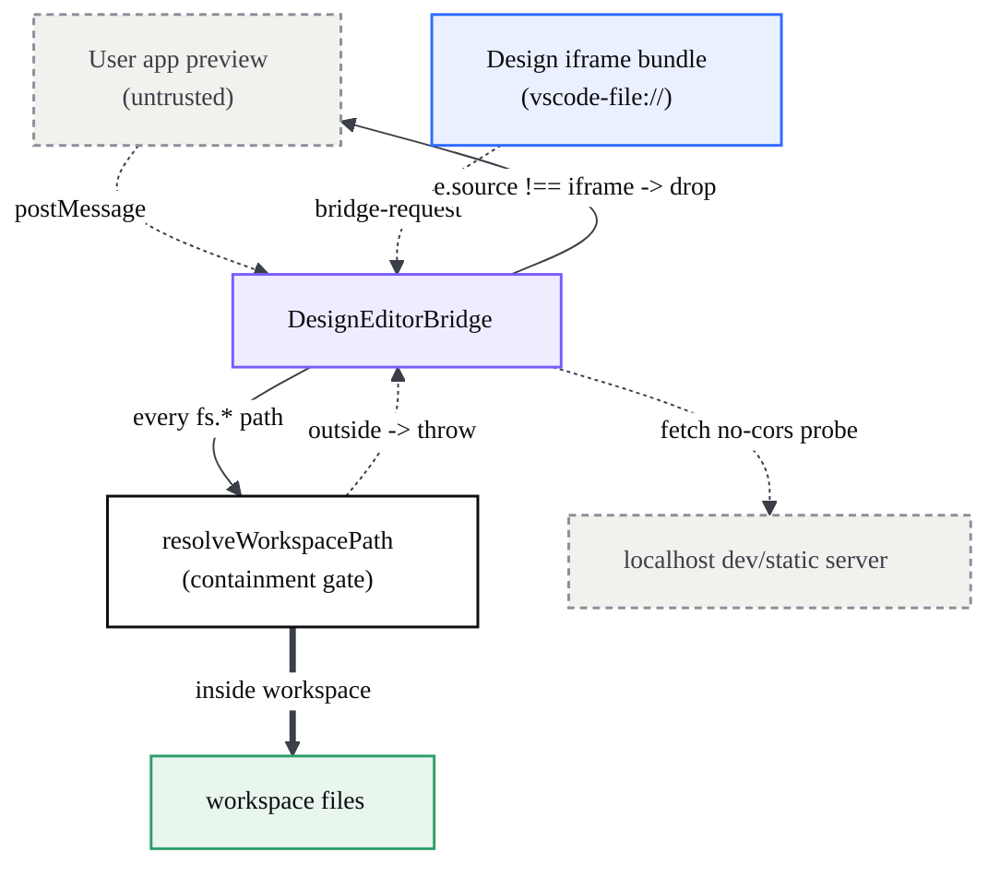
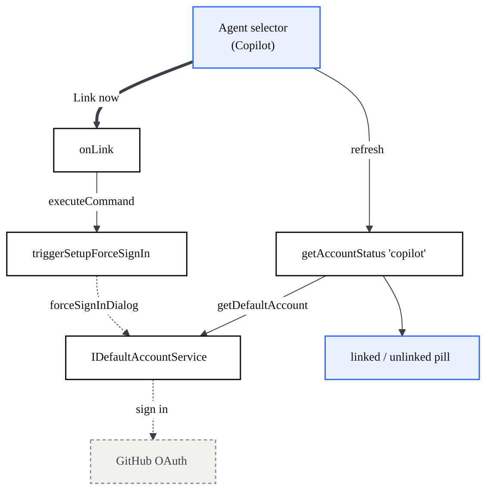
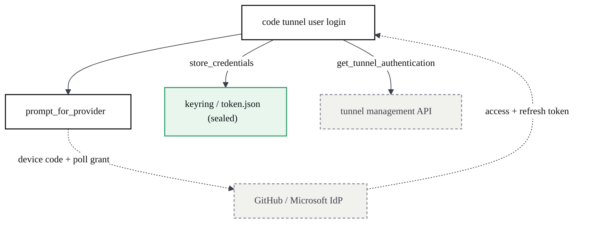

# Security & Permissions

> How CodeCanvas isolates untrusted preview code, confines file-system access to the workspace, controls how freely the AI agent may act, and authenticates each agent.

## Security model & trust boundaries

> The Design bridge reads and writes the workspace and starts local servers; this page documents who is trusted, where the boundaries sit, and what an enterprise reviewer must verify before shipping.

The Design environment runs privileged file-system and process operations on behalf of an iframe. That makes the bridge the primary attack surface. The trust model rests on four enforced controls (origin check, workspace confinement, local bundle, CSP) plus one integrity guard (self-write echo) and one packaging caveat (`--no-sandbox`).

### Trust zones

| Zone | What runs there | Trusted? | Boundary control |
| --- | --- | --- | --- |
| Workbench renderer | `DesignEditorBridge`, workbench services | Yes (our code) | n/a |
| Design iframe bundle | Onlook React bundle, loaded from app resources via `vscode-file://` | Yes (shipped locally) | message-origin check |
| User app preview | The user's own page, rendered in a native `WebContentsView` / nested preview iframe | **No (untrusted code)** | cannot reach the bridge |
| Local dev/static server | `npm run dev` or `npx serve` in a terminal | Local, user-owned | bound to localhost only |



### Message-origin validation

The bridge listens for `message` events on `mainWindow` and rejects anything that does not come from the Design iframe's own window: `if (e.source !== this.iframe.contentWindow) return;` (`designBridge.ts:116`). The inline comment states the intent directly — "the user's app preview (untrusted code) must not be able to drive the workbench" (`designBridge.ts:114`). After the source check, the payload must be a non-null object (`designBridge.ts:120`) before it is dispatched by `data.type` (`designBridge.ts:123`–`132`).

This is the linchpin of the model. The Design iframe is created with **no `sandbox` attribute** (`designEditorPane.ts:52`) and is same-origin with the workbench, so it has full privileges; what protects the workbench is that only that specific `contentWindow` is accepted as a request source. The untrusted user preview is a separate native `WebContentsView` (see the Preview page), so it is out-of-process and cannot satisfy the `e.source` identity check.

Note for reviewers: **outbound** replies and events use a wildcard target origin — `postMessage(..., '*')` in `reply` (`designBridge.ts:149`) and in the `fs-change` push (`designBridge.ts:533`). The recipient window is still pinned to `this.iframe.contentWindow`, so delivery is scoped to the trusted frame, but the wildcard means the messages are not origin-restricted on the wire.

### Workspace confinement

Every file-system method funnels its path argument through `resolveWorkspacePath` (`designBridge.ts:338`) before touching disk. The resolver:

1. Treats POSIX-absolute or Windows drive-letter paths as `URI.file(...)`, otherwise joins the path onto the **first** workspace folder (`designBridge.ts:341`–`345`).
2. Rejects anything not contained in a workspace folder: `extUriBiasedIgnorePathCase.isEqualOrParent(uri, folder.uri)` over all folders, throwing `Path outside the workspace` otherwise (`designBridge.ts:349`–`350`). Containment is **case-insensitive** so a `c:/` vs `C:\` casing mismatch does not wrongly reject in-workspace writes.

| Bridge method | Calls resolveWorkspacePath at |
| --- | --- |
| `fs.readFile` | `designBridge.ts:356` |
| `fs.writeFile` | `designBridge.ts:380` |
| `fs.readDir` | `designBridge.ts:423` |
| `fs.exists` | `designBridge.ts:430` |
| `fs.stat` | `designBridge.ts:437` |
| `fs.rename` | `designBridge.ts:448`–`449` |
| `fs.delete` | `designBridge.ts:455` |
| `fs.mkdir` | `designBridge.ts:461` |
| `fs.copy` | `designBridge.ts:467`–`468` |
| `fs.watch` | `designBridge.ts:483` |
| `codecanvas:open-source` | `designBridge.ts:602` |

The click-to-source handler reuses the same gate so "a malicious preview page cannot make the editor open arbitrary files" (`designBridge.ts:600`–`602`).

What confinement does **not** do, and reviewers should weigh: it confines to the workspace tree but applies **no allow-list within it**. The bridge has full read/write/rename/delete/mkdir/copy over every file under the open folder(s) — including `.git`, source, and secrets such as `.env`. Deletes are permanent: `useTrash: false` (`designBridge.ts:456`), so there is no OS recycle-bin recovery. The watcher's ignore set (`node_modules`, `.git`, `dist`, etc., `designBridge.ts:478`) only filters change *notifications*, not reads or writes.

### Self-write echo guard (integrity)

When the bridge writes a file it stamps the path in `recentSelfWrites` with a `Date.now() + 1500 ms` expiry (`designBridge.ts:384`, window constant `SELF_WRITE_ECHO_MS = 1500` at `designBridge.ts:89`) *before* the `fileService.writeFile` call. The file watcher's `isSelfWrite` check then drops the matching `onDidFilesChange` event once and deletes the stamp (`designBridge.ts:497`–`504`). This stops a Design save from echoing back to the iframe as an external `fs-change` and reloading the very frame it just patched. It is an integrity/consistency mechanism, not an authorization control; restores deliberately do not stamp so a rollback *does* reload (`designBridge.ts:85`–`88`).

### Local-only rule (no cloud calls)

Within the bridge the only network egress is a localhost reachability probe: `fetch('http://localhost:${port}/', { mode: 'no-cors', cache: 'no-store' })` in `isPortReachable` (`designBridge.ts:312`–`319`), used by `waitForPort`, `findFreePort`, and the static-server flow. Static sites are served by a **local** `npx serve` bound to a free port in 5500–5540 with `--cors` so the `vscode-file://` editor origin can fetch the HTML (`designBridge.ts:251`, `designBridge.ts:265`). The Design bundle itself is loaded from app resources, not the network (`designEditorPane.ts:76`–`81`, `FileAccess.asBrowserUri(... design-editor/index.html)`).

Caveat for reviewers: "local-only" is a **code-level** property, not a CSP-enforced one. The workbench CSP `connect-src` permits arbitrary `https:` and `ws:` (see below), so the policy does not *prevent* the bundle from making cloud calls — it simply does not make them. Verification should be by auditing the shipped bundle, not by relying on the CSP.

### Workbench CSP (`workbench.html`)

The workbench document declares a strict `Content-Security-Policy` (`workbench.html:7`–`70`). Relevant directives for the Design surface:

| Directive | Value | Relevance |
| --- | --- | --- |
| `default-src` | `'none'` (`workbench.html:9`) | deny-by-default; every other source must be opted in |
| `frame-src` | `'self' vscode-webview:` (`workbench.html:23`) | the Design iframe is same-origin (`vscode-file://`), so `'self'` admits it; arbitrary remote frames are blocked |
| `connect-src` | `'self' https: ws: http://localhost:* http://127.0.0.1:*` (`workbench.html:36`) | allows the localhost probes/dev-server fetches; **also allows any `https:`/`ws:`** |
| `script-src` | `'self' 'unsafe-eval' blob:` (`workbench.html:27`) | `'unsafe-eval'` is required by the module loader; no remote script origins |
| `style-src` | `'self' 'unsafe-inline'` (`workbench.html:32`) | inline styles permitted (Design writes inline styles) |
| `img-src` | `'self' data: blob: https: ...` (`workbench.html:12`) | thumbnails/data URIs |
| `require-trusted-types-for` | `'script'` (`workbench.html:49`) + a fixed `trusted-types` policy allow-list (`workbench.html:52`) | Trusted Types enforced; only named policies may create script-bearing sinks |

The two values a reviewer should note are `script-src 'unsafe-eval'` and the broad `connect-src https: ws:`. Neither is Design-specific (both are inherited from upstream VS Code), but together they mean the CSP does not, by itself, guarantee the local-only property.

### `--no-sandbox` status

The Chromium process sandbox is **enabled by default**: `main.ts` calls `app.enableSandbox()` unless `--no-sandbox` / `--disable-chromium-sandbox` is passed or `argv.json` sets `disable-chromium-sandbox: true` (`main.ts:43`–`46`); when `--no-sandbox` is present it additionally disables the GPU sandbox (`main.ts:47`–`53`).

The risk is in the **dev launchers**, which pass the flag explicitly: `scripts/codecanvas-dev.ps1:16` (`--ArgumentList ("--no-sandbox")`) and the documented dev command in `design-editor-src/COMPILAR.md:44`. Running with `--no-sandbox` removes Chromium's renderer isolation. This is acceptable for local development but must not reach a distributable build (the project's own validation notes flag exactly this — `REPORTE_PRODUCTO_Y_DEMO.md:717`, `REPORTE_VALIDACION_BACKEND_DEMO.md:131`).

Do not confuse this with the agent-command sandbox: `SandboxHelperService` (`src/vs/platform/sandbox/node/sandboxHelper.ts:14`) wraps AI-run terminal commands using Linux bubblewrap (`bwrap`/`socat`) or the Windows MXC SDK — a separate subsystem from the Chromium process sandbox discussed here.

### What an enterprise reviewer needs

- Confirm the message-origin check (`designBridge.ts:116`) is intact — it is the single boundary between the untrusted preview and privileged file ops.
- Treat the bridge as **full workspace read/write with permanent deletes** (`useTrash: false`). There is no in-workspace allow-list; secrets under the open folder are reachable.
- Verify the shipped Design bundle makes no cloud calls — the CSP allows `https:`/`ws:`, so local-only is not enforced by policy.
- Ensure no production launcher or installer passes `--no-sandbox`; the flag lives only in dev scripts today.
- Note the wildcard `postMessage` target origin on outbound messages (`designBridge.ts:149`, `:533`) — delivery is window-pinned but not origin-pinned.

## Agent permission modes

> `codecanvas.design.permissionMode` controls how freely the Claude CLI agent may act on your project — from asking first to auto-applying edits to skipping every prompt — and is passed straight through to `claude` as `--permission-mode`.

The CLI-backed Claude agent runs as a headless, one-shot `claude -p` child process (`cliModelsContribution.ts:61`). Because there is no interactive terminal to approve tool calls, a single setting decides up front how much autonomy the agent has. That setting is `codecanvas.design.permissionMode`, defined as `PERMISSION_MODE_SETTING` in `cliLanguageModelProvider.ts:32`.

### The four modes

The setting is registered as a string enum with exactly four values, each with its own in-UI description (`cliModelsContribution.ts:24-35`):

| Value | CodeCanvas description (`cliModelsContribution.ts:28-31`) | Claude CLI canonical semantics (`promptFileAttributes.ts:364-369`) |
| --- | --- | --- |
| `default` | "Ask before each action (write actions are skipped in the headless agent)." | "Standard behavior: prompts for permission on first use of each tool." |
| `acceptEdits` **(default)** | "Auto-apply file edits; other actions still require permission." | "Automatically accepts file edit permissions for the session." |
| `plan` | "Only plan the changes; do not apply anything." | "Plan Mode: Claude can analyze but not modify files or execute commands." |
| `bypassPermissions` | "Run every action without asking. Use with care." | "Skips all permission prompts (requires safe environment like containers)." |

The enum and its `enumDescriptions` are declared at `cliModelsContribution.ts:26-32`; the `default` of `acceptEdits` at `cliModelsContribution.ts:33`; the parent description ("How freely the AI agent (Claude CLI) may act on your project.") at `cliModelsContribution.ts:34`.

### The default: acceptEdits

The shipped default is **`acceptEdits`** (`cliModelsContribution.ts:33`), not `default`. This is a deliberate ergonomic choice: in the headless `-p` run there is no prompt UI, so `default` mode effectively *skips* write actions (per its own description at `cliModelsContribution.ts:28`) — the agent would analyze but never edit. `acceptEdits` makes the common Design workflow ("ask the agent to change the page, see it applied") work without any approval step: file edits land automatically while non-edit actions (e.g. running commands) still require permission.

### How the value reaches the Claude CLI

The value is read live from configuration on every request (never cached) and folded into the CLI argv via the descriptor's `buildArgs`:

```mermaid
%%{init: {'theme':'base','themeVariables':{'fontFamily':'Space Grotesk, Segoe UI, sans-serif','fontSize':'14px','primaryColor':'#ffffff','primaryTextColor':'#0c0d10','primaryBorderColor':'#0c0d10','lineColor':'#3b3f47','tertiaryColor':'#f6f6f3'}}}%%
flowchart TD
  S["codecanvas.design.permissionMode (Settings)"]:::data
  A["CliChatAgent.invoke"]:::ai
  B["descriptor.buildArgs"]:::core
  X["claude -p child process"]:::ext

  S -->|getValue(PERMISSION_MODE_SETTING)| A
  A -->|buildArgs({ modelArg, permissionMode })| B
  B ==>|--permission-mode <mode>| X

  classDef ui fill:#eaf0ff,stroke:#2f6bff,stroke-width:1.5px,color:#0c0d10;
  classDef core fill:#ffffff,stroke:#0c0d10,stroke-width:1.5px,color:#0c0d10;
  classDef ai fill:#fdf0e6,stroke:#e8833a,stroke-width:1.5px,color:#0c0d10;
  classDef data fill:#e8f6ee,stroke:#2f9e6b,stroke-width:1.5px,color:#0c0d10;
  classDef ext fill:#f1f1ee,stroke:#8b909a,stroke-width:1.5px,stroke-dasharray:4 3,color:#3b3f47;
  classDef bridge fill:#f0ecff,stroke:#7c5cff,stroke-width:1.5px,color:#0c0d10;
```

The agent that actually answers in the panel is `CliChatAgent`. Its `invoke` reads the setting (`cliChatAgent.ts:51`), logs the resolved value (`cliChatAgent.ts:53`), and builds the flag argv (`cliChatAgent.ts:56`). The model-picker provider has a parallel read in `sendChatRequest` (`cliLanguageModelProvider.ts:126`, `cliLanguageModelProvider.ts:130`).

`buildArgs` for Claude appends the flag only when a mode is present (`cliModelsContribution.ts:61-65`):

```ts
buildArgs: ({ modelArg, permissionMode }) => [
  '-p', '--output-format', 'stream-json', '--verbose',
  ...(permissionMode ? ['--permission-mode', permissionMode] : []),
  ...(modelArg ? ['--model', modelArg] : []),
],
```

Since the setting always defaults to `acceptEdits`, `--permission-mode acceptEdits` is passed on every Claude run unless a user explicitly clears the value.

### Security implications

| Mode | Edits files | Runs commands | Use when |
| --- | --- | --- | --- |
| `default` | No (write actions skipped headless) | No (no prompt to grant) | You want analysis/answers only with zero side effects |
| `acceptEdits` | Yes, automatically | Only with permission | Normal Design editing (the shipped default) |
| `plan` | No | No | You want a proposed plan before any change |
| `bypassPermissions` | Yes | Yes, all of it | Never on an untrusted workspace — this disables every guardrail |

`bypassPermissions` is the dangerous one: it skips all permission prompts and lets the agent edit files *and* execute commands unattended, in the workspace root cwd (`cliChatAgent.ts:55`). Its own description warns "Use with care" (`cliModelsContribution.ts:31`) and Claude's canonical guidance restricts it to sandboxed environments like containers (`promptFileAttributes.ts:369`). Treat the project workspace as fully exposed when this mode is active.

Note the scope is Claude-only: the Codex descriptor's `buildArgs` ignores `permissionMode` entirely (`cliModelsContribution.ts:85`), so this setting has no effect on the Codex agent. Copilot is not a CLI descriptor at all (`cliModelsContribution.ts:69-70`) and is likewise unaffected.

### Where it is surfaced

The setting is registered in the configuration registry under the `codecanvas` group titled "CodeCanvas" (`cliModelsContribution.ts:19-21`), so it appears in the VS Code Settings editor as **CodeCanvas › `codecanvas.design.permissionMode`**, rendering the four values with their `enumDescriptions` as the inline per-value help. Because it is read via `IConfigurationService.getValue` at request time (`cliChatAgent.ts:51`), changes take effect on the next message — no reload required.

In the reviewed CLI provider path there is no dedicated footer toggle bound to this key; the canonical surface is the Settings UI. (A separate "Approvals" picker exists for the legacy agent-host Claude backend at `agentHostChatInputPicker.contribution.ts:75`, but that is a different mechanism and does not write `codecanvas.design.permissionMode`.)

### Gotchas

- **`default` is not the default.** The shipped value is `acceptEdits` (`cliModelsContribution.ts:33`). Selecting `default` in this headless agent yields a read-only assistant — write actions are skipped because there is no interactive prompt to grant them (`cliModelsContribution.ts:28`).
- **Two readers, one setting.** Both `CliChatAgent.invoke` (`cliChatAgent.ts:51`) and `CliLanguageModelProvider.sendChatRequest` (`cliLanguageModelProvider.ts:126`) read the value independently; the agent's `invoke` is the path that actually answers in the panel (`cliModelsContribution.ts:110-112`).
- **Flag omitted only if value is falsy.** `--permission-mode` is appended whenever `permissionMode` is truthy (`cliModelsContribution.ts:63`); with the default present it is always sent.
- **Claude accepts more modes than CodeCanvas exposes.** Claude's own enum also includes `delegate` and `dontAsk` (`promptFileAttributes.ts:367-368`), but `codecanvas.design.permissionMode` restricts the UI to the four safe-to-reason-about values (`cliModelsContribution.ts:26`).

## Authentication & identity

> CodeCanvas has no single sign-in: each AI agent carries its own identity — Copilot uses VS Code's native GitHub account service, the Claude/Codex CLIs use their own binary sessions, and the Rust `code` CLI does an OAuth device flow only when it needs to open a tunnel.

There is no central CodeCanvas account. "Who am I" is resolved per agent, in three independent places, and the panel only ever *reads* the relevant credential to show a linked/unlinked pill. `getAccountStatus` is the dispatcher: it routes each agent id to the right credential source (`ccAccountStatus.ts:61`).

| Agent | Auth mechanism | Where the credential lives | Sign-in entry point |
| --- | --- | --- | --- |
| **Copilot** | Native VS Code account (`IDefaultAccountService`, GitHub OAuth) | In-app account/profile service | `triggerSetupForceSignIn` command (`chatViewPane.ts:353`) |
| **Claude** | The `claude` binary's own session | `~/.claude.json` (`oauthAccount.emailAddress`) | Terminal: `claude auth login` (`ccAccountStatus.ts:21`) |
| **Codex** | The `codex` binary's own session | `~/.codex/auth.json` (tokens / API key) | Terminal: `codex login` (`ccAccountStatus.ts:28`) |
| **Kimi** | No backend yet | — | `'unavailable'` (`ccAccountStatus.ts:82`) |
| **Rust `code` CLI** | OAuth device flow (GitHub or Microsoft) | OS keyring, or encrypted `token.json` | `code tunnel user login` → `Auth::login` (`cli/src/auth.rs:524`) |

The agent selector re-reads status on agent switch and whenever the window regains focus — e.g. after the user finishes a `claude auth login` in a terminal (`chatViewPane.ts:340`, `chatViewPane.ts:347`).

### Copilot: the native GitHub account

Copilot is the only agent that authenticates *inside* the app. `getAccountStatus` deliberately does **not** read any CLI credential file for it; it asks the shared `IDefaultAccountService` — the same service behind VS Code's profile menu and the bundled Copilot extension (`ccAccountStatus.ts:75`):

```ts
case 'copilot': {
    const account = await defaultAccountService.getDefaultAccount();
    return account ? { state: 'linked', email: account.accountName } : { state: 'unlinked' };
}
```

The service is constructed once per window as `DefaultAccountService` (`desktop.main.ts:213`) and exposes the full identity surface — `getDefaultAccount()`, `signIn()`, `signOut()`, plus `onDidChangeDefaultAccount` and `getDefaultAccountAuthenticationProvider()` (which carries the `.name` / `.enterprise` flags) (`src/vs/platform/defaultAccount/common/defaultAccount.ts:58`).

The panel wires the two account actions to it directly:

| Panel action | Copilot path | Code |
| --- | --- | --- |
| **Link now** | runs the first-party setup (GitHub OAuth + entitlement check + registers the account in the profile menu) via the `triggerSetupForceSignIn` command, then refreshes status | `chatViewPane.ts:350` |
| **Sign out** | calls `defaultAccountService.signOut()` (the same call behind VS Code's account sign-out), then refreshes | `chatViewPane.ts:366` |

`triggerSetupForceSignIn` is an `Action2` whose title is the localized string `"Sign in to use GitHub Copilot"`; it just forwards to the chat-setup command with `{ forceSignInDialog: true }` (`chatSetupContributions.ts:323`). A second entry, `triggerSetupFromAccounts`, surfaces the same flow from the global Accounts menu when the user is signed out (`chatSetupContributions.ts:361`).



#### The first-run "Sign in to use GitHub Copilot" modal — and why it is dismissable

When the entitlement is unknown (or `forceSignInDialog` is set) the setup runner shows a modal titled `"Sign in to use GitHub Copilot"` (`chatSetupRunner.ts:249`). The dialog is built with `disableCloseButton` defaulting to **false** (`chatSetupRunner.ts:187`), so the close/Escape path is live; the `triggerSetupForceSignIn` action does not pass `disableCloseButton`, and dismissing it returns `ChatSetupStrategy.Canceled` (`chatSetupRunner.ts:196`). In other words, **the modal can be dismissed and Copilot is optional** — the user can close it and keep working with Claude.

This matters because the *forced* onboarding was a first-run trap: the experimental onboarding wizard plus the renderer agent-host demanded GitHub auth in a ~30s `listSessions` loop, even though Claude (the CLI default agent) needs no login. That forced path is now turned off via `product.json` `configurationDefaults` — `chat.agentHost.enabled: false` and `workbench.welcomePage.experimentalOnboarding: false` — so first run opens straight to a working Claude chat (commit `d42dbe93`, `product.json`).

### Claude (and Codex): the CLI's own session, no in-app login

The Claude agent never authenticates through the app. The chat agent simply spawns the `claude` binary and streams stdout back as markdown; it passes a prompt and flags only — no token, no credential (`cliChatAgent.ts:60`). Authentication is entirely the binary's responsibility, using whatever session it stored on disk.

`getAccountStatus` reflects that by reading the CLI's *own* credential file — the same one `claude auth login` writes — rather than going through any agent host (`ccAccountStatus.ts:56`):

| Agent | File read | Linked when |
| --- | --- | --- |
| `claude` | `~/.claude.json` | `oauthAccount.emailAddress` present (`ccAccountStatus.ts:64`) |
| `codex` | `~/.codex/auth.json` | `tokens` or `OPENAI_API_KEY` present; email decoded best-effort from the `id_token` JWT (`ccAccountStatus.ts:68`) |

Sign-in / sign-out for these agents are not in-app: **Link now** and **Sign out** open a fresh terminal and run the agent's own command (`chatViewPane.ts:357`, `chatViewPane.ts:372`), drawn from two maps (`ccAccountStatus.ts:20`):

```ts
export const AGENT_LOGIN_COMMAND  = { claude: 'claude auth login',  codex: 'codex login'  };
export const AGENT_LOGOUT_COMMAND = { claude: 'claude auth logout', codex: 'codex logout' };
```

Copilot is intentionally absent from both maps — the comment notes it "signs in through VS Code's native GitHub auth, not a terminal command" (`ccAccountStatus.ts:23`).

### The Rust CLI: OAuth device flow for tunnels

The standalone `code` CLI (`cli/src/auth.rs`) is a separate identity world from the chat agents. It authenticates only to drive **tunnels** (the tunnel management API), via an OAuth 2.0 device-authorization flow against one of two providers (`cli/src/auth.rs:50`):

| Provider | client_id | Device-code URI | Default scopes |
| --- | --- | --- | --- |
| Microsoft | `aebc6443-…faa56` | `login.microsoftonline.com/.../devicecode` | `.../.default offline_access profile openid` (`auth.rs:91`) |
| GitHub | `01ab8ac9400c4e429b23` | `github.com/login/device/code` | `read:user read:org` (`auth.rs:96`) |

`do_device_code_flow_with_scopes` runs the standard loop: POST to the code URI, print the `verification_uri` + `user_code` for the user, then poll the grant URI until the device is authorized — honoring `slow_down` / HTTP 429 back-off per RFC 8628 (`auth.rs:774`). Provider choice is interactive (`prompt_for_provider`) unless an `Auth` instance is locked with `set_provider`, and non-interactive CLIs default to GitHub (`auth.rs:743`).

Tokens are persisted encrypted: by default the OS **keyring** (`KeyringStorage`, chunked to fit the platform entry-size limit), falling back to a `0o600` `token.json` file (`FileStorage`); values are sealed/unsealed with host-bound encryption unless `VSCODE_CLI_DISABLE_KEYCHAIN_ENCRYPT` is set (`auth.rs:202`, `auth.rs:298`, `auth.rs:386`). GitHub has no refresh token, so a "refresh" is a touch of `GET /user`; Microsoft uses a real `refresh_token` grant, and `keep_token_alive` renews proactively before expiry (`auth.rs:653`, `auth.rs:841`). The result is handed to the tunnel API as `Authorization::Bearer` (Microsoft) or `Authorization::Github` (`auth.rs:491`).



### Known issue & gotchas

- **GitHub session not detected immediately after sign-in.** The panel's Copilot pill is derived from `getDefaultAccount()` and only re-evaluated on agent switch and on window-focus change (`chatViewPane.ts:347`). After signing in with GitHub the session may not be reflected right away; correct detection on the next launch is expected to be fixed in a coming release. Workaround today: refocus the window (or restart) to force a `refreshAccountStatus`.
- **Copilot must use the native LOCAL chat, never the agent-host.** Selecting Copilot routes to `openNewChatSessionInPlace.local`, not the `agent-host-copilotcli` background integration — the comment is explicit that the latter "replaces the standard GitHub Copilot model picker" (`chatViewPane.ts:330`). The agent-host that demanded GitHub auth on first run is disabled by default (`product.json` `chat.agentHost.enabled: false`).
- **Do not inspect CLI files for Copilot.** `getAccountStatus` warns against reading CLI credentials for a GitHub Copilot session — it must go through `IDefaultAccountService` (`ccAccountStatus.ts:76`).
- **The Rust CLI's auth is namespace-isolated.** `Auth::with_namespace` stores credentials under a separate keyring prefix / `token-<ns>.json`, so an agent-host login there "does not affect tunnel or other global auth" (`auth.rs:410`). It is unrelated to the in-app Copilot/Claude identities.
- **Email shown for Claude/Codex is best-effort and unverified.** The Codex email is decoded from the `id_token` JWT payload *without verifying the signature* (`ccAccountStatus.ts:42`).
