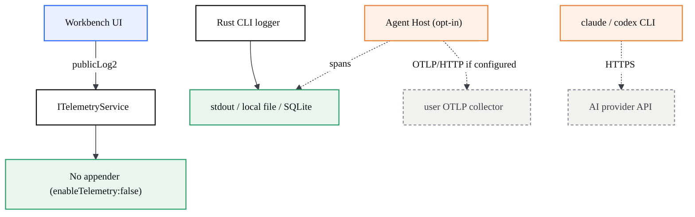
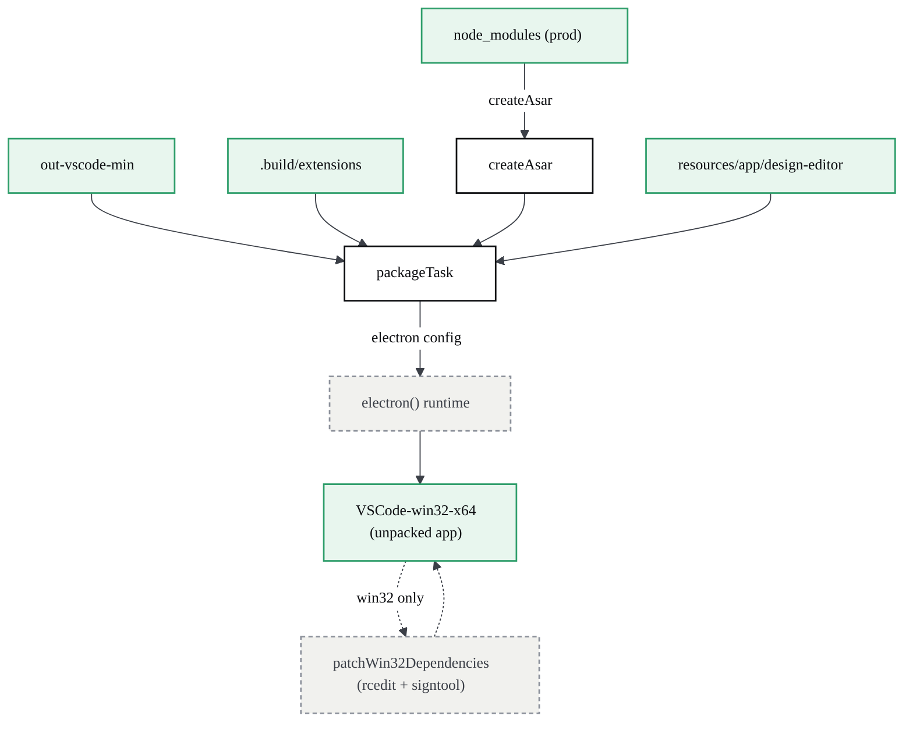
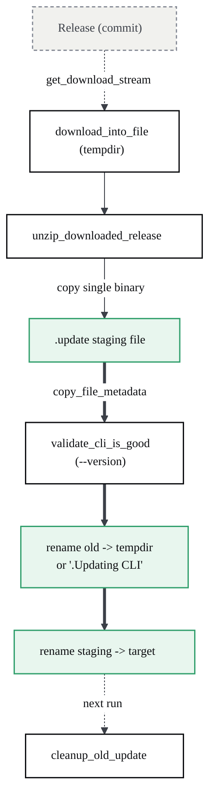
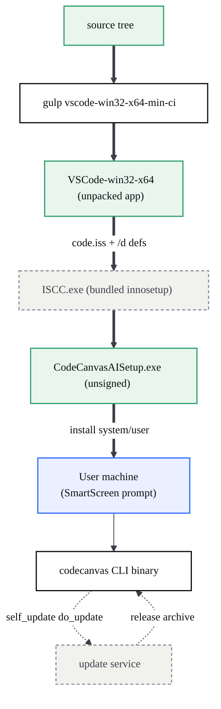

# Telemetry, Limits & Operations

> What data (if any) leaves the machine, the concrete operational limits and timeouts, and how CodeCanvas is built, packaged, signed, and shipped.

## Telemetry & data egress

> CodeCanvas ships telemetry-off at the product level; the only network egress in the default Design + Claude flow is the agent CLI talking to its own provider — everything else stays on the machine.

### At a glance

- Workbench analytics are disabled in `product.json` (`enableTelemetry: false`, `product.json:8`) and no telemetry/AppInsights key is configured.
- The native Agent Host OTel pipeline (OTLP traces) exists but is **off by default** and gated behind a build flag plus an explicit setting (`OTEL.md:5`, `product.json:3`).
- The Rust CLI's logger writes only to stdout or a local capped file — it has no network sink (`cli/src/log.rs:131`, `cli/src/log.rs:151`).
- The AI chat path spawns a vendor CLI through plain pipes; that CLI, not CodeCanvas, opens the only outbound connection (`cliProviders/cliProcess.ts:40`).

| Surface | Default state | Egress when active |
| --- | --- | --- |
| Workbench telemetry (`ITelemetryService`) | Off — `enableTelemetry: false` | None (no appender / no key) |
| Agent Host OTel (OTLP traces) | Off — `chat.agentHost.enabled: false`, Insiders-only | User-configured OTLP collector only |
| Rust CLI logging | stdout + local file | None |
| Agent chat (Claude / Codex CLI) | On-demand per message | The vendor CLI → its own provider API |

### Data egress map



### Workbench telemetry: off at the product level

VS Code's telemetry stack is wired but inert. `product.json:8` sets `"enableTelemetry": false`, which is the master switch the upstream telemetry appender checks before sending anything; the file also carries no `aiKey`/AppInsights endpoint, so even if the switch were flipped there is no sink to receive events.

The Agents window still *defines* telemetry events — `src/vs/sessions/common/sessionsTelemetry.ts` declares classifications and calls `telemetryService.publicLog2(...)` for UI interactions, tunnel discovery, socket lifecycle, and terminal recovery (`sessionsTelemetry.ts:36`, `sessionsTelemetry.ts:138`, `sessionsTelemetry.ts:254`). These all route through the same `ITelemetryService` import (`sessionsTelemetry.ts:6`). With `enableTelemetry: false` and no key, the calls reach a no-op appender — they shape *what would be measured*, not *what leaves the machine*. `product.json:41` (`agentsTelemetryAppName: "agents"`) only names the channel; it does not enable it.

### The Agent Host OTel channel (opt-in, off by default)

The Agent Host is a separate utility process that embeds the native `@github/copilot-sdk` and has its own OpenTelemetry pipeline, documented in `src/vs/platform/agentHost/OTEL.md`. It is **doubly gated**: the host itself is disabled by default (`chat.agentHost.enabled: false`, `product.json:3`) and the OTel doc marks it "Insiders / non-stable builds only" (`OTEL.md:5`).

The pipeline only activates if env/settings explicitly turn it on. `readAgentHostOTelEnv()` computes `enabled` as the OR of `COPILOT_OTEL_ENABLED`, a DB-exporter flag, an OTLP endpoint, or a file path (`agentHostOTelService.ts:79`); if none are set, `getSdkTelemetryConfig()` returns `undefined` and no SDK telemetry is constructed (`agentHostOTelService.ts:133`). Settings are translated to env only when a value was explicitly configured — `buildAgentHostOTelEnv()` drops empty/undefined keys and only sets `COPILOT_OTEL_ENABLED` when the setting is on (`agentService.ts:206`).

When it *is* on, what carries depends on the mode (`OTEL.md:21`):

| Mode | Trigger | What carries / where |
| --- | --- | --- |
| Pass-through | `otel.enabled` true, DB exporter off | SDK exports spans straight to the **user-configured** OTLP/gRPC/file/console sink — no interception (`agentHostOTelService.ts:178`) |
| DB mode | `otel.dbSpanExporter.enabled` true | SDK is re-pointed at a loopback receiver on `127.0.0.1` (OS-assigned port), spans decoded into local SQLite; only fans out if an external endpoint is *also* set (`agentHostOTelService.ts:165`, `localOtlpReceiver.ts:83`) |

Span attributes never include prompt/response content unless the operator opts in: `captureContent` defaults to undefined/false and the doc flags it privacy-sensitive (`OTEL.md:64`, `agentHostOTelService.ts:106`). Crucially, there is **no Anthropic/Microsoft default endpoint** — the OTLP destination is whatever the operator points `OTEL_EXPORTER_OTLP_ENDPOINT` at. With no endpoint, DB mode keeps every span on `127.0.0.1` and on disk. Env is also bound at spawn time, so a stale setting cannot silently re-enable egress mid-session (`OTEL.md:83`).

### CLI logging: local stdout / file only

The Rust CLI (`cli/`) logs through `cli/src/log.rs`. It has exactly two sinks: `StdioLogSink`, which prints to stdout (`cli/src/log.rs:137`), and `FileLogSink`, which appends to a local file and truncates it past a 10 MB limit (`cli/src/log.rs:157`, `cli/src/log.rs:179`). Neither opens a socket; the `RustyLogger` adapter (`cli/src/log.rs:328`) just routes the `log` crate back into these local sinks and even drops noisy network-crate modules. There is no telemetry or OTLP exporter in this logger — CLI diagnostics never leave the machine on their own.

### The enterprise picture: Design + Claude is single-egress

In the default Design environment with the Claude agent, the chat does not call any CodeCanvas-owned analytics backend. A user turn is handed to the main-process `ICliAgentService` and run as a child process over **plain pipes, not a PTY** (`cliProviders/cliProcess.ts:34`, `cliProcess.ts:40`); the prompt is written to the CLI's stdin and the streamed reply is forwarded back (`cliProcess.ts:17`, `cliProcess.ts:53`). The only outbound network connection is the one the vendor CLI itself makes to its provider API to service that prompt.

So the enterprise boundary is clean and auditable:

- Workbench telemetry: **off** (`product.json:8`).
- Agent Host OTel: **off / Insiders-only**, and even when on, points only where the operator configures (`OTEL.md:5`, `agentHostOTelService.ts:79`).
- CLI logs: **local files/stdout** (`cli/src/log.rs:151`).
- Design write-back, preview, and inspector are local file operations.

The single egress to reason about is the agent CLI → its own provider. Everything else is local-only by default.

## Operational limits & timeouts

> The hard numbers behind the Design preview: which ports it grabs, how long it waits for a dev server, when it gives up on the preload script, and the size/retry caps on inserting media.

These values are mostly compile-time constants. Where a number is configurable through a parameter, the table lists the **default** that ships, and the subsections explain when the default is overridden.

### Constants at a glance

| Constant | Value | Where | Purpose |
| --- | --- | --- | --- |
| Static-server port range | `5500`–`5540` (41 ports) | `src/vs/workbench/contrib/codecanvasPreview/browser/designBridge.ts:251`, `:270` | Range scanned by `findFreePort` for `npx serve`. |
| `waitForPort` poll interval | `1000` ms | `designBridge.ts:331` | Sleep between port-reachability probes. |
| `waitForPort` timeout (bridge fallback) | `60000` ms | `designBridge.ts:157` | Used only if the caller omits `timeoutMs`. |
| `waitForPort` timeout (client default) | `120000` ms | `design-editor-src/src/lib/workbench-bridge.ts:138` | Default sent by the editor when it calls `waitForPort`. |
| `waitForPort` RPC envelope timeout | `timeoutMs + 10000` ms | `workbench-bridge.ts:139` | Outer bridge timeout, always 10s longer than the poll budget. |
| `startDevServer` RPC timeout | `60000` ms | `workbench-bridge.ts:137` | Bridge call budget for spawning the dev/static server. |
| `callWorkbench` default RPC timeout | `30000` ms | `workbench-bridge.ts:80` | Default for every other bridge call (fs ops, list, etc.). |
| `PRELOAD_FALLBACK_TIMEOUT_MS` | `20000` ms | `design-editor-src/src/hooks/use-start-project.tsx:15` | Force-unblocks the frame overlay if the preload script never reports. |
| `SELF_WRITE_ECHO_MS` | `1500` ms | `designBridge.ts:89` | Window in which Design's own writes are ignored by the fs watcher. |
| "Changes saved" pill reset | `2500` ms | `designBridge.ts:107` | Quiet period before the save pill fades to `idle`. |
| Asset-name collision cap | `1000` suffixes | `design-editor-src/src/lib/html-writeback.ts:384` | Max `name-1`…`name-1000` attempts before refusing to save. |
| Media-insert size cap | none | `design-editor-src/src/components/bottom-bar/index.tsx:23` | `FileReader.readAsDataURL` reads the whole file (see below). |
| Feedback image compression | 2 MB target, 5 attempts | `design-editor-src/src/utils/upload/image-compression.ts:18`, `:87` | Separate path from media-insert (see below). |

### Static preview server (ports + cold start)

Static HTML/CSS folders have no dev script, so the bridge serves them with `npx serve`. `findFreePort(5500, 5540)` linearly scans the 41-port window, skipping ports already handed out (`staticPorts`) and any port that answers a probe, throwing `No free port available` if the whole range is occupied (`designBridge.ts:270`-`278`). The chosen port is launched with `npx --yes serve -n --cors -l <port> .` (`designBridge.ts:265`).

`--yes` matters for the **cold-start caveat**: on a machine where the `serve` package is not yet cached, `npx` downloads it on first run before the HTTP server binds the port. During that download the port is not reachable, which is exactly why the editor waits with the generous 120s budget rather than mounting the frame immediately. `--cors` is also required — without `Access-Control-Allow-Origin: *` the `vscode-file://` editor cannot fetch the HTML to inject the inspector, and the canvas is stuck view-only (`designBridge.ts:262`-`265`).

Reachability is checked with a `no-cors` `fetch`, which resolves to an opaque response if anything is listening and rejects otherwise (`designBridge.ts:312`-`319`).

### waitForPort: budget vs. poll vs. envelope

`waitForPort` loops until `Date.now() + timeoutMs`, probing the port and sleeping `1000` ms between attempts; it returns `{ ready: false }` on deadline rather than throwing, and rejects up front only on an invalid port (`designBridge.ts:322`-`334`).

Three timeouts stack on one call, so be precise about which applies:

| Layer | Value | Note |
| --- | --- | --- |
| Bridge fallback | `60000` ms | Applies only if `params.timeoutMs` is missing (`designBridge.ts:157`). |
| Client default | `120000` ms | What `use-start-project` actually sends, since it passes no override (`workbench-bridge.ts:138`). |
| RPC envelope | `timeoutMs + 10000` ms | Outer guard, always 10s slack so the inner loop reports first (`workbench-bridge.ts:139`). |

In the normal Design flow the **120s** client default wins; the 60s fallback only fires if some other caller invokes the method bare. If the port never answers, the editor surfaces a recoverable "server did not respond" error instead of a blank canvas (`use-start-project.tsx:69`-`75`).

### Preload fallback (PRELOAD_FALLBACK_TIMEOUT_MS)

When a project is chosen, the local provider pipeline (fs sync, oid instrumentation, preload-script injection) starts asynchronously. If it never reports `PreloadScriptState.INJECTED` within `PRELOAD_FALLBACK_TIMEOUT_MS = 20000` ms, a `setTimeout` force-sets the state to `INJECTED` anyway so the frame overlay clears and the page still renders — read-only if injection truly failed (`use-start-project.tsx:15`, `:55`-`59`).

### Media insert: FileReader and asset writes

Media insert deliberately has **no enforced size limit**. `fileToImageData` reads the picked file with the native `FileReader.readAsDataURL`, producing a base64 data-URL of the entire file. This replaced an older byte-by-byte `String.fromCharCode` + `btoa` loop that "choked/threw on large files, so videos (tens of MB) silently failed to insert" (`bottom-bar/index.tsx:19`-`37`).

The data-URL is then persisted by `saveAsset`, which strips the `data:` prefix, ensures the `/assets` folder, and writes the base64 through the bridge in `'base64'` encoding (`html-writeback.ts:360`, `:401`). Collision-free naming retries `name-1`, `name-2`, … and **bails after 1000 attempts** rather than overwriting an existing file (`html-writeback.ts:383`-`398`). On the receiving side `fs.readFile` auto-detects binary by scanning the whole buffer for a NUL byte, after a bug where binaries whose first NUL sat past byte 512 were misread as text (`designBridge.ts:368`-`377`).

### Image compression (feedback attachments only)

Note this is a **separate path** from media-insert — `image-compression.ts` is the compressor for feedback attachments, not for assets dropped on the canvas. Its defaults are: max `1920×1080`, quality `0.8`, JPEG, and a `2 * 1024 * 1024` (2 MB) target size (`image-compression.ts:18`-`24`). If the encoded blob exceeds the target it retries up to `maxAttempts = 5`, dropping quality by `0.1` each pass but never below `0.3` (`image-compression.ts:87`, `:100`-`102`).

### Self-write echo & save state

Every Design write stamps the file path with an expiry of `Date.now() + SELF_WRITE_ECHO_MS` (`1500` ms) so the fs watcher suppresses the echo event and the just-patched frame is not reloaded (`designBridge.ts:89`, `:384`, `:497`-`504`). After writes drain, the toolbar shows "Changes saved"; a `RunOnceScheduler` then fades it back to `idle` after `2500` ms of quiet (`designBridge.ts:107`-`111`).

## Build, packaging & deployment

> How CodeCanvas AI goes from a source tree to a shippable Windows installer: the gulp packaging pipeline assembles `VSCode-win32-x64`, the bundled Inno Setup compiler turns it into `CodeCanvasAISetup.exe`, and the Rust CLI carries its own self-update path.

The product is a VS Code OSS fork, so it inherits the upstream gulp + Electron + Inno Setup toolchain. This page documents the parts that matter for shipping the fork on Windows and the places where CodeCanvas diverges from upstream: the Design bundle shipped beside `out`, the unsigned-build signtool handling, the CodeCanvas-branded installer, and the CLI self-update.

### At a glance

- Packaging is a gulp task per platform/arch. `BUILD_TARGETS` registers `win32` x64 and arm64 (plus darwin/linux) at `build/gulpfile.vscode.ts:621`; each becomes a `vscode-win32-<arch>-<min>-ci` task series at `build/gulpfile.vscode.ts:651`.
- `packageTask` (`build/gulpfile.vscode.ts:236`) merges sources, built-in extensions, production `node_modules` (as `node_modules.asar`), the Design bundle, and the Electron runtime into `../VSCode-win32-x64`.
- The Windows installer is built by a separate task that shells out to the **bundled** Inno Setup compiler (`ISCC.exe` from the npm `innosetup` package) against `build/win32/code.iss` (`build/gulpfile.vscode.win32.ts:25`, `:126`).
- **Signing is optional.** Builds are unsigned by default; `signtool.exe` is only used to *strip* invalidated signatures before `rcedit`, and a missing tool is treated as "no signature" (`build/gulpfile.vscode.ts:529`). Without a code-signing certificate, the installer trips Windows SmartScreen.
- The app runs with `--no-sandbox` in dev (`scripts/codecanvas-dev.ps1:16`); the sandbox decision lives in `src/main.ts:43`.
- The Rust CLI self-updates by downloading a release, validating it, and atomically swapping the binary (`cli/src/self_update.rs:78`) — but only when compiled with quality/commit metadata.

| File | Responsibility |
| --- | --- |
| `build/gulpfile.vscode.ts` | `packageTask`: assembles the unpacked app, builds `node_modules.asar`, ships the Design bundle, applies Electron, patches Win32 binary metadata. |
| `build/gulpfile.vscode.win32.ts` | `buildWin32Setup` / `packageInnoSetup`: invokes bundled `ISCC.exe` with `/d` definitions to compile the installer. |
| `build/win32/code.iss` | The Inno Setup script: `[Setup]` metadata, file copy, registry/file associations, PATH + context-menu tasks. |
| `product.json` | Brand identity, app IDs, mutex names, and the fields packaging injects (`commit`, `date`, `version`, `checksums`). |
| `cli/src/self_update.rs` | CLI self-update: download, unzip, validate, atomic rename swap, cleanup of the old binary. |

### The gulp packaging pipeline

`packageTask(platform, arch, sourceFolderName, destinationFolderName)` (`build/gulpfile.vscode.ts:236`) is the heart of packaging. For `win32`/`x64` it reads `out-vscode-min` and writes a sibling `VSCode-win32-x64` directory (`destinationFolderName` at `build/gulpfile.vscode.ts:638`, destination resolved at `:237`). It merges several gulp streams (`build/gulpfile.vscode.ts:363`):

| Stream | Source | Notes |
| --- | --- | --- |
| `packageJsonStream` | `package.json` | `name`/`version` rewritten from `product.nameShort` (`:285`, `:293`). |
| `productJsonStream` | `product.json` | Build injects `commit`, `date`, `checksums`, `version` (`:301`). |
| `sources` | `out` + `.build/extensions` | App code + built-in extensions (`:275`). |
| `deps` | production `node_modules` | Packed into `node_modules.asar` (`:336`). |
| `designEditor` | `resources/app/design-editor/**` | The Design bundle, base `resources/app` (`:361`). |

After merge, the stream is piped through `electron(electronConfig)` (`build/gulpfile.vscode.ts:433`) to lay down the Electron runtime (`ffmpegChromium: false`, `:426`), and `inlineMeta` (`:517`) inlines `package.json`/`product.json` into the bootstrap entry points. The whole thing is written to disk with `vfs.dest(destination)` (`:523`).

Checksums for the core renderer/main entry points (workbench HTML/JS/CSS, the extension host, the sessions window) are computed at `build/gulpfile.vscode.ts:244` and folded into the shipped `product.json` so the runtime can integrity-check itself.



### The Design bundle ships beside `out`

CodeCanvas adds one stream that upstream does not have. The Design editor (the Vite/React Onlook bundle) is copied verbatim from `resources/app/design-editor/**` with base `resources/app`, so it lands at `resources/app/design-editor` inside the packaged app (`build/gulpfile.vscode.ts:359`). The inline comment states the intent: ship the Design bundle "next to `out`… so `DesignEditorPane` can load it at runtime." The pane loads it from this on-disk location inside the iframe rather than from a server, which is why the [Design environment](?p=02-design-environment) works fully offline.

### node_modules.asar and unpacked natives

Production dependencies are resolved (`getProductionDependencies`, `build/gulpfile.vscode.ts:323`), cleaned via `.moduleignore` filters (`:333`), then archived into `node_modules.asar` by `createAsar` (`build/gulpfile.vscode.ts:342`). Native and binary assets cannot run from inside an asar, so they are **unpacked** — the unpack glob list at `:342` includes:

| Unpacked pattern | Why |
| --- | --- |
| `**/*.node` | Native addons (must be a real file on disk to `dlopen`). |
| `**/@vscode/ripgrep-universal/bin/**` | The `rg` search binary. |
| `**/@github/copilot-*/**` | Copilot runtime. |
| `**/node-pty/build/Release/*`, `.../conpty/*` | Terminal backend (ConPTY on Windows). |
| `**/*.wasm` | WebAssembly modules. |
| `**/@vscode/vsce-sign/bin/*` | Signature verification helper. |

`vsda` is deliberately retained in plain `node_modules` (not only the asar) for internal use (`build/gulpfile.vscode.ts:355`).

### Win32 binary metadata + code-signing status

For `win32` only, `packageTask` is followed by `patchWin32DependenciesTask` (`build/gulpfile.vscode.ts:648`). It globs every `*.node`, `rg.exe`, and `*explorer_command*.dll` and rewrites their version resources with `rcedit` — stamping `CompanyName: 'CodeCanvas AI'` and `LegalCopyright: Copyright (C) 2026 CodeCanvas AI` (`build/gulpfile.vscode.ts:583`).

Because `rcedit` invalidates any existing Authenticode signature, the build first calls `stripAuthenticodeSignature` (`build/gulpfile.vscode.ts:540`). This is where the fork's **unsigned** posture is explicit:

- `hasAuthenticodeSignature` spawns `signtool.exe verify /pa` and, on `error` (ENOENT), resolves `false` — the comment notes signtool "ships with the Windows SDK and is absent on unsigned/local builds" (`build/gulpfile.vscode.ts:531`).
- A missing/absent signature means the strip is skipped and `rcedit` proceeds on an unsigned PE (`build/gulpfile.vscode.ts:544`).
- When a signature *is* present, `signtool.exe remove /s` strips it first (`build/gulpfile.vscode.ts:548`), because ESRP's append-sign (`signtool /as`) otherwise fails with `0x800700C1`.

There is no certificate wired into the default build, so the resulting `.exe` and installer are unsigned. The practical consequence: **Windows SmartScreen** shows an "unknown publisher" warning on first run, and the user must click through. Signing is opt-in at installer-compile time (see below); the actual `signtool sign` step is left to an ESRP pipeline (`SignTool=esrp` in the script).

### The Inno Setup installer

The installer is a distinct task family defined in `build/gulpfile.vscode.win32.ts`. `defineWin32SetupTasks` registers four tasks — `vscode-win32-{x64,arm64}-{system,user}-setup` (`build/gulpfile.vscode.win32.ts:135`). The compiler is the **bundled** ISCC: the path is resolved from the npm `innosetup` package, not a system install (`build/gulpfile.vscode.win32.ts:25`):

```ts
const innoSetupPath = path.join(path.dirname(path.dirname(require.resolve('innosetup'))), 'bin', 'ISCC.exe');
```

`buildWin32Setup(arch, target)` (`build/gulpfile.vscode.win32.ts:61`) builds a definitions map from `product.json` (`NameLong`, `DirName`, app IDs, mutex names, `Arch`, `SourceDir` = the packaged `VSCode-win32-<arch>` folder), writes a per-target `product.json`, then calls `packageInnoSetup` against `build/win32/code.iss` (`:77`, `:126`). `packageInnoSetup` (`:28`) spawns `ISCC.exe` with `/d<Key>=<Value>` flags and an ESRP sign callback. Two CLI flags toggle behavior:

| Flag | Effect | Source |
| --- | --- | --- |
| `--sign` | Sets the `Sign` definition → enables `SignTool=esrp` in the script | `build/gulpfile.vscode.win32.ts:35`; `build/win32/code.iss:43` |
| `--debug-inno` | Sets `Debug` for a verbose compile | `build/gulpfile.vscode.win32.ts:31` |

`build/win32/code.iss` carries the CodeCanvas branding and install behavior:

| Setting | Value | Line |
| --- | --- | --- |
| `OutputBaseFilename` | `CodeCanvasAISetup` | `build/win32/code.iss:18` |
| `AppPublisher` / URLs | `CodeCanvas AI`, GitHub `FaridDevU/CodeCanvas-AI` | `build/win32/code.iss:11` |
| `SetupIconFile` | `resources\win32\codecanvas.ico` | `build/win32/code.iss:25` |
| `Compression` | `lzma` + `SolidCompression=yes` | `build/win32/code.iss:19` |
| `CloseApplications` | `force` (so updates can shut the app down) | `build/win32/code.iss:41` |
| `MinVersion` | `10.0` (Windows 10+) | `build/win32/code.iss:29` |
| `SignTool` | `esrp` — only under `#ifdef Sign` | `build/win32/code.iss:43` |

System vs user install diverges on `DefaultDirName`/privileges: the `user` target installs to `{userpf}\{#DirName}` with `PrivilegesRequired=lowest` (no admin), the `system` target to `{pf}\{#DirName}` (`build/win32/code.iss:47`). Optional `[Tasks]` add the `addtopath` PATH entry, file associations, and Explorer context-menu entries (`build/win32/code.iss:85`). The bulk of the 1900-line script is per-extension file-association registry keys.

### The --no-sandbox flag

The Chromium sandbox is on by default. `src/main.ts:43` enables it via `app.enableSandbox()` unless `--no-sandbox` / `--disable-chromium-sandbox` is passed or `argv.json` disables it; when `--no-sandbox` is present it also appends `--disable-gpu-sandbox` (`src/main.ts:47`). `no-sandbox` is registered as an alias of the `sandbox` switch in the argv parser (`src/main.ts:576`). The dev launcher passes it explicitly:

```powershell
Start-Process -FilePath $exePath -ArgumentList (@("--no-sandbox") + $CodeCanvasArgs) ...
```

(`scripts/codecanvas-dev.ps1:16`). The `code.bat` dev launcher (`scripts/code.bat`) instead relies on `VSCODE_DEV=1`/`ELECTRON_ENABLE_LOGGING` and launches `.build\electron\<nameShort>.exe`. `--no-sandbox` is a dev/launch convenience, not baked into the shipped installer.

### CLI self-update flow

The Rust CLI (`cli/`) ships as a standalone binary and updates itself via `SelfUpdate` (`cli/src/self_update.rs:21`). Construction is gated on compile-time metadata: `SelfUpdate::new` reads `VSCODE_CLI_COMMIT` and `VSCODE_CLI_QUALITY` (`option_env!`, `cli/src/constants.rs:35`) and errors with `UpdatesNotConfigured` if either is missing (`cli/src/self_update.rs:32`). Because this fork's `product.json` defines no `quality`/`updateUrl` (the build defaults quality to `dev`, `build/gulpfile.vscode.win32.ts:74`), self-update is effectively inert unless those env vars are supplied at compile time and an update service is configured.

`is_up_to_date_with` simply compares `release.commit == self.commit` (`cli/src/self_update.rs:61`). When an update is needed, `do_update` (`cli/src/self_update.rs:78`) performs an atomic, crash-safe swap:



Steps, in order:

1. **Download** the release archive into a `tempdir` (`cli/src/self_update.rs:84`).
2. **Unzip** and copy the single contained binary to a `.update` staging path next to the running exe; `copy_updated_cli_to_path` asserts exactly one file in the archive (`cli/src/self_update.rs:95`, `:144`).
3. **Copy metadata + validate** — apply file permissions (`copy_file_metadata`, platform-specific at `:160`/`:167`), then run the staged binary with `--version`; a non-zero exit aborts with `CorruptDownload` (`cli/src/self_update.rs:101`, `:121`).
4. **Swap** — rename the current exe out of the way (into the tempdir, or fall back to the `Updating CLI` extension if the tempdir is on another drive), then rename the staged binary onto the target path (`cli/src/self_update.rs:106`, `:114`).
5. **Cleanup** — `cleanup_old_update` deletes the leftover `Updating CLI` file on a later run, since the old binary may still be in use during the swap (`cli/src/self_update.rs:67`).

### Deployment topology



### Gotchas

- **Unsigned by default → SmartScreen.** No certificate is configured in the build; `signtool` is only used to *strip* signatures, and its absence is tolerated (`build/gulpfile.vscode.ts:531`). End users see an "unknown publisher" warning. Signing requires `--sign` (`build/gulpfile.vscode.win32.ts:35`) plus an ESRP pipeline.
- **ISCC is bundled, not system.** The build resolves `ISCC.exe` from the npm `innosetup` dependency (`build/gulpfile.vscode.win32.ts:25`); a system Inno Setup install is neither required nor used.
- **The Design bundle must exist before packaging.** `packageTask` reads `resources/app/design-editor/**` (`build/gulpfile.vscode.ts:361`); if the Vite bundle was not built into that folder, the Design environment ships empty.
- **Natives must stay unpacked.** Anything matching the `createAsar` unpack list (`build/gulpfile.vscode.ts:342`) — `*.node`, `rg`, ConPTY, `*.wasm` — fails to load if it ends up inside `node_modules.asar`.
- **CLI updates are inert without compile-time metadata.** `SelfUpdate::new` returns `UpdatesNotConfigured` unless `VSCODE_CLI_COMMIT` and `VSCODE_CLI_QUALITY` were set at compile time (`cli/src/self_update.rs:32`); this fork's `product.json` ships no `quality`/`updateUrl`.
