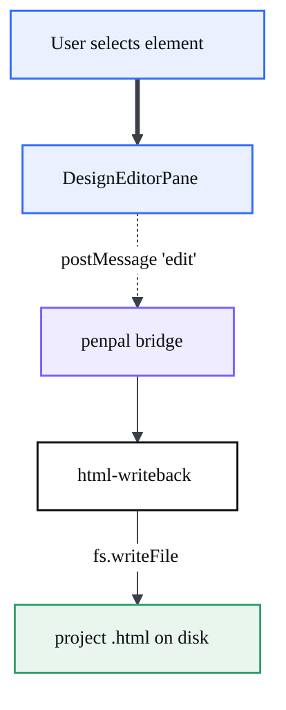
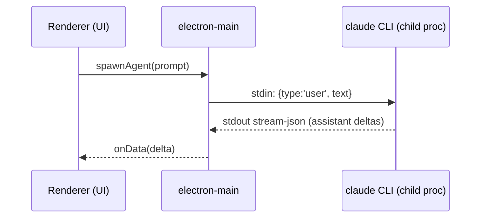

# CodeCanvas Docs — Style & Diagram Contract

This file is the single source of truth for how every documentation page and
every diagram in `public/docs/` is written. All authors (human or agent) must
follow it so the docs read as one coherent book, not a pile of notes.

---

## 1. Voice & format

- **Language:** English. Developer-facing, precise, no marketing fluff.
- **Tense:** present tense, active voice ("The pane loads the bundle", not "The bundle is loaded by the pane").
- **No emojis anywhere.** Not in prose, not in diagrams, not in headings. (Project rule.) Use words or Codicons names if an icon is needed.
- **Audience:** an engineer new to the codebase who is competent but has never seen it. Explain the *why*, not just the *what*.
- **Length:** high-signal. Prefer short sections with a diagram over long prose. If a paragraph repeats a diagram, cut the paragraph.

### Code references
- Reference real code as `` `path/to/file.ts:120` `` (path relative to the CodeCanvas repo root, with line number when useful). These must be real — verify before writing.
- Fenced code blocks must declare a language (` ```ts `, ` ```rust `, ` ```bash `, ` ```json `).
- When showing an interface or signature, copy it faithfully from the source, then trim noise.

### Page skeleton (every subsystem page uses this order)
```
# <Subsystem name>

> One-sentence "what this is and why it exists".

## At a glance        <- 3-6 bullet summary + the key files table
## Architecture        <- 1 diagram (component view) + prose
## How it works        <- the main flows, EACH with its own diagram (per-function)
## Key modules         <- table: file -> responsibility
## Extension points / reuse   <- what a developer can reuse or hook
## Gotchas             <- the non-obvious traps (pull from real bugs/comments)
```

### Key-files table format
```
| File | Responsibility |
| --- | --- |
| `src/.../foo.ts` | One line. |
```

---

## 2. Diagrams — the CodeCanvas visual system

We use **Mermaid** (rendered by the docs viewer). The *philosophy* is borrowed
from architecture-diagram best practice (high-signal, not an inventory dump);
the *look* is ours: the CodeCanvas paper/ink palette with a fixed semantic
color code so a reader learns the legend once and reads every diagram fast.

### Rules of a good diagram (follow all)
1. **One idea per diagram.** A component view OR one flow. Never both.
2. **Size:** aim 6-18 nodes. If it needs more, split it. (Mega/system diagram is the only exception, max ~24.)
3. **Per-function first:** every non-trivial flow in "How it works" gets its own small diagram. The big picture comes last, on the Diagrams page.
4. **Direction:** `flowchart TD` (top-down) for flows/sequences-as-flow; `LR` only when the flow is genuinely a left-to-right pipeline.
5. **Label every cross-boundary edge** with the method / message / event name. An unlabeled arrow across a boundary is a bug.
6. **Color = meaning, always.** Use the classes below. Never color a node for decoration.
7. **Short labels:** 1-4 words per node. Detail goes in the prose, not the node.

### Arrow semantics (consistent everywhere)
- `A --> B`  solid: synchronous call or direct data flow.
- `A -.-> B` dashed: asynchronous / event / IPC message / stream.
- `A ==> B`  thick: the primary "happy path" through the diagram (use sparingly to guide the eye).
- Always put the verb/message on the edge: `A -->|loadBundle()| B`, `A -.->|postMessage 'select'| B`.

### The semantic palette (copy this block verbatim into the END of every `flowchart`)
```
  classDef ui fill:#eaf0ff,stroke:#2f6bff,stroke-width:1.5px,color:#0c0d10;
  classDef core fill:#ffffff,stroke:#0c0d10,stroke-width:1.5px,color:#0c0d10;
  classDef ai fill:#fdf0e6,stroke:#e8833a,stroke-width:1.5px,color:#0c0d10;
  classDef data fill:#e8f6ee,stroke:#2f9e6b,stroke-width:1.5px,color:#0c0d10;
  classDef ext fill:#f1f1ee,stroke:#8b909a,stroke-width:1.5px,stroke-dasharray:4 3,color:#3b3f47;
  classDef bridge fill:#f0ecff,stroke:#7c5cff,stroke-width:1.5px,color:#0c0d10;
```

| Class | Use for | Reads as |
| --- | --- | --- |
| `ui` (blue) | Anything the user sees / renderer UI, panes, views, the canvas | "surface" |
| `core` (ink/white) | Core logic, services, controllers, plain modules | "engine" |
| `ai` (orange) | AI agents, LLM/CLI backends, chat providers | "intelligence" |
| `data` (green) | Files on disk, persistence, write-back, storage, state | "data at rest" |
| `ext` (gray, dashed) | External processes / OS / 3rd-party (Copilot, GitHub, child processes) | "outside our boundary" |
| `bridge` (purple) | IPC channels, ProxyChannel, penpal, message bridges | "wire between worlds" |

Assign classes with one line per class at the bottom: `class A,B ui;` `class C core;` etc.

### The init header (put at the TOP of every Mermaid block)
```
%%{init: {'theme':'base','themeVariables':{'fontFamily':'Space Grotesk, Segoe UI, sans-serif','fontSize':'14px','primaryColor':'#ffffff','primaryTextColor':'#0c0d10','primaryBorderColor':'#0c0d10','lineColor':'#3b3f47','tertiaryColor':'#f6f6f3'}}}%%
```

### Full diagram template (copy, fill in)
````

````

> The viewer renders a global legend once at the top of the Diagrams page, so
> you do NOT need a "Legend" subgraph inside each diagram — just use the classes
> correctly and the colors are self-explanatory.

### Sequence diagrams
For request/response or multi-turn protocols (IPC handshakes, the Claude CLI
stream, penpal connect), a `sequenceDiagram` is allowed and often clearer than a
flowchart. Keep the same color intent in participant naming. Example:
````

````

---

## 3. Where to write

- Each subsystem page: `public/docs/NN-name.md` (number assigned in `IA.md`).
- Do not edit other agents' pages.
- Diagrams live inline in the page they explain (per-function). The mega/system
  diagram and a gallery of links live in `public/docs/10-diagrams.md`.
- API spec: `public/docs/api/openapi.yaml`.

## 4. Definition of done (per page)
- [ ] Follows the page skeleton.
- [ ] Every "How it works" flow has its own diagram.
- [ ] Every diagram uses the init header + the semantic classes + labeled edges.
- [ ] Every code reference points to a real file (and line where useful).
- [ ] No emojis. English. Present tense.
- [ ] "Gotchas" section has at least the real traps you found in comments/bugs.
